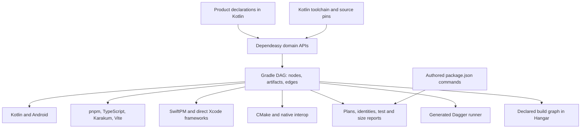

# Dependeasy build layer

Dependeasy owns reusable build mechanics. Each repository declares its modules,
artifacts, dependencies, and product constraints in Kotlin. Gradle evaluates the
declarations and schedules work; the language tools compile and resolve packages.
The build layer does not introduce another scheduler, dependency resolver, or
product runtime dependency.



## Design rules

* Keep declarations separate from execution. Applying a plugin or reading a build
  plan must not install dependencies, clone repositories, or compile native tools.
* Use small domain APIs that compose. A JavaScript component declares its sources
  and Kotlin producers; its install, types, bindings, and bundle tasks can then
  participate in any DAG. Avoid a universal project object with hundreds of options.
* Return ordinary typed Gradle task providers. The common API supplies defaults;
  an exceptional case can configure arguments, environment, inputs, outputs, or
  compose an existing task without adding a new runner or bypassing the graph.
* Carry the producer with an artifact. File consumption adds both a dependency
  and a tracked input. Ordering alone does not establish data consumption.
* Give execution tasks declared state. Gradle properties, file collections,
  providers, and injected services replace execution-time access to `Project` or
  captured build-script state. Declare machine-specific tools and configuration.
* Place a mechanism in its domain. Source generation, provenance, native interop,
  workspace installation, and desktop jar retention have separate implementations.
  Product choices remain visible at their call sites.
* Retain real constraints and qualification failures. Do not disable lint, weaken
  type checks, raise budgets, or add compatibility stubs to make a build appear green.

## Domains and status

Native kernel consolidation uses the existing CMake task and platform types. Its
budget is internal dependency/tool preparation functions, with no new public API,
stored state or dependency. Acceptance is the owner input and composition tests,
then the FFI host check, three Android ABIs and both Apple SDK builds. Native
sources, CMake fragments and consumed libraries must invalidate compilation;
unrelated language version changes must not. Kotlin remains the C++ standard's
authority for both mobile and standalone CMake declarations.

* **Toolchains:** Kotlin owns versions; Gradle, Node and pnpm downloads are checksummed;
  native revisions are pinned. Java 25 runs builds, with Android bytecode at 21.
  Next: qualify compiler updates per target and make Linux OS package resolution less
  dependent on mutable distribution repositories.
* **Graph:** Lazy nodes, typed artifacts, cycle checks, included-build ownership and
  schema-1 exports feed Hangar's Build source. Some plugin task closures cannot expand
  during declaration discovery; shell bodies remain explicitly opaque. Next: define observed
  execution receipts separately from declarations before adding live state.
  BestBuds is the combined IntelliJ root for both products and Reaktor. Shared
  framework scopes are deduplicated when the products export a diamond graph.
* **Kotlin/Android:** Forty-three active shared modules use `module(namespace)` with
  common/web/Android/Apple/JVM declarations. Compiler plugin bundles, automatic
  generator inputs, per-platform test dependencies and explicit test discovery
  replace repeated mechanics; AGP keeps signing and lint ownership. Next: qualify
  AGP's new KMP Android plugin with the existing NDK/CMake integration.
* **JavaScript:** One frozen pnpm workspace installs producer-dependent Kotlin exports;
  Vite, Karakum and the TypeScript native CLI/API have defined roles. Next: resolve
  product bundle/runtime budgets and qualify browser flows. Registry entries with
  missing package metadata trigger repair using the frozen lock; complete installations
  stay incremental. Compiler export copying excludes dependency trees, preserves
  relative contexts and prunes obsolete compiler files. Custom export directories
  are declared in a Gradle catalog for worker and IDE artifact transfer.
* **Apple:** Explicit frameworks link directly in Xcode; exact SwiftPM resolutions
  supply SDKs through module-owned `src/iosMain/swift` adapters. Swift only injects
  and exports SDK calls; initialization, validation and notification behavior remain
  Kotlin. There is no shared Apple SDK source folder. Next: qualify signed archives and SDK
  behavior on physical devices.
* **C++:** C++23, typed CMake tasks, pinned inputs, prefab/cinterop and shared dependency
  libraries reduce repeated work. Hermes reuses its host compiler. Module-owned C++ installers and TypeScript bundles
  participate in the same graph. Android packages the pinned NDK runtime rather
  than a transitive prefab runtime. Next: keep upstream
  language exceptions explicit and expand ABI checks as targets are added. The
  performance module now shares the same source-set layout and CMake declaration.
  Security now aligns its owned C++ sources with Kotlin source sets and uses one
  native library instead of duplicate C API/core compilations; this change is in
  qualification. Its host OpenSSL discovery still needs replacement by pinned
  target-specific crypto artifacts; a passing static
  library build alone does not qualify those imported artifacts for an app link.
* **JVM applications:** Programs, named probe compilations, quoted launchers and
  distributions share one classpath kernel. Desktop packaging exposes the Compose
  DSL; Spring uses native Gradle BOMs and a pinned buildpack builder. The actual
  packaged desktop runtime probe passes. The actual worker Docker image builds with
  Java 25, and its launcher reports JRE 25.0.4. Next: qualify production startup and release.
* **Generated content and checks:** Typed Kotlin objects, Node generators, shared
  Markdown/Vite content and dependency boundaries replace repeated plumbing. Next:
  move additional bespoke generators when a real consumer needs the common mechanism.
* **Provenance/storage:** Deterministic identities, shared caches, desktop jar leases,
  packaged launchers/class archives and bounded cleanup control repeated output.
  Compiler exports are excluded from source tracking. Metadata requests retain the
  selected platform's transfer scope. Next: measure cold/warm builds under controlled load.
* **Runners/releases:** Load-based Mac/M1 routing, generated Dagger/manifest aliases,
  worker binding order and shared command cancellation connect delivery declarations.
  Fastlane uses a frozen launcher and shared artifact helpers, with product release
  domains kept readable. Next: qualify credentialed releases and consolidate remaining
  authored workflows while preserving their product checks.

## Hangar build workspace follow-up

Acceptance: the former Deploy tab is labeled Build, opens the generated Dependeasy
graph, retains the existing task runner and artifact/release views, and qualifies
Hangar plus BestBuds Android, iOS and web artifacts. Keep persisted mode identities
compatible. Use the existing graph projection and execution bindings; do not create
another scheduler, graph format or build declaration source. The change budget is
one shared build-graph reading function, one small graph view, existing pane/state
wiring, and a bounded report adapter in shared tooling discovery. Named Gradle
targets reuse its existing wrapper binding; their shared source seal also includes
the report read during discovery. External commands are not inferred from that
report. A separate graph selection belongs to the Build
pane so viewing build tasks does not overwrite the application graph's selection.
The projection groups tasks by their Gradle project paths beneath each build.
Acceptance retains task identities and dependency edges, nested project ownership,
and the workspace layout budget. These scopes derive from the exported task paths;
they add no declaration, graph format, API or stored state.
Failing desktop flows retain tagged bounds and interaction states alongside their
existing screenshot. This diagnostic excludes field values and adds no product
state or API; it distinguishes a missing target from an unavailable interaction.
The mode-frame check follows the existing route identity while asserting the new
pane label; a display rename must not require migrating persistent route keys.
The production catalog contract removes the deleted prototype deploy alias from
its expected inventory while retaining all surviving approval and mutation checks.

Worker transport must also reconcile the generated desktop distribution after a
successful transfer. Acceptance replaces one jar version, removes its obsolete
copy, retains the current launcher/runtime and leaves unrelated directories intact;
failed and scoped transfers do not reconcile that distribution. Extend the existing
owned agent-library reconciliation with Compose's generated main/app directory.
No new command, configuration, cache or dependency is required.
Hangar's `desktopPackage` target uses its existing host-native Compose producer on
Mac and Linux. Its declaration must be portable; Dagger still produces Linux
artifacts through the same task, and Apple-only targets retain their macOS gate.

BestBuds' separate website must participate in this qualification alongside its
Kotlin browser app. Acceptance builds its Kotlin exports before shared TypeScript
checks and its normal Vite client/Worker bundle, retains reference-asset pruning,
and exposes the web artifacts through the generated graph. Reuse the JavaScript
component API and package command escape hatch; the package's public build command
delegates to Gradle while its bundle command never calls Gradle. The budget adds
one component declaration and one workspace target, with no new API, flag, state,
tool or dependency.
The website's unused, incomplete graph experiment is removed after verifying it
has no importers. Its compiler exclusion is removed too, so all remaining website
sources participate in type checking.
Shared type checks use the native compiler's build mode so solution configurations
check their referenced projects and retain compiler-owned incremental results.
Acceptance rejects an error in a referenced project and passes after correcting it,
then builds the actual website. Replace the per-project invocation with this native
operation; add no configuration parser, orchestration layer, API or dependency.

Qualification also repairs duplicate table-header automation IDs: the shared
table owns those IDs, so Hangar's header labels must not repeat them. The existing
surface and header-layout checks are the acceptance evidence. This repair adds no
API, state or dependency.

Two graph ownership fixtures must explicitly request their inspected application:
constructing a Data pane deliberately leaves that application unloaded. Keep the
first-use navigation regression and the ownership/retirement assertions; do not
restore eager loading or extend their deadlines to satisfy incompatible setup.

The complete build report also exercises the graph layout kernel at workspace
scale. The repeatable test fixture includes nested project task paths so it also
qualifies project grouping. Acceptance preserves every card and dependency, finite geometry, repeated
layout determinism and a measured layout budget. A JFR capture of the real report
identified ELK's additional input-order sorting as the bottleneck. The budget for
this repair is removing that override: sorted graph inputs and the existing random
seed retain deterministic layout. Add no graph truncation, scheduler, public API,
flag, stored field or dependency. The existing ELK regressions and a large declared
build benchmark qualify the change. ELK documents `NONE` as its
[default ordering strategy](https://eclipse.dev/elk/reference/options/org-eclipse-elk-layered-considerModelOrder-strategy.html).

The full Hangar sweep found a reproducible shutdown deadlock between the kernel
graph and an auth reader factory. Acceptance closes the session while its factory
waits for its owner, disposes a late reader exactly once without submitting a
query, and keeps graph-retirement tests and the full desktop sweep passing. The
repair budget moves factory calls and cancellation outside the auth-session
monitor and uses the existing lifecycle state to reject a closing owner. No new
public API, state, timeout, dependency or approval bypass is needed.

The same sweep exposes a driver race when typing into a workspace field during
its initial read. Acceptance keeps the Agent review and acceptance flows intact
and waits for the existing field's enabled semantics before setting text. The
budget is one readiness check in the shared scene driver, using its existing
timeout; add no sleep, longer deadline, fixture bypass or product state.

Older AI flows also contradict the existing overview-without-pin flow: clearing a
subject leaves the visible scope overview, while explicitly closing the inspector
hides it. Acceptance checks the overview title and absence of the previous subject's
details after clearing; keep close, pin, activation and row-identity checks. Update
only those stale fixture expectations. An Agent keyboard-menu flow waits for its
existing menu's enabled state before typing. These repairs add no product API,
state, dependency or deadline.

Analytics qualification preserves scope isolation: changing environment clears the
previous connection's facts, and returning to production requires a new read.
Screen metrics and Cloud's app links still link to the selected Kotlin application,
so opening those panes requests its existing background activation as Graph and UI do.
Data and Build continue to open without activating it. Extend the first-use test
and retain the screen-link flows; add no API, state, dependency or eager startup.
The canned product timestamps include their UTC offset so frozen-clock assertions
retain the same meaning on both Macs, independent of the process time zone.
The existing `hangar.flows` selector also accepts its JVM property through Gradle
for focused worker checks; an ordinary build still runs the full sweep. Radar's
missing-configuration flow asserts the actual reason, retaining its reachability
and recovery checks.

## Manna Kotlin migration

Manna already has shared Compose features and native services. Its browser, edge,
and API implementations still contain approximately 81,000 lines of TypeScript,
so build modernization alone does not complete the product migration. Kotlin is
the intended owner of product rules, state transitions, services and presentation.
Browser, Cloudflare and Apple adapters expose platform capabilities to those rules.

The first extracted `manna:domain` module has no Compose, React or Reaktor runtime
dependency. Native callers and an exported Kotlin/JS package consume its identifier
and review-plan migration rules, wire records, attribution and origin descriptions.
Work-session records and their interval transitions, overlap accounting, clipping
and local-day calculation, including unrecorded gaps, also live in this domain. Native code and the JavaScript
transport adapter use the same timeline kernel; `buildWeb` includes web unit tests.
The TypeScript adapter converts transport values;
it does not maintain another copy of the rules. Its Kotlin producer precedes web
checking and bundling through the ordinary Dependeasy declaration. Native record
codecs and UI projections stay outside the reusable wire and policy module.
Manna API and browser testing now declare the same Vite/Vitest/Wrangler versions;
Cloudflare's current Vitest plugin replaces its legacy pool package.
Media retention validation, removal-receipt reasons and the authority required to
choose deletion also move into the common domain; its TypeScript adapter supplies
wire field types and keys. Platform storage queries retain their adapter boundary.
Calendar validation, canonical millisecond timestamps, local days, DST gap/fold
resolution and quota windows now share another common kernel. Native timestamp
generation and JavaScript recurrence adapters both consume it. Numeric POSIX cron
parsing, validation and date matching also move to the common schedule kernel;
the JavaScript adapter only converts sets and arrays. RRULE grammar and lazy
pattern enumeration now share small common kernels too. Calendar/cron occurrence
expansion, exception membership, original-time revision ownership, inclusive limits
and DST deduplication are undergoing native and JavaScript qualification in Kotlin.
The native legacy preview adapts to those same kernels. Schedule validation, immutable
revision checks, future editing, exception ownership and revision-aware previews now
share common Kotlin implementations, qualified through qualification 14. Calendar and quota
checks remain separate small kernels; native and browser descriptions use the same
interpreted rule. Locale-specific date captions remain presentation adapters.
Automation draft records, bounds and pure preview decisions also share a Kotlin
kernel. The native store and browser adapter supply local evidence and create
receipts; evaluating a preview performs no platform effects. Unsupported triggers
no longer fall through to unrelated memory events in the browser.
Historical rhythm modes, credit ownership, window targets and upcoming occurrences
also share qualified common kernels. The next progress slice consolidates outline
identities, correction history, unit winners and provider requirements. Both the
native learning screen and browser/API adapters use that same projection. This
slice passes qualification 18, with all four Apple framework links passing in 17.

Continue by domain: remaining wire contracts, synchronization and services,
feature state and presentation, then Worker routes and capabilities. Preserve the
current public URLs, stored records, principal/workspace isolation and receipts.
Existing browser/backend tests must qualify each switch before its TypeScript
implementation is retired. Platform SDK declarations can remain TypeScript and
Karakum-generated Kotlin bindings; product logic belongs in Kotlin. Do not bundle
the complete Compose app into Workers to reuse a small domain rule.

## Common and exceptional declarations

```kotlin
dependeasy {
    val frontend = javascript("frontend", "targets/web") {
        kotlinLibraries("app")
        kotlinLibraries("reaktor-auth", build = "reaktor")
        sources("../shared-ui")
    }
    val bundle = frontend.vite()
    bundle.configure { environment.put("PUBLIC_ORIGIN", "https://example.org") }

    frontend.build("buildWeb", bundle = bundle)
    workspace {
        includedBuild("reaktor")
        target("verification") { tasks(":check"); effect = "verify" }
        external("iosRelease") { fastlane("ios", "build_release"); platform = "macos" }
        dagger()
    }
}
```

The declaration expresses the product selections. The component owns workspace
installation and source tracking, and the DAG owns dependencies. The configured
task remains an ordinary Gradle task; a product-owned producer can join through
`node(...)` and `consumes(...)`.
Generated web assets use `build(..., generators = listOf(...))`: they are explicit
bundle inputs, excluded from authored source snapshots. Checks and generators
remain separate declarations, so a verification task cannot silently consume
another task's outputs through a broad directory scan.

## Two planes and module ownership

Each consumer has one `dependeasy` block. It states platforms, dependencies,
programs and artifacts in the orchestration plane. Domain implementations own
command execution, source generation, installation and packaging in the kernel
plane. Task receivers provide the low-level escape without forcing implementation
loops into the top-level composition. The bootstrap plugin build is the exception:
it cannot apply a plugin that it is still compiling.

C++ and TypeScript sources follow Kotlin source sets (`src/commonMain/cpp`,
`src/commonMain/typescript`, and platform-specific siblings). Mobile bridges own
their runtime, exports and callbacks. Current Android/iOS adapters exercise
Kotlin ↔ C++ ↔ TypeScript; JVM FFM and JS Wasm are future adapter boundaries, not
implemented parity claims. Third-party Swift adapters live in their owning
module source sets and forward to Kotlin protocols; they contain no policy.

## Sources of truth and graph contract

Gradle owns artifact dependencies, entrypoints, runner selection and worker fleet
membership. `package.json` owns JavaScript dependencies and authored package commands;
the frozen pnpm lockfile owns resolved packages. Kotlin owns toolchain versions.
SwiftPM and Xcode retain their native package/link contracts. These are distinct
domains, rather than competing copies of the same task list.

`generateDagger` renders runner functions from Gradle entrypoints, copies the
shared Dependeasy runtime, and emits `dagger.json` with the Kotlin-owned engine pin.
CI reads that generated engine version. `verifyDagger` compares checked-in output with a separate
generated reference and fails on drift. It does not repair a stale adapter during CI.
`generatePackageScripts` owns only explicitly generated deployment aliases; it preserves
authored scripts and dependencies and excludes its own aliases from its input identity.
It also emits target metadata for Reaktor's delivery binding and a bounded alias
transfer report; worker synchronization merges only those owned manifest fields.
Generating the entire manifest would create an unnecessary bootstrap coupling today.

`buildGraph` writes `build/dependeasy/build-graph.json` without running compilation,
package installation, deployment or Fastlane. Schema 1 separates declared state from
execution, identifies tasks by build owner plus absolute task path, includes pipeline
edges and available Gradle dependency closures, imports active package commands, and
nests explicitly included build exports. Unexpanded tasks retain a diagnostic class;
opaque script bodies retain their authored command. Generated package aliases and
declared package invocations have explicit edges. No shell dependency parser guesses
an execution graph.
Dependency discovery snapshots values while the selected graph task is configured.
Execution consumes that snapshot; it never queries Gradle's mutable build model while
execution holds build locks. The adapter fixture checks mixed included-build execution
and graph export with configuration-cache reuse.

`reportBuildLayout` is separate, small machine metadata: Gradle declares composite
names and relative directories once. Worker transfer selects participating build
owners from that map instead of assuming the invoking repository owns every output.
The report does not compile, expand task closures or introduce another composite
definition. The diamond fixture verifies one shared framework and configuration-cache
reuse. Platform artifact filtering and shared snapshots continue to control storage.

Hangar's Build source projects this export into existing graph shapes, typed ports,
scopes and inspector facts. An absent export requests an explicit export; reading the
surface never starts a build. Declared targets carry no live health or execution state.
External recipes that call Gradle, including Fastlane, execute outside a running Gradle
task to avoid recursion and workspace-lock deadlocks.
The Fastlane Apple kernel assembles Xcode build, archive and export commands from
argument tokens. Product recipes select signing and release policy around those
operations; they do not concatenate another Xcode command implementation.

## Qualification

[VALIDATION.md](VALIDATION.md) records actual build results and limits. Incremental
observations are not controlled before/after speed measurements. Storage figures
must distinguish logical directory size from physical APFS allocation. A successful
root Gradle build does not imply that a separately declared web or signed release
target passed.

Shared Vite asset declarations now serve and emit the same named files, filter
font directories without following dependency links, and isolate development
fixtures from production bundles. DevTools backend delivery and bootstrap ordering
use a separate opt-in adapter. Manna declares asset policy in its config and leaves
filesystem traversal, middleware and bundle hooks in Dependeasy.

Fastlane source reproducibility: rename the ignored consumer source `fastlane/domains/ios/build` to `artifacts` and update its import. Acceptance is Git-visible source, Ruby syntax and the existing release contract suite; add no API, flag, state or dependency.
The same ignore rule hides the shared `fastlane/apple/Build` helper on this Mac. Rename it to `Xcode` and update the consumer and shared contract fixture; acceptance and change budget are unchanged.

Large graph rendering acceptance: focusing a task inside a 126,112 × 178,993 world frame must render without exceeding Compose constraints. Preserve world dimensions, edges, viewport transforms, header semantics and full-frame fill/border. The kernel budget is an optional physical content size and clipping policy in the existing node render style; the graph API measures frame headers within the viewport while Blueprint draws frame bodies in world coordinates. No graph truncation, deadline extension, scheduler, stored field or dependency. Qualify the shared renderer with a large-frame composition regression and the real Build flow.

Worker transfer scope acceptance: a custom JavaScript entrypoint must transfer web outputs and required metadata without copying native frameworks or desktop caches. The website qualification took 1m 12s to build but copied 92,848 paths because the transport did not recognize its authored task name. Dependeasy will declare JavaScript entrypoint families in the existing build-layout report; the worker consumes this generated metadata and records the chosen family in its receipt. Retain conservative full transfers for unknown or mixed targets and backwards compatibility for older receipts. Budget: one task-family map in the existing report, internal registration by the JavaScript API, and a bounded transport reader. No new consumer DSL, version source, build scheduler or dependency. Qualify custom task names, configuration-cache reuse and mixed/unknown transfer selection.
Artifact traversal also skips the existing downloaded native-source cache (`.github_modules`) and Xcode DerivedData: their outputs belong to the consuming Gradle build directories. These caches are neither source declarations nor transfer artifacts.
Build navigation consistency: the existing Run-menu action opens the Build pane, so its label and internal callback name must say Build. Preserve its semantic/persisted route identity and navigation-only behavior; remove the unused deployment-busy parameter. The menu contract and existing mode-opening flow qualify the rename, with no execution or approval behavior added.
