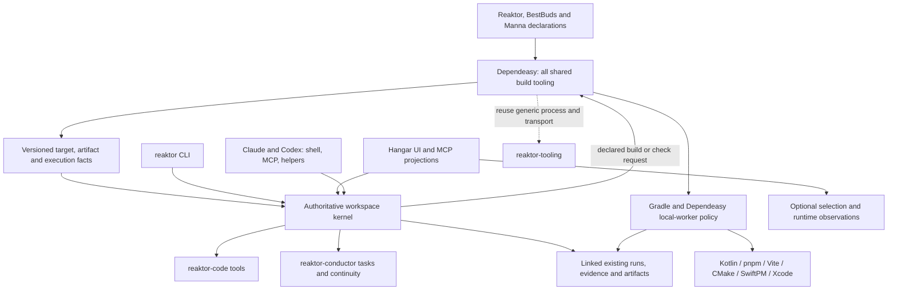

# Reaktor CLI, Dependeasy and Hangar HLD

Proposed redesign, 9 October 2026. `reaktor` becomes the small terminal and agent-shell projection of the workspace kernel. Dependeasy declares what can be built and the artifacts/checks it produces. The kernel binds that model to workspace identity, policy, execution and receipts. Hangar, CLI and agent tools use those same capabilities. The broader [code/agent HLD](code-agent-hld.md) defines source tools, task continuation, result bounds and cross-surface semantics; this document specifies the terminal/build integration.

The user authorized coordination with the Codex chat **Plan build system upgrades** (`01a11fbf-f50a-7360-8e69-be364d5ca6d6`). Its updated [build-layer HLD](/Users/ovd/dev/.remote-dev/build-layer-audit-20261009/findings-and-hld.json) requires all shared build tooling inside Dependeasy, pnpm-only owned JS installs, Vite-only owned bundling, and SwiftPM/direct Xcode Apple integration. Active rollout is Reaktor, BestBuds and Manna; other repositories wait until all three are stable. The [Dependeasy README](../dependeasy/README.md) and [qualification](../dependeasy/VALIDATION.md) retain earlier lazy DAG/typed-artifact, npm, native and Apple evidence plus known failures. That earlier evidence does not qualify the new pnpm reference pipeline. Consume the concrete APIs and receipts the build owner supplies as implementation lands. The integration boundary is versioned plan/target/artifact facts and execution receipts through shared kernel operations, without competing CLI build configuration.

The [single execution plan](engineering-tools-plan.md) owns sequencing, the build-upgrade prerequisite and acceptance gates. This HLD is an architecture reference. The build chat's 10 October completion handoff satisfied the user's start condition. The first framework invocation and CLI startup slice is underway; final contracts, receipts, remaining product failures and file ownership are recorded in the plan.

## What exists and why the old CLI should be replaced

| Surface | Source evidence | Consequence |
|---|---|---|
| Framework `reaktor` | Standalone included build; 23 built-in top-level names plus generated script families/target/library aliases; separate `ReaktorProject` interpretation of package metadata and regex-parsed Gradle settings | Command meaning varies with project contents. Several paths resolve the same work through different heuristics. |
| Legacy build/process path | Hard-coded `npm run`, synthesized module task paths, suffix/name aliases, guessed deployment/log recipes; shared supervised executor underneath | Preserve supervision, replace the duplicated catalog and policy/planning path. A folder or script name is not an authoritative build capability. |
| Legacy desktop launch | `engine` starts a committed `targets/reaktorDesktop/engine.jar` with manually assembled Java options | Replace artifact guessing with declared host artifacts and supported kernel/Hangar attachment. |
| BestBuds `reaktor-workbench` | Thin Clikt host over `ReaktorKernel`: snapshot/tasks, plan/run, connections, inspect/tools and MCP | Useful shared-kernel behavior already exists; reuse it rather than extending the old process shortcuts. |
| Conductor `reaktor-agent` | Native harness/task owner, usage CLI, connection/lifecycle/config installation and MCP federation | Keep these mechanisms; project their supported operations into the unified CLI without copying executors or parsers. |
| Dependeasy | Typed artifacts, lazy task providers, ordering/consumption edges; `BuildPlan` schema-v1 declared JSON plus readable `PipelineReport`; Gradle remains scheduler | Consume the declaration export for supported discovery. Execution receipts, complete input/artifact identity and final contract compatibility remain qualification work. |
| Kernel and Hangar | Shared kernel implementation and graph APIs; separate CLI/GUI/MCP operational instances/state files; agent background service already hosts a headless kernel | Sharing code is not sharing live operations. Default clients need one explicit authoritative workspace owner for shared runs and receipts. |

The legacy audit counted 21 Kotlin files and 3,146 lines; these are diagnostics, not size targets. Its installed distribution had 234 jars totaling 123,445,620 bytes. One installed `reaktor --help` probe from BestBuds exceeded 25 seconds and was terminated; its cause was not established. Audited source initialized workspace discovery before help/version parsing. The first implementation slice now handles root help/version/bare invocation before discovery and terminal initialization. The rebuilt distribution's outside-repository smoke passes: first help probe 0.609 seconds, subsequent new JVM processes 0.062–0.073 seconds, no stderr or workspace files. These are warm-filesystem observations, not a dropped-cache cold benchmark or proof of the old timeout's cause. The new distribution still has 256 jars/143,041,351 bytes; dependency trimming and non-root discovery replacement remain open. [Smoke receipt](/Users/ovd/dev/.remote-dev/engineering-tools-cli-help-20261010.json).

The [CLI audit](/Users/ovd/dev/tmp/cli-redesign-audit-20261009.json) retains scope and verification evidence. That earlier audit is a historical snapshot. The current consolidation changes four planning documents, adds no runtime API, flag, stored schema, dependency or module, and leaves the build owner's implementation files untouched.

## One build model and one operation owner

Arrows show capability/data flow, not imports. Dependeasy remains a Gradle plugin/build owner and must not depend on the runtime kernel or Compose. Runtime consumers import its evaluated, versioned facts, not Gradle `Project`/`TaskProvider` objects. Gradle and specialist engines retain compilation, resolution and incremental scheduling. The kernel coordinates selected operations and their evidence; it does not become a second build scheduler.

| Owner | What belongs there |
|---|---|
| Dependeasy | All shared build tooling: declarations/toolchain contracts, artifact graph, generation, compiler/bundler integration, packaging, build verification, CI/local-worker policy and transfer rules |
| `reaktor-tooling` | Generic process supervision, connections and transport-only build-model/worker/device mechanics; reusable ports, with no independent shared build policy |
| Workspace kernel | Scoped catalog, planning/policy/authority, operation identity, run lifecycle, normalized evidence and host coordination |
| `reaktor-code` | Code query/index/recipe/guard tools and language integrations, tied to build/compilation facts |
| `reaktor-conductor` | Agent task/context/continuation/usage tools and native execution; associate kernel checks with existing evidence |
| `reaktor-cli` | Argument parsing, compact discovery/help, rendering and client lifetime; no product recipes or alternative build graph |
| Hangar | Operator presentation, explicit navigation, optional selection/runtime observations and the existing MCP projections |
| Products | Product composition, applicable checks and release/deployment policy |

The closed BestBuds kernel currently contains product catalog and recipes. A reusable framework CLI must not import BestBuds to operate across Reaktor+. Start by making it a client of the existing workspace host. Extract generic kernel contracts/mechanisms into an appropriate existing Reaktor owner only when another product needs them; keep product catalogs in product composition. Avoid relocating the whole kernel, a new universal runtime module or a dependency from code back to tooling/Conductor.

The build owner's bounded pnpm compatibility in [JvmProjectDiscovery](../reaktor-tooling/src/jvmMain/kotlin/dev/shibasis/reaktor/tooling/JvmProjectDiscovery.kt) is qualified by six passing [seal tests](../reaktor-tooling/build/test-results/jvmTest/TEST-dev.shibasis.reaktor.tooling.JvmProjectDiscoverySealTest.xml) and a [successful log](/Users/ovd/dev/.remote-dev/build-layer-migration-20261009/pnpm-task-discovery-qualified.log). Stable legacy task IDs and command/effect/closure behavior are retained. This planning pass inspected the targeted receipts; BestBuds production catalog/MCP qualification is still pending. This remains transitional discovery compatibility; the redesigned CLI delegates to Dependeasy declarations and execution capabilities. Retire replaced inference at qualified cutover rather than extending it into a competing build catalog.

## Dependeasy integration contract

Consume one versioned owner-produced projection: the completed build handoff qualifies `buildGraph` and schema-1 `build/dependeasy/build-graph.json` as the workspace acquisition path. It retains included-build owners, available task closures and explicit opaque/unexpanded script facts, with `state=declared`. The standalone API remains `javascript(name, directory)`; [BuildPlan](../dependeasy/src/main/kotlin/dev/shibasis/dependeasy/model/BuildPlan.kt) is backend-independent and individual plan exports are supporting artifacts. Do not add another acquisition mechanism or parse readable output as a permanent protocol. The public declarative DSL and exported facts derive from the same owner; the CLI has no second target configuration. Execution receipts remain a separate integration contract.

The current JSON explicitly has `state=declared`. It contains plan/node IDs, task paths, prerequisites, target leaves, pinned toolchain declarations and local cache-scope labels. It is useful declaration discovery, not a qualified execution receipt, complete artifact graph or strong source/input manifest. `requires` alone does not distinguish ordering from consumed file inputs; pinned versions do not attest the tools actually used; `cacheScope=local` does not establish reuse validity. Report declared state and missing coverage honestly, reject unsupported schema versions and do not authorize cached success or source application from declaration data alone. Explicit report generation writes its metadata artifact; help/version must still avoid Gradle and report generation. The build owner is qualifying pnpm and will provide the final export contract and execution evidence.

The qualified execution integration additionally needs workspace/included-build identity; qualified component/producer/artifact and compilation scope; supported build/check/dev capabilities; exact executable task mappings; producer/consumer artifact relationships and ordering relationships; artifact kind/files/resources; host/target OS, CPU/ABI, SDK and mode; toolchain/input provenance; local-state versus portable-output classification; and unsupported/omitted scope. These are the normalized build facts confirmed by the Dependeasy owner, not a second terminal model. Preserve the distinction between `.after` ordering and `.consumes` file inputs. A readable DAG alone does not establish all execution inputs or a safe check-cache manifest.

Current [BuildPipeline.model](../dependeasy/src/main/kotlin/dev/shibasis/dependeasy/dag/BuildPipeline.kt) constructs a node task path from the declaring project plus the provider's name. For a foreign `TaskProvider`, this is not sufficient owning-project identity. Dependeasy must expose and qualify the provider's actual project/build ownership before that path is admitted as accurate. Until then, foreign ownership is unsupported/unknown; CLI must not repair it through folder/name heuristics. The build owner reports existing product DAGs use local aggregate producers and are unaffected. Include foreign-project and duplicate included-build cases in export qualification; the schema remains declaration-only.

Qualification must make target identity unambiguous across included builds. Human names resolve only when unique; replies supply canonical references and source anchors. Detect stale exports using the evaluated declaration/configuration inputs and producer version. Do not treat HEAD, modification time or a settings-file regex as complete build identity. Unknown custom plugin inputs remain explicit and disable unsafe reuse. Querying a catalog never runs install/compile/deploy tasks.

Regenerate only when relevant declarations, configuration or toolchain inputs change. Plain help/version uses the packaged command schema and no Gradle evaluation. An initial authoritative discovery may configure Gradle; report that work and cache its scoped facts rather than repeating it for each command/model turn. Offline stale discovery can be shown as stale, but cannot authorize execution or evidence reuse. Retain configuration-cache behavior and existing source/worker locking.

Dependeasy must first qualify the clean pnpm-only reference pipeline: TS contract → Karakum externals → Kotlin/JS compilation/export → facade typecheck → Vite output. Earlier npm qualification is historical evidence, not acceptance of that pipeline. At each qualified cutover, remove replaced npm/Yarn installers and locks, obsolete bundlers and superseded Apple/build paths. A required generator TypeScript API or Hermes bytecode compiler has a distinct responsibility; it does not justify a parallel installer, bundler or typecheck path. CLI build/check/dev selects declared capabilities and delegates their implementation. Shared toolchain and bootstrap-readable native-source contracts, packaging, build checks, CI and local-worker policy belong to Dependeasy; neither CLI nor Hangar pins or implements them independently. Bootstrap builds remain available through Gradle/native tools without a product runtime graph or already-built kernel service. Declared outputs and worker receipts are imported without copying host-specific `node_modules` or treating mutable CMake state as portable artifacts.

Common consumers use concise declarative profiles for intent, targets and dependencies. Exceptions progressively use typed backend options, native configuration or custom Gradle tasks with declared inputs/outputs and tool/environment identity in the same artifact graph. This 80/20 API preserves native flexibility without introducing a second build engine or another editable common configuration.

## Command model

Use stable verbs over typed subjects. Keep target names, task IDs, recipe IDs and provider names in arguments/discovery, rather than generating top-level commands from every folder and package script. A command does not mean something different because a similarly named script appeared.

Derive/adapt command schemas and help from the existing canonical capability descriptors and serializers. The common verbs are presentation mappings to admitted operations, not another business-rule registry. Provider/recipe details load on demand; unsupported capabilities are absent or explicitly unavailable for the resolved scope.

The following is proposed syntax, not shipped commands. Common actions are concise projections over existing plans/runs:

| Invocation | Meaning |
|---|---|
| `reaktor status` | Bounded workspace/owner/build-model status and current relevant runs; no connection probes or model execution |
| `reaktor build <target>` | Resolve the target's declared build capability, validate current scope and execute its build plan |
| `reaktor check <target>` | Select explicit applicable checks, execute/reuse under strong input identity and return a retained receipt |
| `reaktor dev <target>` | Start/attach the declared development capability; reject unsupported targets rather than guess a script |
| `reaktor open <reference>` | Explicitly open a source/target/task/run in matching Hangar context using an admitted navigation capability |
| `reaktor code query …` | Code queries defined by the code/agent HLD |
| `reaktor change plan/apply …` | Retained exact source/recipe plans and authorized application |
| `reaktor task …` | Existing durable agent task/context/checkpoint operations; distinct from a Gradle task |
| `reaktor peer …` | Conductor-owned peer discovery and typed bounded communication, projected to A2A through qualified native-session adapters |
| `reaktor run …` | Read/wait/cancel/logs for retained kernel or agent execution, with reference-kind validation |
| `reaktor artifact read …` | Bounded retained artifacts, including diffs, reports and logs |

Advanced discovery/invocation and owner/config/MCP lifecycle remain under `tools` and `workspace` groups. Their detailed help loads on request. Product infrastructure/release operations come from the scoped kernel catalog; an explicit lower-level capability invocation handles rare operations without adding `db`, `infra`, `dagger`, `auth`, `fastlane`, every worker and every script to root help. Do not make a universal raw shell command the authoritative operation API. Direct native tools remain usable with observed evidence imported under the existing rules.

Root help fits the common workflow and works outside a repository. Bare `reaktor` prints that help, not a full project/graph inventory. `status`, scoped discovery and completion provide relevant facts on demand. Help/version must be parsed before terminal initialization, workspace scanning, owner startup or provider loading. Reuse Clikt where it helps; parser-library replacement and a large TUI are not prerequisites.

Use the existing workspace argument convention as the canonical explicit root (`--dir`), with compatibility mapping for `--workspace`; never add both as independent semantics. Environment is request scope validated by the owner. CLI queries and execution must not silently mutate Hangar's selected environment. Production effects retain explicit target/authority/approval even when the UI happens to be displaying production.

Common build/check commands wait locally for a terminal receipt and return its success/failure exit status. An admitted detach mode returns the durable run handle promptly for agent workflows; awaiting uses bounded server waits and revision cursors, not repeated model requests. Terminal interruption reports detachment/uncertain termination honestly; only explicit cancellation through the owner attests cancellation. Reuse helper-generated request IDs and retained references from the code/agent HLD rather than asking agents to calculate fingerprints or rebuild argv.

Machine mode emits one bounded valid JSON result on stdout, progress on stderr, stable error codes and meaningful process exit status. It never opens a picker or reads an approval from redirected stdin. MCP stdio emits protocol only. Invalid inputs fail before source/process side effects. Existing policy requirements still apply; an agent's terminal cannot impersonate an authenticated human approver or satisfy independent approval with another string label.

## Shared kernel lifetime and Hangar interaction

Use the existing supervised workspace owner for normal CLI/Hangar/agent operations, with explicit identity/capability negotiation. Conductor's background service and `KernelAgentService` provide current ownership and headless-host mechanics. The authenticated operation connection must expose the admitted typed kernel commands as well as agent controls. Extract shared dispatch beneath MCP; the current read-only kernel/Hangar MCP endpoint is not a mutation transport.

Today the desktop/terminal kernel instances and agent-service kernel use separate operational stores. Do not point concurrent embedded hosts at one file or assume memory is synchronized. Migrate normal operation/run/catalog ownership to the selected workspace service, while GUI sessions retain rendering and selected-subject observations. Mark existing standalone CLI/MCP hosting as explicit isolated compatibility modes, with distinct owner IDs and state. No implicit fallback to a fresh independent kernel when the authoritative owner is unavailable: it would split operations and evidence.

Reads do not start providers/models or attach a heavy kernel merely to print help. Operations needing the service attach/start through existing supervision and validate workspace, owner incarnation, scope and capabilities. Service absence, a wrong workspace, unavailable product composition and unsupported versions return explicit remedies. Owner startup must load the required product catalog headlessly; generic framework work remains usable without a BestBuds catalog or running Hangar.

Hangar sees the CLI-created run and its receipt through the same owner, and CLI can inspect a Hangar-created run. Same-scope retries through another surface deduplicate effects; this needs an actual shared operation request ID/receipt, not “find the newest run for this task.” Scope and approval remain attached to the exact retained plan. CLI process exit and desktop closure detach clients without terminating durable work.

One authoritative workspace owner does not require a new universal result store. Kernel operational runs keep their existing ownership; Conductor agent tasks/runs/evidence keep theirs, with typed references linking checks and artifacts. Extend the existing kernel check runner/import path and project a scoped combined view where needed. A fixture accepting two different approver labels does not establish two authenticated independent principals; preserve that distinction when exposing remote operation commands.

`open` is an explicit navigation request, distinct from observational MCP reads. Carry workspace, source/definition revision, environment, subject and optional run reference into existing route/selection bindings. Validate source-to-runtime mappings; report stale/unsupported resolution instead of selecting the first match. If Hangar is closed, launch a declared supported desktop artifact or return an actionable unavailable result. Never guess a committed engine jar. The current desktop MCP exposes reads; navigation delivery/acknowledgment is an implementation requirement, not a claimed existing endpoint.

## Migration contract

The [canonical roadmap](engineering-tools-plan.md#delivery-sequence) contains the execution gates. Migrate through one declared target, authoritative workspace owner, compact CLI, retained check receipt and shared Hangar/native-client proof. Remove replaced heuristic paths as real consumers migrate; do not maintain a parallel terminal build graph.

`reaktor-agent` can remain an internal/compatibility launcher for installed MCP clients; `reaktor-workbench` can remain an explicit isolated kernel host. The supported user-facing command is `reaktor`. Preserve existing owned MCP configuration manifests and scoped uninstall semantics without overwriting user configuration or breaking active agent-service launchers. Shared kernel extraction needs a second real consumer within the active Reaktor/BestBuds/Manna rollout; product catalog/policy stays with product composition. Expansion to other repositories requires all three to pass the build owner's supported-target correctness, reproducibility, recovery, performance/storage and declarative-API usability gates.

## Acceptance evidence

| Risk | Required proof |
|---|---|
| Startup bloat | Packaged help/version outside a repository performs no workspace scan, Gradle evaluation, provider/model start or GUI initialization; cold/warm latency and classpath size recorded |
| Task ambiguity | Duplicate included-build targets require a qualified reference; no folder/suffix/script fallback; legacy metadata cannot override authoritative build facts |
| Duplicate build graph | CLI and Hangar show the same evaluated Dependeasy target/artifact closure and exact execution mapping; shared build algorithms, packaging and CI/local-worker policy exist only in Dependeasy |
| Tool and rollout duplication | A clean pnpm/Vite reference pipeline passes before cutover; replaced paths are removed; Reaktor, BestBuds and Manna stabilize before other repositories migrate |
| Misleading plans | Catalog/preview has zero tool install/compile/deploy effects; missing/generated/custom-input scope is explicit |
| Stale build facts | Declaration/config/toolchain changes invalidate the projection and affected plans/checks; same-size relevant dependency changes invalidate reuse |
| Split kernels | CLI and Hangar attach to the same owner/run; other-workspace discovery and concurrent shared-file embedding are rejected |
| GUI coupling | Build/check and kernel reads work with Hangar closed and MCP disabled, on a Compose-free host classpath |
| Cross-surface duplication | CLI/MCP/Hangar retry returns the original run/receipt after a lost reply or owner recovery |
| Policy drift | Environment is request scope, not UI mutation; reviewed exact plans and real authority govern effects on every surface |
| Terminal ambiguity | Machine mode never prompts, stdout is valid bounded JSON, progress is on stderr and failed/incomplete checks cannot exit as complete success |
| Lifecycle drift | Client detachment preserves durable work; cancellation/uncertain recovery is accurately reported; no duplicate starts after restart |
| Broken Hangar links | Explicit open preserves scope/revision/run, selection reads remain unchanged, unavailable/stale navigation reports a remedy |
| Legacy breakage | Existing MCP registrations/background launchers survive migration; replaced commands map once or explain the replacement |
| False ROI | Matched accepted tasks count discovery/build startup, all model requests, setup, checks and repair; no quality or coverage reduction |

Worker run `20261009-174121-bestbuds` passed the current kernel CLI's five existing tests with no failures/errors/skips, plus `verifyKernelBoundary`; Gradle completed in 18 seconds and artifact transfer returned exit 0. The tests validate fixture planning, execution, exact approval fingerprints and receipt retention. They do not establish the redesigned command surface, shared live-owner connection or Dependeasy export. The installed-help timeout is retained as a failed probe, not converted into a passing startup claim. Complete measured acceptance remains the implementation gate.

The build owner resolved the collector-authority assertion mismatch and graph-bridge cleanup failure in targeted reruns. The [earlier qualification findings](engineering-tools-plan.md#earlier-targeted-qualification) retain inspected XML and successful logs: 4 authority cases and 2 graph-bridge cases, all with zero failures/errors/skips. Assertions preserve the collector's `false`/`unavailableReason` contract; cleanup uses the fresh fixture directory's guarded parent. The current implementation slice reran the graph-bridge fixture. The [final handoff](engineering-tools-plan.md#10-october-build-handoff-and-first-implementation-budget) records Reaktor/Manna root passes and remaining BestBuds failures; shared live-owner implementation remains open.

## Source anchors

- [Legacy root CLI](../reaktor-cli/src/main/kotlin/dev/shibasis/reaktor/cli/Main.kt), [project model](../reaktor-cli/src/main/kotlin/dev/shibasis/reaktor/cli/ReaktorProject.kt) and [command guessing](../reaktor-cli/src/main/kotlin/dev/shibasis/reaktor/cli/ProjectCommands.kt).
- [Kernel CLI](../../bestbuds/targets/reaktorCli/src/main/kotlin/ai/bestbuds/reaktor/cli/Main.kt), [its tests](../../bestbuds/targets/reaktorCli/src/test/kotlin/ai/bestbuds/reaktor/cli/ReaktorCommandTest.kt) and [kernel ownership](../../bestbuds/modules/kernel/README.md).
- [Dependeasy DAG](../dependeasy/src/main/kotlin/dev/shibasis/dependeasy/dag/BuildPipeline.kt), [typed artifacts](../dependeasy/src/main/kotlin/dev/shibasis/dependeasy/dag/BuildArtifact.kt), [declaration model](../dependeasy/src/main/kotlin/dev/shibasis/dependeasy/model/BuildPlan.kt) and [JSON/readable plan producer](../dependeasy/src/main/kotlin/dev/shibasis/dependeasy/dag/PipelineReport.kt).
- [Kernel agent service](../../bestbuds/modules/kernel/src/main/kotlin/ai/bestbuds/reaktor/kernel/KernelAgentService.kt), [workspace connection](../reaktor-conductor/src/jvmMain/kotlin/dev/shibasis/reaktor/conductor/workspace/AgentWorkspaceConnection.kt) and [Conductor CLI](../reaktor-conductor/src/jvmMain/kotlin/dev/shibasis/reaktor/conductor/cli/AgentWorkspaceCli.kt).
