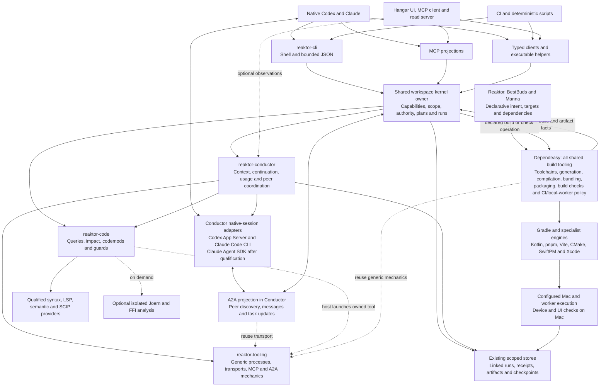
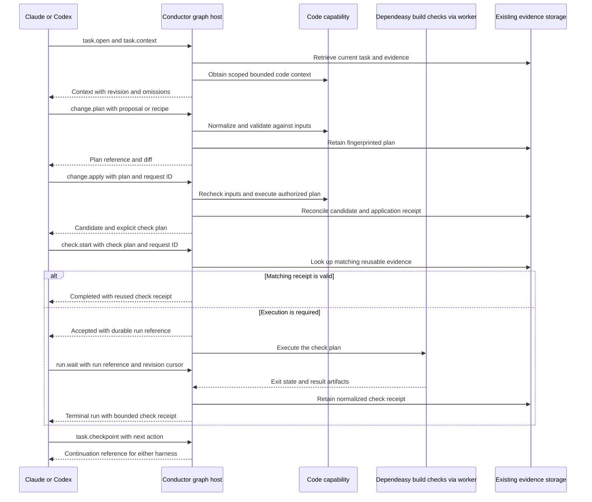

# Reaktor code and agent system HLD

Proposed architecture, consolidated 9 October and updated 10 October 2026 for A2A and the build-completion start condition. `reaktor-code` and `reaktor-conductor` are shared capability and tool packages, with executable tools, recipes, scripts and Kotlin integrations. Together they form one graph-native engineering system that Claude, Codex, CLI, automation and Hangar can use with consistent semantics. Agents can use MCP, shell commands or programmatic helpers as the work requires. Conductor supplies A2A peer communication through adapters to the native harnesses. The purpose is more accepted work within existing subscription allowances through precise context, deterministic transformations, reusable evidence and durable continuation.

The first complete deliverable is a real change queried, planned, applied and verified through this system, then continued in the other native harness without repeating settled investigation. The [single execution plan](engineering-tools-plan.md) supplies sequencing and economics. The [CLI, Dependeasy and Hangar HLD](cli-kernel-hld.md) defines the terminal redesign and authoritative build/kernel integration. Operation names and wire examples below are proposed contracts, not shipped APIs.

## Design constraints and change budget

Use existing graph identities, typed ports, service contracts, workspace ownership, checks, artifacts and recovery. A query is a bounded read; a proposal produces a plan; an application executes that exact plan under existing authority. Source definitions, runtime activations and presentation remain distinct.

The initial design work retained focused integration and CLI audits as historical JSON snapshots and changed four planning documents without runtime additions. The build chat supplied its completion handoff on 10 October, satisfying the user's start condition. The [execution plan](engineering-tools-plan.md#10-october-build-handoff-and-first-implementation-budget) records the first runtime budget, qualification and remaining gates. Implementation earns each contract extension through a real vertical slice. The design acceptance criteria are tools owned by their concern and directly callable by agents, consistent behavior across transports, authoritative Dependeasy/kernel integration, explicit ambiguity and scope, strong write/reuse preconditions, bounded output, Hangar integration and working A2A communication and continuation across native harnesses.

## System structure and module ownership

Arrows in this diagram represent requests and results, rather than module imports.



| Owner | Responsibility | Boundary |
|---|---|---|
| `reaktor-code` | Source identity, indexing/query tools, impact analysis, transformation recipes, code guards and language integrations; common Kotlin contracts alongside executable tooling | Keep common payloads platform-safe; isolate optional engines/assets; no Compose, workbench or Conductor dependency |
| `reaktor-conductor` | Agent-facing context, usage, task/continuation, native harness and execution tools; A2A peers, messaging and lifecycle mappings; policy, budgets, checks, receipts and recovery | Consumes code capabilities; preserves existing task/run/evidence ownership; no mandatory desktop or MCP session |
| `reaktor-tooling` | Generic process/provider infrastructure, connections, transports, MCP door and external device/cloud mechanics; transport-only build adapters and existing source/LSP infrastructure during migration | No independent shared build policy, compiler/bundler/install/package/check sequencing; not the mandatory home of every code or agent tool |
| Dependeasy | All shared build tooling: declarative model/toolchains, artifact graph, generation, compiler/bundler integration, packaging, build verification and CI/local-worker policy | Gradle remains scheduler; export versioned facts without a runtime kernel/Compose dependency; consumers delegate |
| CLI and workspace kernel | Thin terminal projection; authoritative scoped catalog, plans, runs and evidence | Replace terminal-owned task guessing; reuse existing workspace ownership and product composition |
| Existing graph host and transports | Capability registration, discovery and projections | Shared semantics below Kotlin, CLI, MCP and UI; each surface exposes its supported authorized subset |
| Hangar and headless kernel | Shared operational reads, desktop MCP, selected-subject context, runtime inspection and operator interaction | Compose shared code/Conductor capabilities; desktop-only context remains optional and explicitly scoped |
| Reaktor+ products | Target declarations, domain acceptance, applicable check selection and release authority | Active rollout is Reaktor/BestBuds/Manna; other repositories wait until all three stabilize; shared build implementation stays in Dependeasy |

Today tooling depends on code, and Conductor consumes tooling, which exposes code transitively. Code must not acquire a reverse tooling dependency, a Conductor dependency or the full graph/UI module. Register capabilities through existing graph hosts and typed ports; keep common payloads independent of a host implementation. Tool ownership includes executable assets and recipes as well as Kotlin implementations: a code-owned tool can be launched by the existing tooling process owner and projected by Conductor without creating a dependency cycle. Audit actual classpaths before adding a shared port/service dependency or relocating a provider. Bulk source facts are indexed records or overlays tied to graph identity, not an active node for every symbol.

### Modules contain usable tools

Ownership includes the implementation an agent actually invokes. Keep source queries, index maintenance, transformation recipes, code guards and language extraction tools in `reaktor-code`. Keep context assembly, usage reporting, continuation, native harness integration and task/check execution tools in `reaktor-conductor`. Generic process supervision, transports and external device/cloud mechanics remain in tooling. All shared build tooling belongs to Dependeasy, including build verification, packaging and CI/local-worker policy; code/Conductor asset ownership does not duplicate that implementation. Conductor's existing `tools/local-context/context_store.py` is already a precedent for module-owned executable tooling.

Choose the implementation language by the tool: Kotlin, Python, TypeScript, shell or an established native engine can sit behind the same capability. Kotlin integration supplies compilation/source-set context, typed identities, graph mappings and programmatic use where valuable. It does not require rewriting every useful script in Kotlin or restricting the system to Kotlin source. Each language/operation advertises its demonstrated coverage; text or syntax support is useful without claiming semantic resolution.

| Module-owned deliverable | Direct agent access | Kotlin integration |
|---|---|---|
| Code query/index tools | Scoped CLI commands and registered MCP queries; bounded JSON and expandable handles | Existing code types, compilation models, source identity and optional semantic adapters |
| Code recipes and guards | Versioned recipes, dry-run/apply commands and findings, usable from shell/CI | Typed plans/preconditions; compiler-backed checks where the recipe requires them |
| Conductor context/usage/continuation tools | CLI and MCP access to task packets, reports and checkpoints | Existing context, usage, task and evidence models |
| Conductor execution/check tools | Native harness adapters, durable commands and run/artifact handles | Existing workspace ownership, authority, check reducers and worker execution |
| Conductor peer communication tools | MCP, CLI and typed peer operations; A2A client/server projection | Existing collaboration/handoff records, native-session adapters, scoped task/run association and usage |

Discover each callable tool through existing capability descriptors plus executable help. Declare its version, input/output, scope/effects, required runtime and producer. Reuse that metadata across Kotlin, CLI and MCP projections; do not create a second tool registry. Agents receive usable commands and returned handles, without having to import Kotlin libraries or reconstruct compilation facts themselves.

Use ordinary module layout: proposed `reaktor-code/tools/` for executable adapters, `reaktor-code/recipes/` for versioned transformations/guards, and `reaktor-conductor/tools/` for agent workflows and supporting scripts. Kotlin contracts remain in the appropriate source sets; platform integrations stay platform-specific. These are packaging conventions, not additional services or modules. A tiny useful script need not become a framework; register it when shared discovery, policy or retained evidence needs that integration.

Package required scripts, recipes and assets through Dependeasy-owned build/distribution machinery and resolve their paths independently of the invoking directory. The current `agentDist` packages JVM jars and a launcher; it does not yet establish packaging for module-owned executable assets. Pin specialist/runtime versions, declare optional installations, and report unavailable prerequisites structurally. Avoid repeated per-task installation and silent dependency downloads. A code-owned executable can be hosted by tooling or Conductor without importing those owners back into code.

Keep heavy engines and platform adapters out of common payloads and preserve headless/UI boundaries. The current code boundary forbids tooling and LSP4J dependencies; that is a constraint on Kotlin dependencies, not a rule excluding useful tools from the module. Reuse current tooling providers first. Relocate or add a platform-specific integration only for a concrete consumer after checking dependency direction and packaging; no default new module or weakened boundary guard is implied.

### First-class access paths

MCP is one projection of the capability system. Shared domain behavior and policy sit below protocol handlers; neither code contracts nor operation execution require an MCP session. Choose an access path by the task's needs rather than prescribing one path to either harness.

| Access path | Useful work | Required behavior |
|---|---|---|
| MCP | Native tool discovery, interactive scoped queries and retained handles | Compact schemas; bounded structured replies; accepted runs and artifact references |
| Hangar MCP | Kernel/source/workspace reads, graph and runtime inspection, optional selected-subject context | Reuse shared read capabilities; preserve scope, provenance and desktop availability; unauthenticated loopback reads never gain mutation authority |
| Shell/CLI | Agent shell execution, pipelines, codemod recipes, build integration and debugging | The same operations; structured JSON on stdout, human progress on stderr; explicit exit/result semantics |
| Typed client | Kotlin applications, Hangar and programmatic composition | Invoke registered typed capabilities directly or through an existing supported connection |
| A2A | Claude/Codex peer discovery, bounded questions, explicit handoffs and delegated work | Conductor-owned projection of peer operations; native-session adapters; shared authority and linked task/run/evidence |
| Scripts/CI | Deterministic batches, scheduled checks and repeatable workflows | Use the CLI or a typed client; reuse plans, runs, receipts and task state without a model or MCP dependency |
| Existing file/editor/build tools | Precise source reads, targeted edits, native compiler diagnostics and execution | Remain usable; import relevant observed changes and evidence into task/candidate ownership |

An agent can query through MCP, compose a deterministic batch in a script, apply a retained plan through CLI and await the same run through another surface. Cross-surface request replay resolves to the same execution when workspace, operation, authenticated caller and request ID match. Transport selection does not create another task, relax authority or change input validity. Direct shell edits are observed changes, not automatically trusted plan receipts; capture the resulting candidate and check it normally.

Today `AgentWorkspaceConnection.call` serializes MCP `tools/call`, including for the workspace CLI. The migration must extract shared invocation below that handler and route CLI/typed calls to it independently. Preserve the current bridge as a compatibility adapter while this happens. Do not build a second executor, force CLI through MCP, or introduce a universal gateway/new network protocol merely to support another surface. Non-MCP invocation still uses explicit workspace ownership and authenticated authority where a connection is involved.

The current framework CLI, BestBuds kernel CLI and Conductor CLI are separate surfaces. Redesign the supported `reaktor` command as a small workspace-kernel client, with stable verbs over declared targets and retained task/run references. Dependeasy supplies build/artifact/check mappings; CLI and Hangar consume them. Its current schema-v1 `BuildPlan` export has `state=declared`, with prerequisites, target leaves and toolchain declarations. This supports declaration discovery; it does not establish qualified execution, complete source identity, artifact provenance or safe check reuse. The [CLI integration contract](cli-kernel-hld.md#dependeasy-integration-contract) keeps that distinction explicit while the build owner qualifies the final export. Their current shared kernel implementation does not imply shared live operational state. Normal clients must attach to an authoritative workspace owner rather than opening independent kernels or sharing persistence files. The dedicated CLI HLD supplies migration and acceptance; no new task-name heuristics belong in this agent layer.

Batching is deterministic client composition of the existing operations, with retained references and explicit stop/continue behavior. It is not an all-powerful free-form agent command. Ordinary `rg`, file tools and build commands remain useful where they already answer the question cheaply.

## A2A between native Claude and Codex

Conductor owns the A2A client/server projection, peer identity, message intent and task-lifecycle mapping. Adapt the existing native-session runtimes, `AgentWorkspaceConnection`, collaboration records and `HybridHandoffs`; retain their task/run/evidence ownership. Native harnesses communicate through Reaktor adapters, whose receive/resume/cancel behavior must be qualified. This design does not assume either desktop product accepts arbitrary A2A messages. Generic HTTP/JSON-RPC/stream/process mechanics can be reused from tooling; peer semantics remain in Conductor. MCP, CLI and typed clients expose the same underlying peer operations, independently of A2A transport.

The [A2A specification](https://a2a-protocol.org/latest/specification/) defines Agent Cards, messages, tasks and artifacts; message sending only optionally deduplicates by `messageId`. The [task lifecycle](https://a2a-protocol.org/latest/topics/life-of-a-task/) requires a new protocol task for refinement after termination, within the same context. Qualify and pin one supported protocol version/binding first, and advertise only implemented optional capabilities. Cards derive supported peer skills and security requirements from existing descriptors and configuration; discovery is compact and carries no credentials.

Our integration profile has the following responsibilities:

- Bind an opaque A2A `contextId` to an authorized workspace/outcome continuity scope. Bind a stateful A2A task to a retained agent run/attempt, distinct from the longer-lived domain task. Follow-up attempts preserve outcome and evidence without reopening terminal runs. Immediate exchanges may return messages without manufacturing extra domain tasks.
- Retain incoming/outgoing message identity, payload identity, recipient, scope and delivery outcome with the existing owner. Same-payload retries reuse the admitted exchange; conflicting ID reuse rejects. Reconcile lost acknowledgments and owner restart before retrying native submission. An uncertain native delivery remains uncertain rather than causing a blind second model turn. Do not infer exactly-once peer execution from protocol support.
- Send a bounded question, decision, findings or next action with current source anchors and task/plan/check/artifact references. Resolve larger artifacts on demand under current access and input validity. Distinguish queued, delivered, consumed, answered and verified states. A peer's answer supplies evidence or a proposal, not an automatically verified change.
- Keep discovery and state reads free of model execution. Message intent explicitly distinguishes notification, question, handoff and delegation; requests that schedule or resume model work carry the existing authorization and budget. A managed native session receives at an adapter-supported turn boundary. An unavailable or unsupported recipient returns queued/unavailable behavior explicitly. No silent new paid API harness or arbitrary desktop-chat injection is implied.
- Apply existing authenticated operation authority and change-scope ownership to both ends. Peer instructions cannot expand workspace access, mutate source or start privileged checks by themselves. Link parent/recipient runs and count both harnesses' consumption once. Bound message bytes, exchanges, recipient model turns, concurrent work and total task budget; council/debate loops are opt-in work, not the default communication path.
- Map interruptions, terminal outcomes and cancellation to existing run evidence. Streams are optional observations, not a durable delivery guarantee; use retained owner state and reconciliation after disconnect. Client detachment preserves durable work. Terminal message/task status and successful product checks remain separate facts.

The first proof is a real bounded Codex request to Claude and an evidence-backed reply used by Codex, followed by the reverse direction and a fresh-session handoff. Exercise offline/busy recipients, stale inputs, duplicate requests, lost replies, restart, interruption, cancellation and incompatible versions. Require current evidence, no duplicate mutations/submissions and no repeated settled discovery. Protocol fixtures support this proof; they do not replace native-client acceptance or measured total task consumption.

## Hangar, kernel and door integration

Hangar already exposes MCP and consumes MCP in its workbench. Integrate these surfaces rather than treating Hangar only as a Kotlin client or creating a competing desktop server.

| Existing surface | Current capability | Integration responsibility |
|---|---|---|
| Conductor workspace MCP | Authenticated native-agent/task controls and workspace operations, including mutations | Shared invocation and policy below MCP; retain effect-specific authority |
| Headless kernel MCP | Read-only workspace/source declarations, configured worker/store/server graph queries, retained check results and operational reads | Compose shared code/context/check read capabilities without desktop dependencies |
| Hangar desktop MCP | Kernel reads plus app/cloud/runtime/devtools graphs and workbench selection; loopback, read-only | Project shared reads and supply optional observed desktop context |
| Reaktor door | Discovery, provider catalog, routing, retained snapshots and eligible read fallback | Advertise supported capabilities without duplicating engines; verify fallback compatibility |

The authorized subsets differ. Reuse shared operation definitions, schemas and read models wherever a surface supports them; do not move authenticated task controls or source writes into Hangar's unauthenticated read server. Hangar's MCP client can inspect those same read models, with its existing cancellation/disposal behavior. Check requests and retained operations remain with their authorized Conductor/kernel owner; shared build-check execution delegates to Dependeasy. Hangar can inspect retained results.

Selected-subject context is an optional input to the existing task packet. Preserve workspace, source revision, compilation/target, environment, graph-definition identity/revision, activation/session, selection version, observation time and task/principal provenance as available. Missing fields remain unknown. The live selection observed in this audit had a null source revision and null selected subject; it cannot establish a source-bound handoff. Current Conductor selection packets also mark unresolved dependency/definition context as partial. Do not change the human's selection to collect context, or use process-local UI handles as worker/source identities. Current SSH workspaces reject local selection context; cross-host use needs a proven source/definition mapping.

Support open Hangar, `--mcp-only` desktop hosting, a headless kernel with Hangar closed, and unavailable desktop context. These cases must give equivalent shared reads when scope matches and explicit unavailability for desktop-only reads. `--mcp-only` avoids opening a window but still uses the desktop distribution; it does not prove that shared headless code is free of Compose dependencies. Keep borrowed/owned graph lifetime and runtime observations separate from source identity.

Two source-audited routing gaps are implementation gates. The kernel bridge validates `/workspace/identity`, while desktop discovery currently probes only the server name. The door permits fallback between duplicate tool names when both advertise read-only, without comparing schema/version, workspace or environment. Before broadening fallback, require compatible capability/schema versions and scope, evidence requirements and caller authority; otherwise return explicit provider unavailability. Never silently read another workspace or replace a required semantic provider with a weaker answer. No cross-workspace fallback was intentionally executed during this audit.

Built-in providers currently declare themselves self-governed, so door authority and result gates defer to each host. Verify host enforcement of aggregate result bounds and effect-specific access rather than assuming the door always applies them. A seat/run label is attribution, not an authenticated principal. Keep discovery compact, offer useful capability profiles and defer specialist startup until needed; an agent need not load every desktop/devtools schema for a source query.

The [integration audit](/Users/ovd/dev/tmp/code-agent-integration-audit-20261009.json) records live Hangar reads and focused worker checks. These validate existing integration paths; shared non-MCP dispatch, tool asset packaging, native cross-harness continuation and token savings remain implementation/adoption work.

## Shared domain model

Extend existing owners instead of creating another task, graph, candidate or result store.

| Concept | Meaning and existing owner |
|---|---|
| Task | One requested outcome, acceptance, decisions, next action and ownership; Conductor task/workspace state |
| Workspace | Explicit repository roots, included builds and authorized scope; workspace model |
| Candidate or revision | A particular source state, including dirty changes across relevant repositories; candidate/revision storage |
| Input manifest | Content identities and configuration relevant to one query, plan or check; extension of candidate/evidence validity |
| Compilation | Target, source sets, dependencies, compiler/plugins and flags; Dependeasy-owned build facts |
| Source occurrence | Declaration/location in a particular file content version; code contract |
| Change plan | Proposed edits, input manifest, skipped cases, effects and required checks; code contract, retained by Conductor |
| Run and receipt | Durable execution identity and its reconciled effects/results; existing Conductor run/evidence state |
| Context and artifacts | Bounded evidence and expandable references; existing `ContextPacket`, `ArtifactRef` and artifact pages |

Conceptual symbol identity, file occurrence, source revision, compilation and runtime identity cannot substitute for each other. A qualified name is an address that may be ambiguous; it is not a rename-stable identity. Preserve lineage for known moves/renames and use authored Reaktor IDs where available.

Expose distinct typed references at Kotlin boundaries so a task ID cannot accidentally be used as a run or plan ID. Reuse their existing serialized identity and storage where appropriate. IDs identify state; they do not grant authority. At transport boundaries, validate reference kind, workspace membership and revision before invocation.

## Versioned engineering overlays

Reaktor coordinates authoritative engines and retains useful facts above them. Public results contain durable identities, occurrences, relationships, findings and provenance; provider AST, PSI, analysis-session objects and raw compiler internals stay private. Source, build and runtime facts can be joined when a producer establishes the mapping. The system must expose missing mappings rather than inventing a complete source-to-runtime chain.

| Overlay | Retained or derived facts | Authority and limitations |
|---|---|---|
| Structure/build | Repository, module, source set, compilation, dependency and executable check mappings | Build-model/configuration evidence; target and included-build scope are explicit |
| Syntax | Declarations, ranges, imports and structural matches | File content and grammar version; useful on incomplete code; no resolved-call guarantee |
| Semantics | Resolved symbols, references, receiver/types and inheritance | Exact compilation and semantic provider; unresolved/generated/unsupported scope is visible |
| Reaktor | Authored definition IDs, typed ports, ownership and declared connections | Existing definition graph; distinct from activated objects |
| Verification | Required/executed checks, findings, reports and acceptance linkage | Exact candidate, check specification and execution environment/freshness |
| Runtime | Activations, calls/traces, diagnostics and Measure observations where available | Observed build/runtime identity and time; absence of observation proves no general absence |
| Change | Plans, edits, candidate lineage, skipped cases and reconciled effects | Exact inputs, recipe version, authority and resulting receipts |

Borrow interoperability ideas from [SCIP's symbols, occurrences and producer metadata](https://github.com/scip-code/scip/blob/main/scip.proto), while preserving Reaktor's existing authored identities. A provider symbol address may change on rename; explicit lineage links old and new versions. Borrow the selective-fact approach from [Glean](https://glean.software/docs/introduction/): retain the facts clients need, without requiring a new database or indexing every expression.

Use three storage/computation tiers: retain a small durable core of identities, manifests, declarations and task evidence; index reusable scoped relationships incrementally; compute bounded impact/call views on request. Expensive control/data-flow analysis is a separate on-demand capability for demonstrated investigations. Avoid activating one graph node per AST/PSI element, storing every possible derived edge or rebuilding the whole workspace each turn.

### Independently versioned analysis providers

SCIP and Joern supply complementary provider artifacts behind the same Reaktor capabilities. Their full review, compilation matrix and adoption order live in the [canonical plan](engineering-tools-plan.md#review-of-the-joern--scip-proposal). Existing graph identity/ownership remains the foundation; there is no temporary competing control plane or required third database. Provider internals stay private.

A source anchor includes exact file content, coordinate encoding and compilation/input identity, with provider/version/options and index snapshot. Commit/module/variant alone cannot establish validity for dirty worktrees. Verified symbol/content/range joins retain ambiguous/unmapped outcomes. Possible static calls, compiler references, producer-attested FFI bindings and observed runtime calls remain distinct. Provider conflicts retain their provenance rather than silently overriding one another. Publish validated immutable index artifacts atomically; partial imports and dependent invalidation are explicit.

### Impact cone and query planning

`code.query` impact returns a bounded, revision-bound view from an explicit symbol, source change or retained plan. It can include declarations/references, dependent compilations, mapped checks, Reaktor definitions and observed runtime subjects. Every inclusion has a reason and provenance. Relationship kind, evidence strength and selection policy are separate fields: `references` or `buildDependency` describes a relation; `compilerResolved` or `observed` describes evidence; a required-check mapping describes why a check is selected. A label such as “must affect” cannot manufacture proof of behavioral impact.

The response names included and omitted scope, unresolved relationships, the check-selection basis and expandable references. Depth, edge/member count, time and serialized output bounds constrain expansion. It may supply a conservative check plan, but cannot assert that every affected test or runtime path is known. Compare selected checks with broader validation before tightening coverage.

The planner follows a small ordered policy: validate scope and required evidence; reuse facts only if their input manifests still match; choose a capable available provider for the stated target; execute within the budget; return bounded results and explicit limitations. Prefer the least costly provider that satisfies the request, not the least costly provider regardless of correctness. Callers can request syntactic evidence for discovery; semantic requirements cannot silently degrade to syntax or text search. A timeout, missing classpath or unsupported target remains visible and cannot produce a falsely complete empty result.

Providers declare supported language/target, evidence level, operation, cancellation and version. Index, query, transform, verify and finding production are capability roles, not five mandatory interfaces implemented by every plugin or five additional agent tool families. Start with adapters for proven consumers; avoid an empty universal plugin framework.

### Specialist selection and unified findings

These are provider choices to pilot, not dependencies approved for every product. Pin compatible versions and test the repository's actual Kotlin/KMP compilations before claiming coverage.

| Specialist | Role in this system | Adoption boundary |
|---|---|---|
| [Gradle Tooling API](https://docs.gradle.org/current/userguide/tooling_api.html) / repository build models | Compilation/dependency models and supported build execution | Validate available models for included builds/KMP; executable task mappings come from the build owner, not guessed names |
| Existing index, `rg`, [Tree-sitter](https://tree-sitter.github.io/tree-sitter/) | Cheap text/declaration lookup and incremental syntax | Start with existing machinery; validate chosen grammar, anchors, broken-code and deletion behavior |
| Existing LSP / [Kotlin Analysis API](https://kotlin.github.io/analysis-api/index_md.html) | Compiler-backed Kotlin identity and reference/type queries | Pinned, compilation-aware adapter; analysis-session objects never escape; API is under development |
| [ast-grep](https://ast-grep.github.io/reference/languages.html) | Kotlin structural matches and bounded syntactic recipes | Semantic preconditions supplied separately when a recipe depends on identity or types |
| [OpenRewrite Kotlin](https://docs.openrewrite.org/authoring-recipes/writing-kotlin-recipes) / PSI-based editing | Candidate for repeated JVM/Kotlin migrations needing richer rewrite support | Pilot one real recipe; verify toolchain, artifact access, formatting and semantic coverage; no universal KMP claim |
| [detekt type resolution](https://detekt.dev/docs/gettingstarted/type-resolution/) / [Android Lint](https://developer.android.com/studio/write/lint) | Deterministic Kotlin and Android checks | Configure actual classpaths/variants; identify skipped analysis-dependent rules and imported coverage |
| [KSP](https://kotlinlang.org/docs/ksp-overview.html) | Declaration metadata and generated contracts when worthwhile | No expression/body analysis or source modification; cannot replace general semantic queries or codemods |
| [SCIP](https://github.com/scip-code/scip) and qualified language indexers | Semantic navigation artifacts and interchange | Protocol support alone does not establish provider accuracy or KMP coverage; pin compilation/provider inputs and preserve partial scope |
| [Joern](https://docs.joern.io/) | Optional call/control/data-flow analysis and slicing | Predefined bounded queries; frontend-specific qualification, isolated execution and immutable scoped artifacts; no unrestricted Scala or automatic checkpoint refresh |
| Compiler/FIR/IR or CodeQL | Later compile/runtime mapping or deeper checks | Add only for a measured case; keep unstable internals private and expensive analysis on demand |
| Graphify, CodeGraph or Serena | Alternatives for a measured retrieval/navigation gap | Same correctness, freshness and end-to-end cost gates; no mandatory parallel indexing stack |

Extend or project existing `AgentFinding` and `CheckResult` ownership into a common finding view: rule/producer and version, severity/message, candidate/input identity, artifact/location, optional symbol/Reaktor subject, evidence and actionable next references. Preserve producer diagnostics as artifacts. Report parser omissions and unavailable checks separately; normalized findings cannot imply that all output or all required checks were understood. Fingerprint findings by rule, subject and relevant inputs so unchanged failures and attempted repairs remain recognizable across harnesses.

The agent receives the focused failure, implicated source, prior attempts and next required action. A deterministic recipe resolves straightforward matches in bulk; exceptional cases become bounded findings for reasoning. Codemod setup, skipped cases, verification and human review count toward its economics. Claimed 10× gains and example migration counts in the notes remain hypotheses or illustrations until measured here.

## Small composable operation surface

Use seven operation families. The table describes responsibilities; several operations adapt existing workspace/run/artifact behavior rather than introducing new mechanisms.

| Family | Proposed operations | Contract |
|---|---|---|
| Task | `task.open`, `task.context`, `task.checkpoint` | Attach to an existing task, retrieve current bounded evidence, retain decisions/next action; opening an unknown ID fails instead of silently creating another task |
| Peer | `peer.discover`, `peer.send` | Discover qualified peers; send a typed bounded notification/question/handoff/delegation with current task/evidence references; reads and retained run/artifact access reuse existing families |
| Code | `code.query` | Typed query variants for find, outline, references and impact, with capability/completeness per scope |
| Change | `change.plan`, `change.apply` | Preview a proposal/recipe without source writes; execute the exact retained plan against matching inputs |
| Check | `check.start` | Run an explicit retained check plan or return a reusable matching receipt; project validation has a distinct meaning from provider access |
| Run | `run.read`, `run.wait`, `run.cancel` | Read or await a durable operation and reconcile cancellation through existing run ownership |
| Artifact | `artifact.read` | Fetch bounded pages of source, diffs, diagnostics or logs by retained reference |

Task creation remains with the existing submission/task owner and requires an explicit request. `task.open` associates a native harness session with that task. `task.context` can include the code preparation query needed for the next action, so agents need not assemble a packet through many small tool calls. That composition has a bounded, inspectable read set and does not execute writes or checks.

Opening a task, retrieving context or querying code does not start a model execution. Model work uses the existing explicit submission path and declared budget. Checkpoints compare the expected task revision before updating decisions or the next action; concurrent clients receive a conflict instead of silently replacing each other's continuation.

The common path is easy; specialist options stay in typed lower-level query or recipe requests. Do not add interacting flags for automatic mutation, silent fallback, unrestricted output or implicit global scope. One `code.query` operation carries a closed set of meaningful query variants; it is not a free-form query language.

### Operation discovery and transport projections

Reuse existing operation descriptors, request/response serializers and graph capabilities. Keep a canonical operation ID and version, request/result schema, effect class, required scope and cancellation semantics in one definition. Derive or adapt CLI help, MCP schemas and compact discovery from it. Do not introduce a second schema registry or hand-maintain different business rules in each transport.

For example, canonical `code.query` projects to CLI `code query` and MCP `code_query`; `change.apply` projects to `change apply` and `change_apply`. All resolve to the same registered capability and validators below MCP. The proposed aliases must be wired through shared dispatch and their projections before documentation treats them as executable commands. A typed/programmatic client uses those contracts without manufacturing a `tools/call` envelope.

Discovery exposes supported query/recipe/check capabilities for the current workspace and target. Common operation descriptions stay small; provider-specific schemas and detailed help load on demand. Unknown operations, parameters, discriminators and incompatible versions produce explicit invalid-request results. A compatibility adapter has one declared mapping and conformance evidence.

## Request scope and result semantics

Resolve scope once through task/workspace ownership and include the resolved scope in every result. Code queries identify workspace and source revision; semantic queries also identify the compilation. Mutations and evidence reuse include the exact input-manifest identity. No operation silently falls back to another working directory, target, overload or newer revision.

Caller identity and authority come from the existing connection/grant, not a caller-supplied seat or principal label. Task and harness references provide attribution. Code references and retrieved documents remain evidence; their embedded instructions do not authorize commands.

Replies distinguish a completed operation, an accepted durable run and a rejected request. Reuse existing result types underneath; this is a transport contract, not a replacement result framework.

| Dimension | Required distinction |
|---|---|
| Operation delivery | Completed value, accepted run handle, or rejected request |
| Run lifecycle | Existing running/completed/failed/interrupted state plus a precise termination/reconciliation reason |
| Domain outcome | A completed check can have failed tests; delivery success is not check success |
| Result completeness | Complete for a named scope, partial with omissions, unsupported or stale |
| Evidence | Declared, syntactic, compiler-resolved, observed or heuristic, with producer/input provenance |
| Check coverage | Checks selected/executed/skipped/omitted; separately, how much diagnostic output the parser understood |

Current `CheckCoverage.Complete` describes parser recognition. It must never be interpreted as proof that every required test ran. Preserve that type and add execution coverage where the check owner needs it.

Errors have stable codes such as `INVALID_REQUEST`, `AMBIGUOUS_TARGET`, `STALE_INPUT`, `UNSUPPORTED_SCOPE`, `PROVIDER_UNAVAILABLE`, `CONFLICT`, `BUDGET_EXCEEDED` and `AUTHORITY_REQUIRED`, with bounded detail and a typed remedy. A retry hint cannot grant authority or override a stale plan. Mutation requires one unambiguous target; discovery can return several candidates for the caller to choose.

Default results contain the answer, resolved scope, completeness/provenance, important omissions and expandable references. Raw logs and whole graph exports stay in artifacts. Enforce an aggregate byte budget before materializing or serializing output; token estimates are labelled estimates. Count serialized metadata toward the output budget. Reject budgets below the minimum protocol reply size; larger budgets can return a bounded budget-exceeded result. Never truncate machine JSON into invalid syntax. Page cursors bind to the same revision and expire explicitly.

### Example query exchange

The following illustrates proposed wire semantics. It is not a copy-paste command for the current distribution.

```json
{
  "schemaVersion": 1,
  "scope": {
    "workspaceId": "workspace:example",
    "candidateId": "candidate:example"
  },
  "query": { "kind": "find", "name": "ProviderPort" },
  "budget": { "maxBytes": 8192 }
}
```

```json
{
  "schemaVersion": 1,
  "kind": "completed",
  "scope": {
    "workspaceId": "workspace:example",
    "candidateId": "candidate:example"
  },
  "result": {
    "matches": [{ "sourceRef": "source:example", "name": "ProviderPort" }]
  },
  "evidence": {
    "producer": { "id": "kotlin-source-index", "version": "example" },
    "inputManifestId": "inputs:example",
    "strength": "syntactic",
    "completeness": "partial",
    "limitations": ["Top-level type index; generated sources excluded"]
  },
  "artifacts": [],
  "omissions": []
}
```

An empty complete result means no match within its stated scope. An unavailable provider returns unsupported/unavailable, rather than disguising it as an empty match. A precise semantic requirement fails when only syntactic evidence is available. Existing editor `CodeIntelligence` can retain its permissive defaults; the agent projection must adapt capability status explicitly.

Locations use existing zero-based line and UTF-16 column conventions. Wire and edit ranges are half-open, `[start, end)`, bound to file content identity. Human display may show one-based positions and labels that convention. `CodeSpan.contains` currently includes its endpoint; patch code must not infer edit boundaries from that membership helper. Add Unicode and boundary conformance when implementing the adapter instead of silently changing editor behavior.

## Change and verification lifecycle



The agent-to-host arrows are transport-independent: either harness can use MCP, CLI or a helper backed by a typed client, and can switch surfaces between steps. This example shows an inline application and an asynchronous check. Either operation can return an accepted run when execution is long; the caller awaits that same run before treating its receipt as terminal.

Planning normalizes the proposal, resolves targets, checks provider/semantic support, derives edits and required checks, and fingerprints the relevant inputs and effect scope. Application receives a plan reference and idempotency request ID; it does not accept a new free-form rewrite. Recheck the plan and authority before writing. A request ID replay with identical input returns the original run/receipt; reusing it with different input fails.

Plans are immutable once retained. Agents pass returned references into the next operation rather than reconstructing paths, targets, digests or shell commands. `change.apply` takes the plan ID and request ID; it resolves the plan's exact scope and input manifest. Its successful receipt supplies the new candidate and check-plan references. `check.start` takes that check-plan reference and its own request ID. Idempotency is bound to the workspace, operation and caller, and cannot bypass current authority to read the original receipt. This handle-based path is the ergonomic default across surfaces.

Client helpers create and retain a mutation's request ID before dispatch and reuse it on retry. CLI output and structured replies expose the invocation/run references needed to continue through another surface. Agents should reuse those references rather than invent identities or recompute digests. Client-side retry persistence supports recovery; it cannot replace server-side deduplication and reconciliation.

Serialize conflicting applications through existing workspace/actor ownership and use an isolated candidate for multi-file work. Record intended and observed effects so interruption can reconcile partial application. Filesystem, Git, databases and deployments do not form one atomic graph transaction. Preserve unrelated edits. Discarding an owned isolated candidate is a supported cleanup path; automatic rollback of arbitrary shared source/runtime effects is not guaranteed. A failed or uncertain operation retains evidence and cannot be presented as fully applied. A genuine new application attempt receives a new request ID and matching current plan.

Checks consume a retained check plan naming candidate/input manifest, target, required checks and omissions. Reuse success only when every relevant strong input and freshness condition matches. Unknown dependencies or environment state disable reuse; they do not prevent a fresh check, whose limitations remain explicit. Provider-access `workspace verify` keeps its current meaning during migration.

Long execution returns a durable run reference. `run.wait` uses a bounded server wait and revision cursor; completion subscriptions use existing notification paths. Cancellation records requested and observed termination separately. Restart recovery reconciles real side effects and never blindly repeats an uncertain native execution. Acceptance of the product/task remains a separate owner decision; passing checks does not silently accept, merge or publish a change.

## Input identity and cache validity

The worker probe demonstrated that current size-only fingerprints can miss a same-size change to a large dependency while candidate `complete` remains true. Therefore candidate ID and completeness alone cannot authorize reuse or application.

An operation input manifest covers relevant file content, included repository state, dependency artifact digests, compilation/configuration, provider/toolchain version and check/recipe version. Retain weak/unknown inputs explicitly. Hash relevant large files lazily or use trustworthy immutable artifact digests, reusing existing digest-cache behavior. Timestamp and size can accelerate change detection but cannot independently establish content equality.

Keep indexes incremental: update changed facts, invalidate dependents, tombstone deletions and separate facts by compilation and worktree. Distinguish supported complete scope from a useful partial scope. Syntax indexing can prepare context; identity-dependent rewriting requires semantic support for the exact target. A cache hit retains the original receipt/provenance and its current validity evaluation rather than pretending execution occurred again.

## Native harness integration and efficiency

Claude and Codex share task/workspace identity and operation semantics through whichever supported surface suits the work. MCP discovery, CLI invocation and programmatic composition are equally supported paths; native shell/editor tools remain available. Their adapters translate connection/session association and usage formats; they cannot change query, mutation or check semantics. Preserve native authentication and subscription execution for the default path. Account for parent and child runs together, while keeping reported tokens, API estimates and observed native allowance separate. An explicitly selected SDK/API execution mode has its own billing identity; it is never silently substituted for the native-subscription path.

### Codex App Server and Claude Agent SDK

These are harness-control integrations owned by Conductor. A2A describes peer communication; MCP exposes tools to an agent. Neither replaces the harness interface that actually starts, resumes, interrupts or observes model work. Both harness integrations reuse the existing `AgentRuntime`, `InteractiveAgentRuntime` and `AgentSession` contracts, graph ownership and retained workspace runs. Generic subprocess/connection mechanics remain in tooling, and Dependeasy owns their runtime/dependency packaging.

| Integration | Current implementation | Planned role and qualification |
|---|---|---|
| **Codex App Server** | [CodexAppServerRuntime](../reaktor-conductor/src/jvmMain/kotlin/dev/shibasis/reaktor/conductor/appserver/CodexAppServerRuntime.kt) launches `codex app-server`; its existing adapter uses native threads, turns and events | Preferred control surface for managed interactive Codex sessions. Qualify initialization/version capabilities, thread start/resume, turn controls, approvals, terminal outcomes, usage and disconnect recovery on the installed version. Retain existing batch execution for its qualified consumers. |
| **Claude Code CLI** | [ClaudeCodeSessionRuntime](../reaktor-conductor/src/jvmMain/kotlin/dev/shibasis/reaktor/conductor/appserver/ClaudeCodeSessionRuntime.kt) uses streaming JSON stdin/stdout and native session continuation; this is not an Agent SDK integration | Preserve the existing native-subscription path. Its locally generated turn identity is not a Claude provider turn ID. Qualify supported controls and continuation without treating the internal stream protocol as a version-independent contract. |
| **Claude Agent SDK** | No SDK adapter or SDK dependency is implemented in this slice | Explicit qualification candidate for managed Claude sessions: a Conductor-owned TypeScript helper using `@anthropic-ai/claude-agent-sdk`, supervised through existing tooling and packaged through Dependeasy. Use its supported session, permission, hook and event interfaces where they improve the real consumer. Admit it only with a documented authentication/billing mode and conformance evidence; do not replace the subscription CLI on assumption. |

The [official Codex App Server documentation](https://developers.openai.com/codex/app-server/) describes bidirectional JSON-RPC, stdio transport, thread/turn operations, approval requests and account/rate-limit reads. Start with the existing supervised stdio adapter; remote transports require separate qualification. Use native managed account authentication for the local subscription consumer. A supported App Server integration does not establish permission to attach to every existing desktop chat. Commercial/hosted distribution requires the separately supported authentication path documented by OpenAI; do not reuse local credentials as an application service identity.

The [Claude Agent SDK overview](https://code.claude.com/docs/en/agent-sdk/overview) describes Python/TypeScript libraries for Claude Code's agent loop. Its [quickstart](https://code.claude.com/docs/en/agent-sdk/quickstart) documents API-key/provider authentication and restricts third-party products offering claude.ai login/rate limits without prior approval. Therefore SDK installation or a locally working login does not prove that our integration can consume Max allowances. The SDK is included in the design, but the current native-subscription requirement stays on the existing CLI unless a supported SDK subscription mode for this use is established. Any chosen API/credit mode is separately accounted and requires an explicit scope change from subscription-only execution; this documentation update does not authorize that change.

The adapter qualification must cover:

- **Identity and continuation:** map provider thread/session and turn IDs to existing workspace task/run/attempt references. Resume an exact session rather than the most recent session in a directory. Reconcile retained state before restarting an uncertain submission. Cross-harness handoff uses the bounded outcome packet, not interchangeable provider session IDs. SDK [session documentation](https://code.claude.com/docs/en/agent-sdk/sessions) supplies exact resume/fork behavior; forks are distinct child attempts with their own usage.
- **Controls and authority:** advertise only demonstrated steering, interruption, permissions, questions, tool restrictions and configuration-loading support. SDK [hooks](https://code.claude.com/docs/en/agent-sdk/hooks) may intercept tool execution and capture evidence; they do not replace kernel authority, OS isolation or required checks. Unsupported controls return explicit unavailability. Preserve user-owned settings and credentials.
- **Events and economics:** translate streamed output, tools, children, terminal errors and usage into existing Conductor events/evidence. Keep raw provider evidence retrievable with bounded reads. Record the actual auth/billing mode and unavailable counters, count recipient/child consumption once, and keep API cost separate from native allowance. SDK use alone is not a token-saving result.
- **A2A and recovery:** deliver an admitted peer message only at a supported managed-session boundary; peer discovery never starts inference. Exercise busy/offline sessions, stale controls, lost acknowledgments, cancellation and restart without blindly duplicating model work. Retain native session history with its owner rather than adding a second transcript/task database.

Gate 3 first proves these behaviors for the existing App Server/Claude CLI pair. SDK admission adds its own version-pinned conformance and real-session acceptance, including billing identity, before changing the supported Claude path. Protocol fixtures establish adapter behavior; a bounded native task with measured total usage establishes adoption. No SDK package installation or model execution was performed for this design clarification.

Keep a short governing instruction map and progressively retrieve the relevant sections. Maintain a stable instruction/tool prefix and a bounded task packet containing outcome, decisions, source references, findings, verification and next action. Handing off between clients retrieves that packet and validates its revision instead of replaying the full transcript. Context material is deduplicated, and omitted details remain retrievable.

Task budgets compose existing timeout/cost controls with measured request/context/child usage. Specify whether a bound is enforced, estimated or observed; native subscription remaining capacity may be unavailable. Run smaller-window and effort experiments through the same acceptance measurement. A policy intervention must not count omitted checks or extra human repair as savings.

## Storage and worker execution

Reuse existing candidate, evidence, checkpoint, workflow and artifact stores. Retain plans and receipts with task/candidate linkage and bounded index records; do not store transcripts inside source-query results. Artifact pages enforce scope and retention, and an expired reference returns an explicit expiry result.

Route build checks through Dependeasy-owned execution mappings and local-worker policy, using existing Gradle wrappers and `tools/remote-dev` as delegating entry points. Generic process/transport infrastructure may be reused from tooling; reusable build/check sequencing, packaging and artifact transfer rules remain in Dependeasy. Product/domain checks retain their existing selection and authority owners. Private candidate workspaces require composite sibling mapping and routing support before Shadow adoption. Give candidates isolated mutable build/runtime directories, fixtures and ports. Source/run IDs do not substitute for access control. Physical-device installation and UI checks remain on this Mac; no emulators or simulators are introduced.

Shadow later composes the same plan, run, receipt and artifact primitives. Placement follows demonstrated toolchain/OS/runtime capabilities. It does not introduce another agent control plane or require a production cloud migration.

## Acceptance and rollout

| Design risk | Required implementation evidence |
|---|---|
| Transport drift | Equivalent typed-client, CLI and MCP requests resolve to the same capability and equivalent typed replies/errors |
| Tools reduced to library contracts | A shipped code/agent tool is owned inside its concern module, has executable help, and runs from agent shell/CI without importing Kotlin |
| Packaging/runtime ambiguity | Scripts/recipes resolve outside the source checkout; versions/prerequisites are explicit; missing optional engines report unavailability |
| MCP coupling | CLI/CI can query, plan, apply, check and continue a task with the MCP handler disabled and without an MCP session |
| Duplicate CLI/build/kernel ownership | CLI and Hangar consume the same evaluated Dependeasy plan and authoritative run/receipt owner; all shared build tooling stays in Dependeasy; help/version performs no discovery or provider startup |
| Hangar coupling | Open desktop, desktop MCP-only and closed-desktop/headless-kernel cases preserve shared read semantics; desktop-only context is optional and selection/lifetimes stay intact |
| Provider scope drift | Wrong-workspace/environment or incompatible-schema providers cannot satisfy a fallback; required evidence and authority survive routing |
| Surface switching | A plan made through MCP applies through CLI; the same authenticated caller's retry through either returns the original run/receipt without duplicate effects |
| Ambiguous targets | Duplicate symbols and overloads return choices or rejection; no automatic mutation of the first match |
| Hidden unsupported scope | Unsupported KMP/source-set/provider capability cannot produce a falsely complete result |
| Kotlin-only assumptions | One non-Kotlin concern works through the tool layer; language/semantic coverage is explicit and Kotlin-specific context is optional |
| Unsound impact | Relation kind, evidence and check-selection reason stay separate; missing/observed-only paths and omitted scope are explicit |
| Excess analysis | Matching current facts are reused; edits/deletions invalidate dependents; expensive providers run only when the request requires them |
| Stale operations | Dirty source, same-size dependencies, changed flags and included-build edits invalidate affected plans/receipts |
| Position errors | Unicode, UTF-16 columns, end boundaries and stale file versions behave consistently |
| Misleading success | Empty query, unavailable provider, failed tests, missing reports and parser completeness remain distinct |
| Retry and recovery errors | Lost reply/restart returns the original operation; conflicting request reuse fails; uncertain application reconciles |
| Context and artifact growth | Aggregate limits, valid bounded JSON, deduplication and revision-bound paging work at scale |
| Concurrent contamination | Separate candidates and clients cannot mix source facts, writes or mutable build/runtime state |
| Harness discontinuity | A task continues from Codex to Claude and back without repeating settled work or trusting stale checks |
| Peer communication errors/cost | Native A2A questions/replies and handoffs preserve current evidence; duplicates, offline/busy recipients and uncertain delivery reconcile; bounded exchanges count all recipient work |
| False efficiency | Matched accepted tasks include all children, setup, checks and repair; quality/coverage do not regress |

The existing foundation passed 144 worker tests across 24 suites, plus CLI/routing fixtures; see the [test report](/Users/ovd/dev/tmp/token-roi-further-tests-20261009.json). Those tests do not establish that the proposed API is implemented or that token savings have been achieved.

The [single execution plan](engineering-tools-plan.md#delivery-sequence) owns delivery order, provider qualification, economic measurement and product rollout. Its first operation connects continuity, bounded context, strong inputs and retained verification through shared non-MCP dispatch, then proves both native clients, A2A exchanges and Hangar. SCIP/Joern expansion and Shadow require demonstrated need and their own acceptance gates. Reaktor, BestBuds and Manna are the active rollout; other repositories remain deferred until all three meet the build owner's stability gate. The declarative common path and typed backend/native/custom-task exceptions share one artifact graph; pnpm/Vite and SwiftPM/direct Xcode cutovers remove replaced paths after qualification. The 10 October completion handoff is recorded in that plan; the first shared invocation slice is underway. A2A and unified Hangar ownership remain implementation gates.

## Implementation anchors

- [CodeIntelligence](../reaktor-code/src/commonMain/kotlin/dev/shibasis/reaktor/code/CodeIntelligence.kt) supplies existing positions, locations and editor capabilities.
- [Workspace CLI](../reaktor-conductor/src/jvmMain/kotlin/dev/shibasis/reaktor/conductor/cli/AgentWorkspaceCli.kt) supplies current call, MCP, run and access-check transports.
- [Workspace connection](../reaktor-conductor/src/jvmMain/kotlin/dev/shibasis/reaktor/conductor/workspace/AgentWorkspaceConnection.kt) exposes the current MCP-shaped call bridge to migrate; [operation descriptors](../reaktor-service/src/commonMain/kotlin/dev/shibasis/reaktor/service/Operation.kt) supply existing schema identity.
- [Native Codex runtime](../reaktor-conductor/src/jvmMain/kotlin/dev/shibasis/reaktor/conductor/appserver/CodexAppServerRuntime.kt) and [native Claude runtime](../reaktor-conductor/src/jvmMain/kotlin/dev/shibasis/reaktor/conductor/appserver/ClaudeCodeSessionRuntime.kt) are the first adapter candidates; [hybrid handoffs](../reaktor-conductor/src/jvmMain/kotlin/dev/shibasis/reaktor/conductor/workspace/HybridHandoffs.kt) and [collaboration tests](../reaktor-conductor/src/jvmTest/kotlin/dev/shibasis/reaktor/conductor/workspace/AgentCollaborationTest.kt) anchor existing persistence/collaboration behavior, not shipped A2A support.
- [Workspace door](../reaktor-conductor/src/jvmMain/kotlin/dev/shibasis/reaktor/conductor/cli/WorkspaceDoor.kt) and [MCP door](../reaktor-tooling/src/jvmMain/kotlin/dev/shibasis/reaktor/tooling/mcp/door/McpDoor.kt) own current federation, discovery and read fallback.
- [Hangar MCP](../../bestbuds/targets/reaktorDesktop/src/main/kotlin/ReaktorDesktopMcp.kt), [kernel MCP](../../bestbuds/modules/kernel/src/main/kotlin/ai/bestbuds/reaktor/kernel/mcp/KernelMcp.kt) and [desktop MCP client](../../bestbuds/modules/kernel/src/main/kotlin/ai/bestbuds/reaktor/workbench/mcp/DesktopMcpSession.kt) supply existing server/client integration.
- [Kernel agent integration](../../bestbuds/modules/kernel/src/main/kotlin/ai/bestbuds/reaktor/kernel/KernelAgents.kt) supplies current selected-subject packets; [local-context script](../reaktor-conductor/tools/local-context/context_store.py) supplies the existing module-owned tooling precedent.
- [Agent evidence](../reaktor-conductor/src/commonMain/kotlin/dev/shibasis/reaktor/conductor/workspace/AgentEvidence.kt), [check results](../reaktor-conductor/src/commonMain/kotlin/dev/shibasis/reaktor/conductor/CheckResult.kt) and [context packets](../reaktor-conductor/src/commonMain/kotlin/dev/shibasis/reaktor/conductor/ContextPacket.kt) own reusable data today.
- [Service](../reaktor-service/src/commonMain/kotlin/dev/shibasis/reaktor/service/Service.kt) and [typed port capabilities](../reaktor-graph-port/src/commonMain/kotlin/dev/shibasis/reaktor/portgraph/port/PortCapability.kt) supply existing registration and invocation mechanisms.
- [Reaktor instructions](../AGENTS.md) and [BestBuds design bar](../../bestbuds/AGENTS.md) govern graph ownership, dependency direction and API regularisation.
