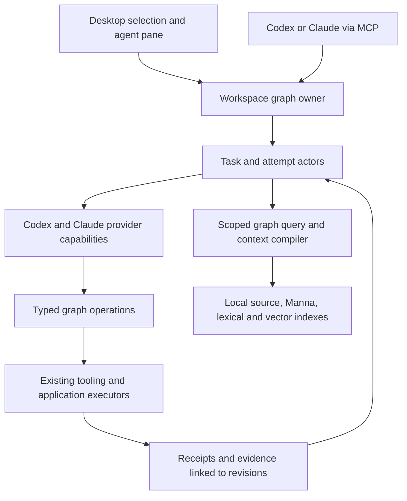

# Improving the agent layer through Reaktor's graph

Status: source-based design and delivery plan, 13 September 2026. The later [Agent Workspace design](https://reaktor.build/docs/reaktor-agent-workspace) adds researched harness adoption, six Pencil boards and a first implementation: shared Compare/Council plus desktop Team/Activity. The remaining graph/runtime design below is still proposed.

The graph is the foundation. Agent orchestration should compose Reaktor graph capabilities directly. The user's latest direction supersedes the mandatory graph-agnostic API rule and the corresponding packaging recommendation in the [tabs council](tabs-council-2026-09-13.md). Existing provider harnesses, protocol definitions, persistence and APIs remain useful; removing them solely to make every class inherit Node would add work without improving graph integration.

The target is one logical graph across application definitions, source, runtime activations, tasks, operations, data and evidence. It does not require one scheduler, a global transaction, or a live object for every historic event. Headless graph execution remains independent of workbench rendering.

## What the current implementation actually does

| Surface | Implemented | Gap that matters |
| --- | --- | --- |
| `KernelGraph` / `KernelAgentsNode` | A real graph node provides `KernelAgents` and connects to the operations provider. | It currently uses operations to find the workspace root; it does not route agent actions through those operations. |
| `AgentWorkspace` / connection | Shared local owner, authenticated MCP, request deduplication, bounded concurrency, cancellation, checkpointed runs and qualified continuation for Ask. | Runs are service records rather than a complete graph-owned task workflow. Kernel execution remains a separate path. |
| Desktop `AgentConversationState` | Provider/model, prompt, write toggle, recent conversations, stream observation and Stop. | Send does not supply selected graph/source context. The pane cannot steer a live turn or resolve provider input requests. |
| `AgentRuntime` | Started, text Delta, ToolUse and Finished events. | No interactive request/response contract, capability negotiation, tool result lifecycle or explicit waiting states. |
| `Protocol` / `Conductor` | Ask, All, Council, Pipeline and Planned; peer visibility; provider session references. | Workspace submissions now select Single/Compare/Council. Native continuation remains restricted to Ask. Parallel round results are appended after all participants finish. |
| `ContextPacket` / compiler | Bounded, scoped evidence; omissions and peer truncation are reported. | Entries lack individual revision/applicability metadata. Oversized packets are omitted whole. Full evidence retrieval and automatic graph selection are missing. |
| Local context | PostgreSQL/pgvector, Memgraph, cached local embeddings and authorized Manna export/import. | Manual refresh, no live revocation propagation, and no warm retrieval service connected to desktop submissions. |

These are code observations, not new end-to-end qualification results. Entry points: [workspace](../src/jvmMain/kotlin/dev/shibasis/reaktor/conductor/workspace/AgentWorkspace.kt), [runtime](../src/commonMain/kotlin/dev/shibasis/reaktor/conductor/AgentRuntime.kt), [Conductor](../src/commonMain/kotlin/dev/shibasis/reaktor/conductor/Conductor.kt), [context](../src/commonMain/kotlin/dev/shibasis/reaktor/conductor/ContextPacket.kt), [kernel graph](../../../bestbuds/modules/kernel/src/main/kotlin/ai/bestbuds/reaktor/kernel/KernelGraph.kt), [Chat state](../../../bestbuds/modules/engine/src/jvmMain/kotlin/ai/bestbuds/reaktor/workbench/render/compose/panes/AgentConversationState.kt).

## 1. Make tasks and execution part of the graph

Extend the existing workspace owner into a headless graph host. Framework agent capabilities belong in Conductor and the appropriate graph substrate/runtime modules; BestBuds contributes its application and operation bindings. The host must not depend on the BestBuds desktop. Desktop and external MCP clients attach to the same graph owner and reference the same task, attempt and operation IDs.

Represent a task's intent, acceptance criteria, selected subjects, participant specifications, attempts, decisions and evidence with typed graph references. Keep task identity stable across provider switches; a provider session belongs to an attempt and carries its own identity and generation. Protocol stage dependencies, conversation parentage and artifact derivation are distinct edge types. Reuse the existing thread/event records through a versioned mapping instead of creating a competing conversation authority.

Use graph-owned actors/mailboxes for ordered task commands and asynchronous completions. A model call must not block the mailbox; completion carries attempt identity and generation. Cancellation, retries and late results cannot revive an old attempt. Each owner declares which resources it owns and which it borrows. Closing a conversation tab releases observation; explicit cancellation controls the agent run. Closing the host has a separately defined shutdown/recovery behavior.

Proposed composition, not current public API:

## 2. Give agents the same operations as humans

Compose the existing kernel operation path into that graph host. Expose bounded discovery, inspect/query, prepare, execute, observe and cancel through typed capability descriptors. Each operation names its subjects, input/output schema, applicable revision, effects and evidence contract. MCP and desktop are transports/presentations of those contracts. Merely finding a provider port is not enough to export it: callable operations need explicit descriptors and supported execution semantics.

Preserve the established path: scoped snapshot → proposal → typed command or source patch → validation → fingerprinted plan → effective grant/policy → execution → reconciliation → receipt. Previously granted routine work proceeds without another approval ceremony. Requested authority, effective authority and provider tool permissions remain separate facts.

Start with useful operations already backed by real executors: build affected modules, run selected checks, start/observe a preview, inspect graph subjects and prepare supported data reads. Reaktor supervises them and returns terminal summaries plus evidence references. The model should not repeatedly poll a process or rediscover the build command.

For existing-app users, expose business contracts such as creating a campaign or updating a Manna task through the application's graph. For greenfield development, compose repository setup, module contracts, source changes, local preview and acceptance checks into the same task model. Unsupported source transformations remain ordinary code changes with diagnostics and reconciliation; graph edits do not magically compile into arbitrary application code.

The current local bearer represents the OS owner. Kedarnath/client access needs server-resolved principal and workspace scope before exporting mutations. A provider's Bash or another MCP server can bypass Reaktor's command path unless its execution environment is constrained. Declare that coverage explicitly; `allowWrites` is not complete mediation.

## 3. Compile context from the selected graph objects

Selecting a tab, route, feature, query, service or failure should establish the task subjects. A bounded graph query finds relevant contracts, dependencies, source bindings, tests, observations and linked decisions. Exact identity and lexical retrieval should work before semantic ranking is added. Agents can fetch more by reference with explicit budgets.

Record per-entry source identity/revision, why it was included, freshness, coverage and applicability. Include working-tree changes and source hashes when a Git commit alone cannot identify the actual inputs. Show the packet in the pane, including exclusions. A source change invalidates affected evidence; changing focus alone does not invalidate an unrelated operation.

Keep stable instructions and unchanged evidence reusable; supply revision deltas rather than repeating the whole workspace inventory. Persist artifacts once and pass compact typed findings with references. Enforce whole-entry budgets so omission preserves provenance. Provider-loaded files, tools and native history need their own coverage statement; the packet is not a claim to contain everything the model saw.

Manna supplies requirements, tasks, goals and accepted decisions with source links. Generated findings remain proposals until accepted into the relevant source of truth. Superseded decisions remain traceable. This user's correction about the graph is a concrete example of why current decisions need precedence over old summaries.

## 4. Support interactive provider sessions

Keep providers replaceable beneath graph-owned task identity. Extend the runtime contract with typed events for tool start/result, input required, permission required, usage, artifacts and terminal outcome; commands cover continue, steer where supported, answer a specific pending request, interrupt and resume. Persist pending request IDs and their attempt scope. Surface supported capabilities rather than pretending both providers implement identical behavior.

Use Codex App Server as the primary interactive Codex adapter. Its documented protocol supports turn start, steering with an expected turn ID, interruption, item streams and scoped approval/input requests. Qualify the installed CLI's generated schema and behavior before enabling each feature. This is an integration path, not evidence that the current batch adapter already supports it. [Official OpenAI documentation](https://learn.chatgpt.com/docs/app-server).

For Claude, keep the working headless CLI for batch work and qualify a supported interactive adapter. The Agent SDK documents approval/question callbacks; where a small provider bridge is required, confine it to protocol translation while the graph host stays Kotlin/JVM. Do not assume private CLI control messages are a stable API, or that switching adapters automatically preserves the existing authentication setup. Test the intended sign-in path explicitly. [Claude programmatic use](https://code.claude.com/docs/en/headless), [approval and input callbacks](https://code.claude.com/docs/en/agent-sdk/user-input).

The pane then shows live actions, questions, concrete permission requests, diffs, checks and cost against one task. Users can steer work, switch providers with a retained handoff, or inspect a run while continuing in another tab. Arbitrary attachment to a running session in another application requires separate provider qualification.

## 5. Make council selective, bounded and resumable

The tabs experiment succeeded, but seven turns including verification consumed about 398,518 fresh input tokens and 39,760 output tokens, plus 1,590,900 cached input tokens. It has no matched single-agent baseline. Three original outputs exceeded the peer cap; complete verification recovered those tails. This establishes useful review findings and an expensive context path, not measured savings.

Represent Ask, review, council and pipeline as graph compositions over the same participant and operation capabilities. Keep the existing protocol vocabulary as presets. Default to one agent; add a bounded independent reviewer for a consequential change. Use a full council when alternative designs or unresolved disagreements justify it. Providers should remain interchangeable, without permanent architect/executor assignments.

Exchange validated findings: subject/revision, claim, evidence references, failure scenario, proposed correction and unresolved question. Store complete artifacts for retrieval. Independence requires isolation of peer artifacts and shared memory as well as prompt filtering. Reuse each participant's own session only when stage visibility permits it; do not fork an independent reviewer from a peer-exposed session.

Checkpoint each stage/attempt as it completes, while preserving deterministic presentation order. Do not rerun a completed stage simply because another participant failed. Enforce participant, context, time and turn budgets at scheduling boundaries; report provider usage uncertainty and possible in-flight overrun. Stop when acceptance evidence is sufficient, rather than forcing another consensus round.

## 6. Keep data local, with clear ownership

| Component | Job in the agent layer |
| --- | --- |
| Reaktor graph | Canonical semantic identity, contracts, relations and declared owners; it ties representations together. |
| Local Reaktor persistence | Task/attempt metadata, ordered event journal, pending requests, receipts, context manifests and artifact references. Migrate existing JSON checkpoints compatibly once the chosen transactional store is qualified. |
| Local source/artifact cache | Content-addressed source slices, diffs, logs and check outputs; page full artifacts on demand. |
| Local PostgreSQL + pgvector | Lexical/semantic candidate retrieval for scoped evidence, with a warm local embedding process. It is not required for every task transition. |
| Local Memgraph | A rebuildable relationship index for bounded dependency/impact queries, useful where it outperforms direct graph traversal. It does not become a second semantic authority. |
| Manna | Authoritative product requirements, goals, tasks and decisions where Manna owns those records; subscribed local views accelerate reads. |

Keep the Reaktor data layer's separation of authority, replica and derived index. Do not force every application or mobile target to run PostgreSQL/Memgraph. Local query availability and unknown freshness must be truthful; remote mutations revalidate against the source. Incremental subscriptions need source cursors, tombstones and visibility changes before shared-client use.

Durable event records need sequence numbers and acknowledged checkpoint boundaries; UI updates can be coalesced independently. On restart, uncertain external effects require reconciliation. Retrying an observation is different from replaying an application write. Durable recording alone does not establish exactly-once external effects.

## Delivery order and acceptance

| Slice | Concrete change | Proof before moving on |
| --- | --- | --- |
| 1 — graph-owned task loop | Extend the headless owner with graph task identity, selected subjects and existing operation bindings. Pass a bounded context packet from desktop and MCP. | Select a BestBuds graph subject, run an agent task and a real affected check. Desktop/MCP show the same task, operation and evidence IDs. Closing the tab leaves the task alive. |
| 2 — interactive sessions and durable events | Add runtime requests/responses, capability discovery, waiting states and event/request persistence. Integrate Codex first and qualify Claude's adapter. | Start, steer where supported, answer, interrupt and resume; reconnect during a pending request; reject stale responses; recover without replaying uncertain effects. |
| 3 — context and review | Connect warm local retrieval and Manna selection; add typed findings, full artifact fetch and per-stage checkpoints. Expose review/council in the same pane and MCP service. | Repeat the tabs design against the same frozen source. Compare completeness, uncached/cache/output tokens, repeated reads, latency and human corrections with single-agent and council baselines. |
| 4 — greenfield and app operation | Compose reusable graph recipes and delegated application capabilities. | Build a small app from an empty folder, add a second feature, verify actual behavior; exercise one existing-app action as owner and scoped collaborator, including denial and stale-plan cases. |

The graph/navigation fixes discovered in the tabs council are part of the relevant tab delivery: serialized transitions, entry identity/payload activation and explicit ownership cleanup. They must not become a requirement to finish the entire proposed Surface system before the agent loop can improve. The tab capability itself belongs directly to the graph.

For this user's workload, measure accepted functionality and evidence quality alongside cost. The previous history audit found repeated source discovery, long contexts, process polling and cross-provider handoffs. Its 20–30% reduction band remains a counterfactual planning estimate. The first benchmark should use held-out BestBuds/Reaktor tasks of comparable scope with the same verification bar; local speed or fewer tokens alone does not prove more completed functionality.

## Architecture sources

This plan follows the existing [Living Graph](../../../bestbuds/targets/reaktorWeb/docusaurus/docs/reaktor-unified-system-graph.md), [atlas agent workflows](../../../bestbuds/targets/reaktorWeb/docusaurus/docs/reaktor-atlas-revamp-5.6-ultra.md), [stable foundations](../../../bestbuds/targets/reaktorWeb/docusaurus/docs/reaktor-stable-foundations-5.6-ultra.md), [agentic tooling](../../../bestbuds/targets/reaktorWeb/docusaurus/docs/reaktor-agentic-tooling.md) and [data graph](../../../bestbuds/targets/reaktorWeb/docusaurus/docs/reaktor-data-graph.md), while distinguishing their design targets from the current source. The current graph-first direction is recorded in [AGENTS.md](../../AGENTS.md).
