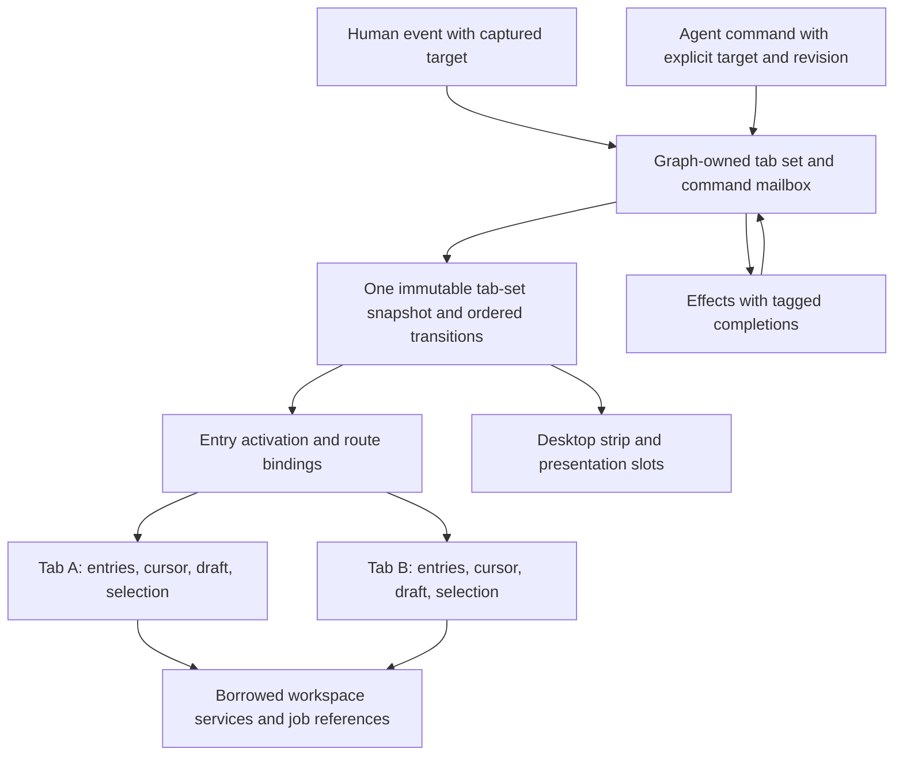

# Tabs design council — 13 September 2026

Status: design experiment completed; tab navigation is not implemented by this change.

**Updated architecture decision, 13 September:** tabs and navigation belong directly to Reaktor's graph. The original council's independently usable, graph-neutral controller recommendation is superseded by the user's direction that the graph is Reaktor's foundation; a separate graph-agnostic API is unnecessary. The historical council outputs and measurements below remain unchanged. The [graph-based agent layer plan](graph-agent-layer-2026-09-13.md) applies this correction across Conductor and the workbench.

Start with two real document flows on screen, each with its own history and editor state, over explicitly shared workspace services. A graph-owned tab set serializes navigation commands and owns activation lifetime. The complete proposed Surface kernel remains a later integration point.

## Experiment

The existing Conductor `Council` protocol ran two independent proposals, two cross-critiques and a Codex synthesis. Participants were GPT-6 Astra through Codex CLI 0.154.0 and Claude Opus 5 through Claude Code 2.1.270, both at high reasoning effort. Five provider turns completed successfully in 401.6 seconds. Both CLIs were upgraded from their existing npm installations; their actual authenticated inference paths were checked before the council.

Each participant received the same frozen working-tree evidence: Surface's tabs/seats proposal, navigation/runtime/rendering code, Desktop navigation/history, and the architecture rules. Source hashes and ranges were recorded. Original proposals could not see each other's answers through the context compiler; the source packet contained no peer output. Editing was disabled; Claude had only Read/Glob/Grep and an empty MCP configuration, while Codex used its read-only sandbox and ignored user configuration for this experiment. These flags do not claim a universal security boundary for arbitrary provider tools.

This exercised the standalone Conductor council. It did not make council runs available in the desktop workspace service or register global MCP configuration.

## Recommended ownership



- **Graph-runtime:** the tab set is a graph-owned capability with durable IDs, typed route contracts, entries and cursor, immutable snapshots, a serialized command mailbox and tagged effect completion. Adapt legacy navigation to that same owner; construct/dispose owned entry activations, bind borrowed services and render committed history. A separate graph-free controller or parallel navigation store is unnecessary. Extend the existing sealed `NavCommand` in its defining module when needed, or bridge typed tab commands through the graph-owned capability.
- **Graph UI / platform adapters:** keyed content rendering, focus/back handling, presentation slots and browser history integration.
- **BestBuds engine:** workbench intents, the mode launcher, tab chrome, draft persistence policy, close decisions and job observation.
- **Surface:** later bind the graph-owned tab capability to the proposed `TabHost`/`Candidate`/layout contracts. Existing `reaktor-core` Fact is real; the entire proposed Surface API is not implemented.

The graph-owned tab set owns membership and activation lifetime. Each content owner mutates its own content state. Shared application, connection and agent-job owners remain outside individual views.

## Identity and command contract

Separate four identities: a route definition identifies a destination contract; a TabId identifies an independent flow; an EntryId identifies one visit; an activation generation identifies the currently mounted runtime instance. Reorder and movement between slots preserve the TabId. Reactivation may change the generation. Opening the same definition twice must produce separate entry/view state.

Illustrative contracts, not compiled APIs:

```kotlin
data class Entry(val id: EntryId, val route: RouteRef, val state: StateRef?)
data class TabFlow(val id: TabId, val generation: Long,
                   val entries: List<Entry>, val cursor: Int)
data class TabSetSnapshot(val revision: Long, val tabs: List<TabFlow>,
                          val slots: List<SlotAssignment>, val focused: TabId?)
data class Command(val id: CommandId, val set: TabSetId,
                   val incarnation: Long, val target: TabId?,
                   val expected: Preconditions, val operation: TabOperation)
data class CloseToken(val id: TokenId, val tab: TabId,
                      val incarnation: Long, val generation: Long,
                      val draftRevision: Long)
```

The controller publishes one coherent snapshot. Graph back stacks are a projection of entries up to the cursor; callers cannot independently mutate both authorities. A bounded ordered transition stream supports effectful adapters, with revision-gap recovery from the snapshot. A conflated StateFlow alone is not a command log.

Human adapters capture the target at the key/pointer event. Agents supply an explicit target and precondition. Preconditions cover the state the operation changes: set membership/order for set operations, tab generation/history revision for navigation, and draft revision for draft decisions. An unrelated focus change must not invalidate every agent command. Opening reserves an identity and returns a receipt; dependent navigation uses that identity, not whichever tab happens to be focused later. Asynchronous effects run outside the command owner and return through it with generation/revision checks. A slow close dialog must not stall every tab.

## User flows

1. **Open a graph alongside another:** open `GraphScope(app, revision, scope)` with a new TabId and an `Alongside` presentation request. Both views may inspect the same underlying application runtime, but have independent selection, viewport and navigation state. Duplicating the inspected runtime is not required.
2. **Open two queries:** create two editor/document states over one explicitly borrowed connection service. Each keeps its own draft, result view, selection and history. A query job has a separate identity and owner.
3. **Follow an agent result:** open a run view beside a graph/source view. Closing its tab detaches observation. Cancelling the run is a separate explicit operation; workspace ownership determines whether the job continues.
4. **Close dirty content:** record a close token and draft revision, return a pending decision, and continue processing other commands. Save/discard/keep resolves that exact token. Further editing invalidates an old approval. A failed save blocks save-and-close or automatic eviction; explicit discard remains a distinct, revision-bound user choice. Cancelling retires the token even if the document revision does not change. After close, focus a surviving tab in the same slot using the declared MRU/adjacency policy; collapse an empty slot without destroying other tabs.
5. **Narrow and widen:** layout changes slot assignment, not membership, history or draft identity. Preserve the focused visible flow. Restore eligible presentation preferences when space returns; overflow remains keyboard-accessible.
6. **Reopen or restart:** restore versioned intents, entries/cursor and acknowledged draft state. Use a fresh activation generation. Restore no credentials, live handles, services or deferred continuations; report abandoned results and unknown work references without replaying effects. Explicitly discarded edits stay discarded: a closed-tab ring must not silently resurrect them, and late draft writes must be fenced by the discard revision.

Keep view selectors inside a screen, coupled list/detail panes within one flow, and independent document tabs as different concepts. The mode rail launches/reuses documents; it does not become another tab-history authority. Preserve existing fixed-section behavior during migration; reselect-to-root and root-back-to-home are product policy choices, not newly assumed framework laws.

## Source contradictions the design must address

| Claim or shortcut | Current source evidence | Required correction |
| --- | --- | --- |
| Navigation already has a serialized channel | `NavigationCapabilityImpl.dispatch` directly mutates bindings/stacks; `Graph` forwards into a private navigation implementation | Establish serialization and route legacy commands through the same owner |
| A graph per tab solves all route state | `RouteNode` constructs one mutable binding; Push/Replace update it, while Pop/Return do not reactivate the revealed payload | Give repeated visits entry-scoped state and defined activation on cursor changes |
| Results naturally settle on close | Removed pending results can be orphaned; `Graph.close` omits its composed navigation cleanup | Settle unresolved results exactly once across removal, replacement, clear and disposal; preserve successful Return and already-completed Unit results |
| Moving pane nodes makes editor state independent | Desktop panes consume shared workspace state providers | Split per-document editors/views from shared connections and jobs; verify the actual provider ownership |
| A hidden tab has zero work and leases | Current lifecycle has no enforced pause axis; the proposal also permits hidden Idle work | Separate presentation resources from declared jobs; require acknowledged quiescence before claiming Frozen |
| Browser tabs implement the same in-process host | Page-script window opening and browser history do not provide full tab-set control | Default the workbench to in-page documents; qualify external windows separately |
| Capture-close-restore makes transfer safe | Failure after ownership commit cannot restore source write authority safely | Defer transfer; later require preparation, committed ownership, fencing and crash recovery |

These are source observations and proposed fixes, not newly executed navigation regression tests. The final evidence supplement confirms RouteBinding's mutable payload, Node cleanup and workspace agent ownership. Parent DI lookup exists, but shared ports must actually be registered or explicitly connected; parent location alone is insufficient.

## Retention, web and accessibility

Hidden means unpresented. Idle may retain declared work. A proposed `Freezing(deadline)` can become Frozen only after owned presentation tasks acknowledge quiescence; timeout leaves a truthful running/idle state with a finding. Arbitrary coroutine suspension is not guaranteed by setting an activity flag. Draft writes need ordered revisions, durability acknowledgements and visible failure; automatic eviction must wait for the acknowledgement it relies on.

Use in-page document tabs for Reaktor's workbench. One browser-history adapter restores exact tab/entry cursors for Back and Forward without echoing its own transition. A policy is still needed for browser-history entries targeting closed tabs; the council recommended avoiding automatic reopening, but this remains a product decision. Opening an external window must distinguish user-activation/popup failure from a committed in-page open. `window.open` may be blocked and has asynchronous navigation; it does not guarantee foreground focus. See [MDN window.open](https://developer.mozilla.org/en-US/docs/Web/API/Window/open) and [popstate](https://developer.mozilla.org/en-US/docs/Web/API/Window/popstate_event).

The tab strip needs keyboard navigation, visible focus, accessible close actions and reachable overflow. The standard ARIA tabs pattern presents one selected panel per tablist; a split document surface needs explicit editor groups/regions and tested selection semantics, rather than marking several panels selected under an unexamined single-tablist contract. See [WAI-ARIA Tabs Pattern](https://www.w3.org/WAI/ARIA/apg/patterns/tabs/). Seats, independent pointer routing and multi-window transfer remain later qualification work.

## Delivery and acceptance

1. **Runtime/controller foundation:** exact target identity, coherent revisions, repeated-route activation and navigation-result cleanup. Test Pop, Return, Replace, forward traversal, clear/dispose, stale completion and cross-graph forwarding. Preserve successful/previously completed results.
2. **Two real desktop documents:** independent graph/query state and histories, two visible slots, explicit borrowed services. Verify two views of one application and two query drafts over the same connection, focused Back, reorder and narrow/widen without state loss.
3. **Safe close and recovery:** revision-bound close decisions, acknowledged drafts, reopen and restart, source/run intents over established workspace job ownership. Test late saves, edit-after-approval, close/reopen ABA, stale draft writes, failed persistence and restore without rerunning jobs.
4. **Platform and retention qualification:** fixed-section parity, correct web Back/Forward, popup failure, accessibility, measured quiescence and memory retention. Window transfer and seats follow only after their ownership/input guarantees are demonstrated.

Items 1–3 are one first usable delivery, with internal checkpoints. Do not ship closable editable tabs while treating guarded close and acknowledged recovery as optional follow-up. Include keyboard switching/close/reopen, focus after close, exhausted-back behavior and accessible controls in that delivery.

## What the council contributed

Claude adopted Codex's single authoritative history, forward cursor and missing graph-navigation cleanup finding. Codex adopted Claude's continuous draft-persistence requirement and refined it to ordered durable acknowledgements. Cross-critique caught overclaims about all deferred results hanging, a proposed popstate implementation that could only go backward, and unsafe post-commit transfer rollback. Both converged on early co-presentation, explicit service ownership and postponing the unimplemented Surface kernel.

Remaining choices include closed-browser-history behavior, retention failure policy and future transfer schema. The revised recommendation places ordered transitions in the graph-owned tab capability and captures human targets at event time. This packaging correction came from the subsequent user direction, not agreement in the original council.

## Harness findings

The initial council's Codex parser concatenated progress messages with the terminal answer. Codex 0.154.0 emits both as completed `agent_message` records without a phase field in the captured probe. The parser now streams messages as before but saves the last completed message as its outcome. Non-init Claude system events no longer emit repeated Started events. Captured-shape regression coverage was added; conductor JVM verification passed 53 tests with one opt-in test skipped.

Three original responses exceeded the 6,000-character per-peer limit: Codex proposal 6,084; Claude proposal 7,112; Claude critique 6,403. Conductor emitted a truncation notice. The complete raw outputs were retained, and the synthesis explicitly acknowledged the missing peer tail. A subsequent independent verification round receives the full outputs plus missing source evidence. Original results are not rewritten to conceal the limitation.

The five-turn council reported 1,660,703 inclusive input tokens, of which 1,392,171 were cached, and 28,222 output tokens. Fresh input was 268,532 tokens. Reasoning output is already included in output and is not added again. These are provider-reported totals across tool/model iterations, not the unique size of the source packet. Claude reported $1.6186 in cost metadata; that is not a claim about incremental subscription billing, and Codex cost was unavailable.

No token-saving claim follows from this experiment: there was no comparable single-agent acceptance baseline. The council improved the design, but repeated source reading and fresh sessions per council stage were expensive. Next improve structured bounded findings, explicit retrieval of complete evidence by reference, stage-aware session continuation, durable partial-round results, and a council view in the shared workspace service. Do not increase every context limit indiscriminately.

## Final independent verification and host corrections

Both providers subsequently reviewed the complete council outputs and a source supplement in an independent `All(blind=true)` round. Both judged the first slice implementable with corrections. This round completed in 136.7 seconds and reported 328,715 inclusive input tokens (198,729 cached), 129,986 fresh input and 11,538 output tokens. It ran the corrected parsers: Codex's saved answer contained its last completed message, and Claude emitted one Started event for initialization. These figures are additional to the original council and exclude the small readiness/format probes.

The final review added operation-specific preconditions, explicit child disposal, first-slice focus/keyboard/close behavior, and a distinction between saved drafts and explicit discard. It also corrected the initial false claim that core Fact was absent. The following ownership questions were then checked directly by the host against additional source; they were not part of the original blind evidence:

- `ConsumerPort.close` disconnects its edge; `ProviderPort.close` disconnects consumers. Neither closes the provider's implementation. Explicit service-owner close methods still govern resource lifetime.
- `ConcurrencyCapabilityImpl` constructs `SupervisorJob()` without a parent and replaces the inherited Job in the combined context. Parent cancellation therefore cannot be assumed to dispose child graph scopes. The adapter needs an explicit owned-child disposal ledger and tests; do not report inherited cancellation as verified.
- `DatabaseWorkspaceState` already separates some ownership through `ownsSession` and `ownsDocuments`, and it has a document-session owner. Reuse those facilities. A per-tab view may borrow them with both flags false and a distinct document identity; its own inspection sessions are still closed by its close method. Confirm independence with integration tests before treating this as a drop-in migration.
- `AgentConversationState.close` cancels its UI observation scope. It does not issue `agent_cancel`. `KernelAgents` owns the shared workspace connection, and the existing AgentWorkspace already owns agent runs. Reuse that owner rather than inventing a second generic job registry for this feature.
- `ReaktorApps.bestBuds.graph` returns the existing `BestBuds` singleton, while the desktop workbench resolver returns its own root. A proposed cache must not blindly close every returned graph. Application handles need explicit owned/borrowed semantics and an owner-supplied release action; tabs only release their borrowed handle. Selection, graph scope and viewport remain per-tab even when the inspected runtime is shared.

Acceptance must therefore prove that closing one tab disposes its own entry graphs and observation tasks while leaving another tab, the BestBuds singleton, the workbench root, shared connections and workspace agent runs alive. These extra source checks narrow the design; they do not claim those tab behaviors have already been implemented or tested.
