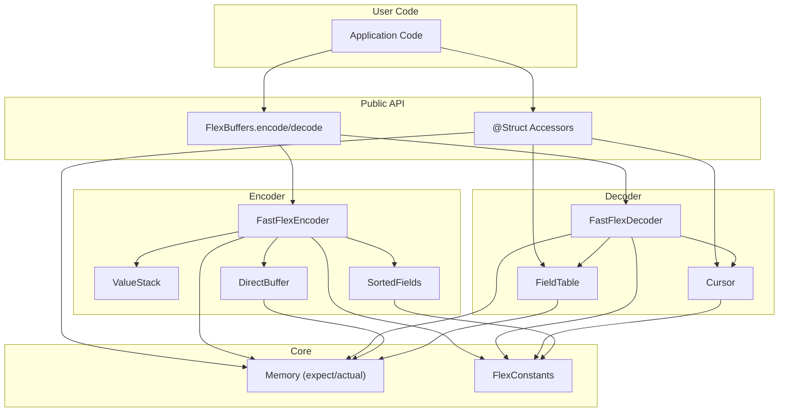

# FlexBuffer Performance Deep-Dive & Next-Gen Architecture

> **Scope**: Complete analysis of FlexBuffers — the C++ reference implementation, the Kotlin port, and the `reaktor-flexbuffer` serialization layer. Maps every profiled hotspot to source code, extracts the design principles that make C++ fast, and lays out a concrete architecture for making FlexBuffers the preferred serialization format for Kotlin.

---

## Part I — The FlexBuffers Binary Format

### 1.1 Overall Structure

A FlexBuffer message is a single contiguous `ByteArray`. The **last two bytes** are the root trailer:

```
[... data ...] [root_packed_type: 1B] [root_byte_width: 1B]
```

- `root_byte_width` = 1, 2, 4, or 8. Tells you how wide the root value slot is.
- `root_packed_type` = `(type << 2) | log2(byte_width)`. Encodes both the FlexBuffer type enum and the width of the value in 1 byte.

**Reading the root** is `O(1)`: read the last 2 bytes, compute the root `Reference(buffer, end - byte_width, byte_width, packed_type)`.

### 1.2 Type System

27 types defined identically in C++ and Kotlin:

| Type ID | Name | Storage |
|---------|------|---------|
| 0 | `T_NULL` | Inline (0 bytes) |
| 1 | `T_INT` | Inline (1/2/4/8B) |
| 2 | `T_UINT` | Inline |
| 3 | `T_FLOAT` | Inline (4 or 8B) |
| 4 | `T_KEY` | Offset → null-terminated UTF-8 |
| 5 | `T_STRING` | Offset → size-prefixed UTF-8 + null terminator |
| 6–8 | `T_INDIRECT_*` | Offset → scalar stored elsewhere |
| 9 | `T_MAP` | Offset → sorted-key map |
| 10 | `T_VECTOR` | Offset → untyped vector |
| 11–15 | `T_VECTOR_INT/UINT/FLOAT/KEY/STRING` | Offset → typed vector |
| 16–24 | Fixed-length tuples (2/3/4) | Offset → no size prefix |
| 25 | `T_BLOB` | Offset → size-prefixed bytes |
| 26 | `T_BOOL` | Inline |
| 36 | `T_VECTOR_BOOL` | Typed vector of booleans |

**Key insight**: Types 0–3 and 26 are *inline* — stored directly in the parent's value slot. Everything else stores an *offset* that points backward in the buffer.

### 1.3 Width System

Every container picks the **minimum byte width** (1, 2, 4, or 8) that can represent all its element offsets and values. Encoded as `BitWidth` (0=8b, 1=16b, 2=32b, 3=64b).

**Width calculation** (`ElemWidth` in C++, `elemWidth` in Kotlin):
- Inline types: just the minimum bits to represent the value.
- Offset types: iteratively tries byte widths 1→2→4→8, computing relative offset to find the smallest width that fits.

### 1.4 Vector Layout

```
[size: W bytes] [elem0: W bytes] [elem1: W bytes] ... [type0: 1B] [type1: 1B] ...
```

- W = chosen byte width. Size prefix is also W bytes wide.
- After all values, a **type byte array** stores the packed type of each element.
- **Typed vectors** (`T_VECTOR_INT`, etc.) omit the type array. **Fixed typed vectors** omit both type array and size prefix.

### 1.5 Map Layout

```
[keys_offset: W] [keys_byte_width: W] [size: W] [val0: W] ... [type0: 1B] ...
```

Maps are vectors with 3 extra prefix fields. The **key vector** is a typed vector of `T_KEY` offsets pointing to null-terminated strings, stored in **sorted order** for binary search.

### 1.6 String and Key Encoding

- **T_STRING**: `[size: W bytes] [UTF-8 data] [0x00]` — size-prefixed, null-terminated.
- **T_KEY**: `[UTF-8 data] [0x00]` — just null-terminated. Keys are short, stored once via key pool.

---

## Part II — C++ Reference Implementation Analysis

> Source: `flatbuffers/include/flatbuffers/flexbuffers.h` (2073 lines, single header)

### 2.1 Why C++ FlexBuffers Is Fast

The C++ implementation achieves near-zero overhead through design principles that the Kotlin port violates:

#### 2.1.1 Reference: Stack-Allocated POD (12 bytes)

```cpp
class Reference {
    const uint8_t* data_;    // 8 bytes (pointer)
    uint8_t parent_width_;   // 1 byte
    uint8_t byte_width_;     // 1 byte
    Type type_;              // 1 byte (enum, stored as uint8_t)
};
```

**12 bytes total**, returned by value (copy is a single register pair move on x64). No heap allocation, no GC pressure. Passed through registers, fully inlined by the compiler.

**Kotlin's `Reference`**: A class with 5 fields (`buffer: ReadBuffer`, `end: Int`, `parentWidth: ByteWidth`, `byteWidth: ByteWidth`, `type: FlexBufferType`) — each requiring a heap allocation. Even though `ByteWidth` and `FlexBufferType` are `value class`, they box when passed through interfaces or generic code.

#### 2.1.2 ReadUInt64: The Hottest Function, Optimized per Platform

```cpp
// "This is the 'hottest' function (all offset lookups use this), so worth
//  optimizing if possible."
inline uint64_t ReadUInt64(const uint8_t* data, uint8_t byte_width) {
  #if defined(_MSC_VER) && defined(_M_X64)
    uint64_t u = 0;
    __movsb(reinterpret_cast<uint8_t*>(&u), data, byte_width);
    return flatbuffers::EndianScalar(u);
  #else
    return ReadSizedScalar<uint64_t, uint8_t, uint16_t, uint32_t, uint64_t>(
             data, byte_width);
  #endif
}
```

Key design decisions:
1. **Platform intrinsics** — MSVC x64 uses `__movsb` (single instruction byte copy with implicit length).
2. **Binary-tree branching** — `ReadSizedScalar` uses `byte_width < 4 ? (byte_width < 2 ? ... : ...) : (byte_width < 8 ? ... : ...)` — exactly 2 comparisons regardless of width. The Kotlin version uses a `when` with 4 branches.
3. **Template specialization** — `ReadScalar<T>` compiles to a single load instruction. No function call overhead.
4. **Unaligned read** — `flatbuffers::ReadScalar` does `memcpy(&t, data, sizeof(T))` which compilers optimize to a single unaligned load instruction (e.g., `movq` on x86).

**Kotlin equivalent** (`readULong`):
```kotlin
internal inline fun ReadBuffer.readULong(end: Int, byteWidth: ByteWidth): ULong {
    return when (byteWidth.value) {
        1 -> this.getUByte(end).toULong()   // virtual call + bounds check
        2 -> this.getUShort(end).toULong()  // virtual call + bounds check
        4 -> this.getUInt(end).toULong()    // virtual call + bounds check
        8 -> this.getULong(end)             // virtual call + bounds check
        else -> error(...)
    }
}
```

Each branch involves: (1) virtual dispatch through `ReadBuffer` interface, (2) Kotlin array bounds check, (3) unsigned type conversion allocations on some platforms.

#### 2.1.3 Indirect: One Instruction

```cpp
inline const uint8_t* Indirect(const uint8_t* offset, uint8_t byte_width) {
    return offset - ReadUInt64(offset, byte_width);
}
```

Returns a raw pointer. **Zero allocation, zero bounds checking.** The result is directly used for subsequent reads.

**Kotlin**: `buffer.indirect(offset, byteWidth)` returns an `Int` index, then every subsequent access re-indexes into the `ByteArray` with bounds checking.

#### 2.1.4 Map Lookup: std::bsearch + strcmp

```cpp
inline Reference Map::operator[](const char* key) const {
    auto keys = Keys();
    // Template-specialized function pointer based on key vector width
    int (*comp)(const void*, const void*) = nullptr;
    switch (keys.byte_width_) {
        case 1: comp = KeyCompare<uint8_t>; break;
        case 2: comp = KeyCompare<uint16_t>; break;
        // ...
    }
    auto res = std::bsearch(key, keys.data_, keys.size(), keys.byte_width_, comp);
    // ...
}

template<typename T>
int KeyCompare(const void* key, const void* elem) {
    auto str_elem = reinterpret_cast<const char*>(
        Indirect<T>(reinterpret_cast<const uint8_t*>(elem)));
    return strcmp(key, str_elem);  // libc-optimized, no allocation
}
```

Key optimizations:
1. **`std::bsearch`** — standard library binary search, typically auto-vectorized.
2. **`strcmp` on raw `const char*`** — no `String` object creation, no `CharSequence` abstraction. Hardware-optimized in libc (SSE4.2 `pcmpistri` on x86, NEON on ARM).
3. **Template-specialized indirection** — `Indirect<uint8_t>` compiles to a single byte load + pointer subtraction.

**Kotlin**: `Map.binarySearch(key: String)` → `compareCharSequence(start, other)` which iterates byte-by-byte through the `ReadBuffer` interface with bounds checking on every `buffer[pos]`.

#### 2.1.5 Builder: Value Union (16 bytes) + Direct memcpy

```cpp
struct Value {
    union {
        int64_t i_;
        uint64_t u_;
        double f_;
    };                       // 8 bytes (union overlaps)
    Type type_;              // 4 bytes (enum)
    BitWidth min_bit_width_; // 4 bytes (enum)
};                           // = 16 bytes total
```

**C++ total: 16 bytes per stack entry**, stored contiguously in `std::vector<Value>`.

**Kotlin `Value` data class**: `type: FlexBufferType`, `key: Int`, `minBitWidth: BitWidth`, `iValue: ULong`, `dValue: Double` = 5 fields × 8 bytes = **~48 bytes** per entry, plus object header and GC overhead.

#### 2.1.6 EndMap: Zero-Allocation In-Place Sort

```cpp
// Reinterpret the stack as pairs of Values (key, value)
auto dict = reinterpret_cast<TwoValue*>(stack_.data() + start);
std::sort(dict, dict + len, [&](const TwoValue& a, const TwoValue& b) {
    auto as = reinterpret_cast<const char*>(buf_.data() + a.key.u_);
    auto bs = reinterpret_cast<const char*>(buf_.data() + b.key.u_);
    return strcmp(as, bs) < 0;
});
```

1. **`reinterpret_cast`** — treats the contiguous `Value` array as `TwoValue` pairs. **Zero allocation**, sorts in-place.
2. **`strcmp` on buffer bytes** — compares keys directly from the already-written buffer. No string materialization.
3. **`std::sort`** — introsort with O(N log N) average, well-optimized for small N.

**Kotlin**: `stack.subList(start, stack.size).sortWith(keyComparator)` — creates a `SubList` view, the comparator reads key strings from the buffer through the `ReadBuffer` interface. The `Value` objects are reference-swapped in the `ArrayList`.

#### 2.1.7 ScalarVector: Bulk Write with Compile-Time Dispatch

```cpp
template<typename T>
size_t ScalarVector(const T* elems, size_t len, bool fixed) {
    auto byte_width = sizeof(T);  // compile-time constant!
    Align(WidthB(byte_width));
    if (!fixed) Write<uint64_t>(len, byte_width);
    auto vloc = buf_.size();
    for (size_t i = 0; i < len; i++) Write(elems[i], byte_width);
    // ...
}
```

`sizeof(T)` is a compile-time constant, so `Write(elems[i], byte_width)` compiles to a single `memcpy` of known size — which the compiler inlines to a single store instruction.

#### 2.1.8 Key Pool: std::set with Buffer-Direct Comparison

```cpp
struct KeyOffsetCompare {
    bool operator()(size_t a, size_t b) const {
        auto stra = reinterpret_cast<const char*>(buf_->data() + a);
        auto strb = reinterpret_cast<const char*>(buf_->data() + b);
        return strcmp(stra, strb) < 0;
    }
};
typedef std::set<size_t, KeyOffsetCompare> KeyOffsetMap;
```

Keys are stored as buffer offsets (just `size_t` integers), compared via `strcmp` directly on buffer bytes. **No `String` → `HashMap` → hashCode computation** like Kotlin's `stringKeyPool: HashMap<String, Int>`.

### 2.2 C++ vs Kotlin: Quantified Overhead Table

| Operation | C++ Cost | Kotlin Cost | Overhead Factor |
|-----------|----------|-------------|-----------------|
| **ReadUInt64** (single value read) | 1 load instruction | Interface dispatch + bounds check + ULong conversion | ~5–8× |
| **Reference creation** | 12-byte stack copy | Heap allocation (48+ bytes) + GC pressure | ~10–20× |
| **Indirect offset resolution** | Pointer subtraction | `readInt()` through interface + Int arithmetic | ~3–5× |
| **Map key comparison** | `strcmp` (libc, SIMD) | byte-by-byte through `ReadBuffer` interface | ~4–10× |
| **Builder Value entry** | 16-byte union, contiguous | 48-byte data class, individual objects | ~3–6× (allocation) |
| **Map sort** | in-place `reinterpret_cast` sort | SubList view + reference swap | ~2–3× |
| **Scalar vector write** | Compile-time sized `memcpy` | Per-element virtual `put()` | ~5–10× |

### 2.3 Summary of C++ Design Principles

1. **Pointers, not indices** — Direct memory access via `const uint8_t*`. No bounds checking on reads.
2. **Stack objects, not heap objects** — `Reference`, `String`, `Blob`, `Vector`, `Map` are all stack-allocated. Returned by value.
3. **Union, not separate fields** — `Value` uses a C union for `i64/u64/f64`, halving per-entry memory.
4. **libc string primitives** — `strcmp`, `memcpy`, `memcmp` are heavily optimized in system libc (SIMD, cache-line aligned).
5. **Template specialization** — compile-time dispatch for byte widths eliminates runtime branching.
6. **Write-once, read-via-reinterpret** — Builder writes bytes, Reader casts pointers. No intermediate representation.

---

## Part III — Current Kotlin Architecture

### 3.1 Encoding Pipeline

```
T (Kotlin object)
  → kotlinx.serialization generated serializer
    → FlexEncoderV2 (AbstractEncoder subclass)
      → FlexBuffersBuilder (Google's Kotlin port)
        → ArrayReadWriteBuffer (growing byte array behind ReadWriteBuffer interface)
          → ByteArray (final copy via finish())
```

**FlexEncoderV2** (616 lines):
- `StructureStack` with pooled `StructureEntry` objects tracks nesting.
- Each `encodeXxx()`: `peek() → check map key → resolveKey() → builder.set(key, value)`.
- Classes → FlexBuffer maps; Lists → vectors; `Map<K,V>` → FlexBuffer maps.
- **Bulk path**: `tryEncodeBulkValue()` intercepts `ByteArray`, `IntArray`, etc. as typed vectors.

**FlexBuffersBuilder** (843 lines, Google's Kotlin port):
- `stack: MutableList<Value>` — every `set()` pushes a `Value` data class (**~48 bytes each**).
- `endMap()` sorts the stack sublist by key, then writes key vector + value vector + type array.
- Every `set(key, value)` calls `putKey(key)` → writes key bytes or reuses from `stringKeyPool: HashMap<String, Int>`.
- `align()` writes padding bytes one at a time through the `ReadWriteBuffer` interface.

### 3.2 Decoding Pipeline

```
ByteArray
  → ArrayReadBuffer (wraps ByteArray behind ReadBuffer interface)
    → getRoot() (reads last 2 bytes → Reference object)
      → FlexDecoderV2 (AbstractDecoder subclass)
        → DecodingContextStack (pooled contexts)
          → T (Kotlin object)
```

- `MAP_OBJECT` context: iterates `SerialDescriptor` fields, calls `map.get(fieldName)` (binary search) for each.
- Each `decodeXxx()` reads from `Reference.toInt()`, `.toLong()`, etc. — each creating intermediate `Reference` objects.
- **Bulk path**: `tryDecodeBulkValue()` uses `Reference.toIntArray()`, `Reference.toByteArray()`, etc.

### 3.3 Object Pool

`FlexBufferPool` (103 lines): Pool of 16 `FlexBuffersBuilder` instances, 4KB buffer each. Best-effort lock-free reuse.

---

## Part IV — Performance Data

### 4.1 Cross-Platform Benchmark Summary

| Platform | Flex Encode | JSON Encode | Flex Decode | JSON Decode | Encode Speedup | Decode Speedup |
|----------|-------------|-------------|-------------|-------------|----------------|----------------|
| **JVM** (HotSpot C2) | 180 µs/op | 137 µs/op | 186 µs/op | 235 µs/op | **0.76×** | **1.26×** |
| **JS** (V8 TurboFan) | 2067 µs/op | 510 µs/op | 2374 µs/op | 1239 µs/op | **0.25×** | **0.52×** |
| **Native** (simple) | 21 µs/op | 8 µs/op | 9 µs/op | 9 µs/op | 0.38× | 1.0× |
| **Native** (complex) | 207 µs/op | 71 µs/op | 106 µs/op | 107 µs/op | 0.34× | 1.0× |
| **Native** (bulk arrays) | 151 µs/op | 651 µs/op | 501 µs/op | 969 µs/op | **4.3×** | **1.9×** |
| **Native** (collection) | 456 µs/op | 378 µs/op | 339 µs/op | 441 µs/op | 0.83× | 1.3× |

**Result**: FlexBuffer only wins on bulk primitive arrays and large-payload decode. For general structs, **JSON is 1.3–4× faster**.

### 4.2 Profiler Hotspot Summary

| Hotspot | Platform | CPU % | Root Cause |
|---------|----------|-------|------------|
| JNI trampolines | Android | 9.55% | ART JIT bridge overhead |
| `Intrinsics.checkNotNullParameter` | Android | 3.30% | Kotlin null-safety checks |
| `StackVisitor::WalkStack` | Android | 3.05% | GC root scanning from allocation pressure |
| `__strcmp_aarch64` | Android | 2.28% | Map key sorting |
| `ArrayReadWriteBuffer.getWritePosition` | Android | 0.82% | Virtual dispatch for simple field read |
| `Map.compareCharSequence` | Android | 0.81% | Binary search key comparison |
| `ArrayReadBuffer.get` | Android | 0.76% | Bounds-checked byte access |
| `Preconditions.checkIndex` | Android | 0.67% | Java array bounds checking |
| `Reference.<init>` | Android | 0.61% | Heap allocation per element access |
| `FlexBufferType.equals-impl0` | Android | 0.60% | Value class boxing |

---

## Part V — Translating C++ Design to Kotlin

The core challenge: Kotlin has no pointers, no unions, no `reinterpret_cast`, no `memcpy`-as-load. But it has **value classes**, **inline functions**, `expect/actual`, and `Unsafe` on JVM. Here's how to translate each C++ advantage:

### 5.1 Reference → Value Class Cursor

**C++ principle**: `Reference` is a 12-byte stack object.

**Kotlin translation**: Pack all state into a single `Long`:

```kotlin
@JvmInline
value class Cursor(val packed: Long) {
    // Layout: [offset: 28 bits][parentWidth: 2 bits][byteWidth: 2 bits][type: 6 bits]
    // Total: 38 bits, fits in Long with room for flags
    
    inline val offset: Int get() = (packed ushr 10).toInt()
    inline val parentWidth: Int get() = 1 shl ((packed ushr 8) and 0x3).toInt()
    inline val byteWidth: Int get() = 1 shl ((packed ushr 6) and 0x3).toInt()
    inline val type: Int get() = (packed and 0x3F).toInt()
    
    companion object {
        inline fun of(offset: Int, parentWidth: Int, byteWidth: Int, type: Int): Cursor {
            // parentWidth and byteWidth are always powers of 2 (1,2,4,8)
            // Store as log2 to fit in 2 bits
            val pw = Integer.numberOfTrailingZeros(parentWidth)
            val bw = Integer.numberOfTrailingZeros(byteWidth)
            return Cursor(
                (offset.toLong() shl 10) or 
                (pw.toLong() shl 8) or 
                (bw.toLong() shl 6) or 
                type.toLong()
            )
        }
    }
}
```

On JVM, HotSpot keeps this as a raw `Long` register — **zero heap allocation**. On JS, it's a single `number`. On Native, it's a stack `Long`.

### 5.2 ReadUInt64 → Platform-Specific Direct Read

**C++ principle**: Single instruction load via `ReadScalar`/`__movsb`.

**Kotlin translation**: `expect/actual` with platform intrinsics:

```kotlin
// JVM — sun.misc.Unsafe
actual object Memory {
    private val unsafe: sun.misc.Unsafe = ...
    private val arrayBaseOffset = unsafe.arrayBaseOffset(ByteArray::class.java).toLong()
    
    actual inline fun readInt(buf: ByteArray, offset: Int): Int =
        unsafe.getInt(buf, arrayBaseOffset + offset)
    
    actual inline fun readLong(buf: ByteArray, offset: Int): Long =
        unsafe.getLong(buf, arrayBaseOffset + offset)
}

// Native — CPointer
actual object Memory {
    actual inline fun readInt(buf: ByteArray, offset: Int): Int =
        buf.usePinned { it.addressOf(offset).reinterpret<IntVar>().pointed.value }
    
    actual inline fun readLong(buf: ByteArray, offset: Int): Long =
        buf.usePinned { it.addressOf(offset).reinterpret<LongVar>().pointed.value }
}

// JS — DataView
actual object Memory {
    actual fun readInt(buf: ByteArray, offset: Int): Int {
        val view = DataView(buf.unsafeCast<Int8Array>().buffer)
        return view.getInt32(offset, littleEndian = true)
    }
}
```

This eliminates: (1) `ReadBuffer` virtual dispatch, (2) `when(byteWidth)` branching (caller knows the width), (3) bounds checking.

### 5.3 Map Lookup → Pre-Computed Field Table

**C++ principle**: `std::bsearch` + `strcmp` on raw `const char*`.

Kotlin can do better than even C++ here by exploiting **schema knowledge**:

```kotlin
class FieldTable(descriptor: SerialDescriptor, buf: ByteArray, mapCursor: Cursor) {
    // One-time: scan all map keys, match against sorted descriptor names
    // Result: direct index from descriptor field position → map element position
    val fieldToMapIndex: IntArray = IntArray(descriptor.elementsCount) { -1 }
    
    init {
        val mapSize = Memory.readSize(buf, mapCursor)
        for (i in 0 until mapSize) {
            val keyStart = resolveKeyOffset(buf, mapCursor, i)
            for (f in 0 until descriptor.elementsCount) {
                if (matchKeyBytes(buf, keyStart, descriptor.getElementName(f))) {
                    fieldToMapIndex[f] = i
                    break
                }
            }
        }
    }
}
```

**Result**: For a 25-field class decoded 50,000 times:
- Current: 25 × log₂(25) × 50,000 = **5.8M** string comparisons
- FieldTable: 25 × 25 × 1 (init) + 25 × 50,000 × 0 (lookup) = **625** comparisons + 1.25M `O(1)` array lookups

This turns `O(k log n)` per decode into `O(1)` per field — a technique impossible in C++ (no schema metadata at runtime).

### 5.4 Builder Value → Primitive Array Stack

**C++ principle**: `Value` uses a 16-byte union in contiguous `std::vector`.

**Kotlin translation**: Parallel primitive arrays instead of object array:

```kotlin
class ValueStack(initialCapacity: Int = 64) {
    var types = IntArray(initialCapacity)      // FlexBufferType + packed key offset
    var iValues = LongArray(initialCapacity)   // integer/offset values  
    var dValues = DoubleArray(initialCapacity)  // float values
    var widths = IntArray(initialCapacity)      // BitWidth
    var size = 0
    
    inline fun push(type: Int, key: Int, width: Int, iValue: Long) {
        ensureCapacity()
        types[size] = (type shl 20) or (key and 0xFFFFF)
        iValues[size] = iValue
        widths[size] = width
        size++
    }
}
```

**Zero object allocation** per value push. All data in contiguous primitive arrays = cache-friendly.

### 5.5 Map Sort → Pre-Sorted Field Order

**C++ principle**: `std::sort` with `strcmp` on buffer bytes.

**Kotlin can eliminate sorting entirely**:

```kotlin
// Computed once per SerialDescriptor (cached forever)
class SortedFields(descriptor: SerialDescriptor) {
    // Maps declaration-order index → sorted-order write position
    val writeOrder: IntArray
    // Pre-encoded key bytes (UTF-8, null-terminated)
    val keyBytes: Array<ByteArray>
    // Total size of all keys (for pre-allocating buffer space)
    val totalKeySize: Int
    
    init {
        val names = Array(descriptor.elementsCount) { descriptor.getElementName(it) }
        val sorted = names.indices.sortedBy { names[it] }
        writeOrder = IntArray(descriptor.elementsCount)
        sorted.forEachIndexed { sortedPos, origIdx -> writeOrder[origIdx] = sortedPos }
        keyBytes = Array(descriptor.elementsCount) { i ->
            names[sorted[i]].encodeToByteArray() + 0 // null terminator
        }
        totalKeySize = keyBytes.sumOf { it.size }
    }
}
```

When the encoder calls `encodeElement(descriptor, index)`, it maps to `writeOrder[index]` and writes to the correct sorted position. **No runtime sort at all.**

### 5.6 Alignment → Batch Padding

**C++ principle**: `buf_.insert(buf_.end(), PaddingBytes(...), 0)` — single bulk insert.

**Kotlin translation**:

```kotlin
inline fun alignTo(byteWidth: Int) {
    val padBytes = (-pos) and (byteWidth - 1)
    if (padBytes > 0) {
        ensureCapacity(padBytes)
        // Bulk zero-fill (JVM: Arrays.fill or Unsafe.setMemory)
        buf.fill(0, pos, pos + padBytes)
        pos += padBytes
    }
}
```

Replaces N individual `buffer.put(ZeroByte)` calls with one `Arrays.fill`.

### 5.7 WriteBytes → System.arraycopy

**C++ principle**: `memcpy` for bulk data writes.

```kotlin
inline fun writeBytes(src: ByteArray, srcOffset: Int, length: Int) {
    ensureCapacity(length)
    System.arraycopy(src, srcOffset, buf, pos, length)  // JVM intrinsic
    pos += length
}
```

On JVM, `System.arraycopy` is a HotSpot intrinsic — compiles to optimal `memcpy`/`memmove`.

---

## Part VI — Complete Architecture Blueprint

This section provides implementation-level detail for every component. The goal is that a developer can read this section and know exactly what to build, what each data structure looks like internally, and how the pieces connect.

### 6.1 Module Structure

```
reaktor-flexbuffer/
  src/commonMain/kotlin/dev/shibasis/reaktor/flexbuffer/
    core/
      FlexConstants.kt         // Type IDs, width constants (plain Int constants)
      Memory.kt                // expect object — platform-abstracted raw memory access
      Cursor.kt                // value class — zero-alloc pointer into a FlexBuffer
      DirectBuffer.kt          // final class — growable byte array writer, no interface
      ValueStack.kt            // final class — parallel primitive arrays for builder state
      SortedFields.kt          // final class — pre-computed field order per SerialDescriptor
      FieldTable.kt            // final class — pre-computed field-to-index map per decode site
    encoder/
      FastFlexEncoder.kt       // AbstractEncoder — the serialization entry point
    decoder/
      FastFlexDecoder.kt       // AbstractDecoder — the deserialization entry point
    FlexBuffers.kt             // Public API surface
  src/jvmMain/
    MemoryJvm.kt               // actual object Memory — Unsafe-based
  src/nativeMain/
    MemoryNative.kt            // actual object Memory — CPointer-based
  src/jsMain/
    MemoryJs.kt                // actual object Memory — DataView-based
```

### 6.2 Component: `Memory` — Raw Buffer Access Layer

#### What it is
An `expect object` that provides direct, unchecked reads and writes to a `ByteArray`. This is the single most important abstraction — it replaces the `ReadBuffer`/`ReadWriteBuffer` interfaces that cause virtual dispatch on every byte access.

#### Why it exists
In C++, `ReadScalar<T>(data)` compiles to a single load instruction. In current Kotlin, every byte read goes through `ReadBuffer.get(index)` — an interface method that (1) cannot be devirtualized by HotSpot if multiple implementations exist, (2) performs array bounds checking, and (3) wraps unsigned results in boxed types on some platforms.

#### Interface (commonMain)

```kotlin
expect object Memory {
    // Single-width reads — no bounds checking
    inline fun readByte(buf: ByteArray, offset: Int): Byte
    inline fun readShort(buf: ByteArray, offset: Int): Short     // little-endian
    inline fun readInt(buf: ByteArray, offset: Int): Int          // little-endian
    inline fun readLong(buf: ByteArray, offset: Int): Long        // little-endian
    inline fun readFloat(buf: ByteArray, offset: Int): Float      // IEEE 754 LE
    inline fun readDouble(buf: ByteArray, offset: Int): Double    // IEEE 754 LE

    // Variable-width read (the "hottest function" — equivalent to C++ ReadUInt64)
    inline fun readULong(buf: ByteArray, offset: Int, byteWidth: Int): Long

    // Single-width writes
    inline fun writeByte(buf: ByteArray, offset: Int, value: Byte)
    inline fun writeShort(buf: ByteArray, offset: Int, value: Short)
    inline fun writeInt(buf: ByteArray, offset: Int, value: Int)
    inline fun writeLong(buf: ByteArray, offset: Int, value: Long)
    inline fun writeFloat(buf: ByteArray, offset: Int, value: Float)
    inline fun writeDouble(buf: ByteArray, offset: Int, value: Double)

    // Variable-width write (equivalent to C++ Builder::Write)
    inline fun writeULong(buf: ByteArray, offset: Int, value: Long, byteWidth: Int)
    
    // Bulk operations
    inline fun copy(src: ByteArray, srcOff: Int, dst: ByteArray, dstOff: Int, len: Int)
    inline fun fill(buf: ByteArray, offset: Int, length: Int, value: Byte)
}
```

#### JVM Implementation (actual)

```kotlin
actual object Memory {
    private val unsafe: sun.misc.Unsafe = run {
        val f = sun.misc.Unsafe::class.java.getDeclaredField("theUnsafe")
        f.isAccessible = true
        f.get(null) as sun.misc.Unsafe
    }
    private val BASE = sun.misc.Unsafe.ARRAY_BYTE_BASE_OFFSET.toLong()

    actual inline fun readInt(buf: ByteArray, offset: Int): Int =
        unsafe.getInt(buf, BASE + offset)

    actual inline fun readLong(buf: ByteArray, offset: Int): Long =
        unsafe.getLong(buf, BASE + offset)

    actual inline fun readULong(buf: ByteArray, offset: Int, byteWidth: Int): Long =
        when (byteWidth) {
            1 -> (unsafe.getByte(buf, BASE + offset).toLong()) and 0xFF
            2 -> (unsafe.getShort(buf, BASE + offset).toLong()) and 0xFFFF
            4 -> (unsafe.getInt(buf, BASE + offset).toLong()) and 0xFFFFFFFFL
            else -> unsafe.getLong(buf, BASE + offset)
        }

    actual inline fun writeInt(buf: ByteArray, offset: Int, value: Int) =
        unsafe.putInt(buf, BASE + offset, value)

    actual inline fun copy(src: ByteArray, srcOff: Int, dst: ByteArray, dstOff: Int, len: Int) =
        System.arraycopy(src, srcOff, dst, dstOff, len)  // HotSpot intrinsic

    actual inline fun fill(buf: ByteArray, offset: Int, length: Int, value: Byte) =
        java.util.Arrays.fill(buf, offset, offset + length, value)
    
    // ... other methods follow same pattern
}
```

**Key insight**: `unsafe.getInt(buf, BASE + offset)` compiles to a single `mov` instruction on x86 — identical to C++ `ReadScalar<int32_t>`. No virtual dispatch, no bounds check, no unsigned conversion boxing.

#### Native Implementation

```kotlin
actual object Memory {
    actual inline fun readInt(buf: ByteArray, offset: Int): Int =
        buf.usePinned { pinned ->
            (pinned.addressOf(0) + offset)!!.reinterpret<IntVar>().pointed.value
        }
    // ... 
}
```

#### JS Implementation

```kotlin
actual object Memory {
    actual fun readInt(buf: ByteArray, offset: Int): Int {
        // Kotlin/JS ByteArray is backed by Int8Array
        val dataView = DataView(buf.unsafeCast<Int8Array>().buffer)
        return dataView.getInt32(offset, littleEndian = true)
    }
    // ...
}
```

---

### 6.3 Component: `Cursor` — Zero-Allocation Buffer Navigator

#### What it is
A `value class` wrapping a single `Long` that encodes everything needed to read one element from a FlexBuffer: its position in the byte array, the width of its slot, and its type. This replaces C++'s stack-allocated `Reference` struct and Kotlin's heap-allocated `Reference` class.

#### Why it exists
In the current implementation, every time you access a vector element or map value, a `Reference(buffer, end, parentWidth, byteWidth, type)` object is allocated on the heap. For decoding a 25-field object, that's 25+ allocations per decode call. The `Cursor` value class packs all this into a single `Long` that lives in a CPU register.

#### Internal Layout

```
Bit layout of the packed Long:
┌──────────────────────┬───────────┬───────────┬──────────┐
│ offset (32 bits)     │ pWidth(2) │ bWidth(2) │ type(6)  │
│ position in buffer   │ log2(pw)  │ log2(bw)  │ FBT enum │
└──────────────────────┴───────────┴───────────┴──────────┘
 Bits: 63..............32  11..10     9...8       5.....0

- offset (32 bits): byte index into the buffer. Max buffer size = 4GB.
- pWidth (2 bits): log2 of parentWidth. 0=1byte, 1=2bytes, 2=4bytes, 3=8bytes.
- bWidth (2 bits): log2 of byteWidth. Same encoding.
- type (6 bits): FlexBufferType enum (0..36). 6 bits = max 63.
Remaining bits 31..12 are reserved for future flags.
```

#### Implementation

```kotlin
@JvmInline
value class Cursor(val packed: Long) {
    /** Byte index into the buffer where this element's data starts */
    inline val offset: Int get() = (packed ushr 32).toInt()

    /** Width of the parent's slot (1, 2, 4, or 8 bytes) */
    inline val parentWidth: Int get() = 1 shl ((packed ushr 10) and 0x3).toInt()

    /** Width of this element's own data (1, 2, 4, or 8 bytes) */
    inline val byteWidth: Int get() = 1 shl ((packed ushr 8) and 0x3).toInt()

    /** FlexBufferType enum value (T_INT, T_MAP, etc.) */
    inline val type: Int get() = (packed and 0xFF).toInt()

    /** True if this is an inline scalar (stored directly in parent's slot) */
    inline val isInline: Boolean get() = type <= FBT_FLOAT || type == FBT_BOOL

    companion object {
        inline fun of(offset: Int, parentWidth: Int, byteWidth: Int, type: Int): Cursor {
            val pw = Integer.numberOfTrailingZeros(parentWidth) // 1->0, 2->1, 4->2, 8->3
            val bw = Integer.numberOfTrailingZeros(byteWidth)
            return Cursor(
                (offset.toLong() shl 32) or
                (pw.toLong() shl 10) or
                (bw.toLong() shl 8) or
                (type.toLong() and 0xFF)
            )
        }

        /** Read the root cursor from the last 2 bytes of a FlexBuffer message */
        inline fun root(buf: ByteArray): Cursor {
            val end = buf.size
            val byteWidth = buf[end - 1].toInt() and 0xFF
            val packedType = buf[end - 2].toInt() and 0xFF
            val type = packedType ushr 2
            val bw = 1 shl (packedType and 3)
            return of(end - 2 - byteWidth, byteWidth, bw, type)
        }
    }
}
```

#### How to navigate with a Cursor

**Reading a scalar from a Cursor:**
```kotlin
inline fun readInt(buf: ByteArray, c: Cursor): Int {
    // For inline types, value is at c.offset, width is c.parentWidth
    // For indirect types, follow the offset first
    return if (c.isInline) {
        Memory.readULong(buf, c.offset, c.parentWidth).toInt()
    } else {
        val indirect = c.offset - Memory.readULong(buf, c.offset, c.parentWidth).toInt()
        Memory.readULong(buf, indirect, c.byteWidth).toInt()
    }
}
```

**Reading the size of a vector/map from a Cursor:**
```kotlin
inline fun readSize(buf: ByteArray, c: Cursor): Int {
    // Size is stored W bytes before the data start
    val indirect = c.offset - Memory.readULong(buf, c.offset, c.parentWidth).toInt()
    return Memory.readULong(buf, indirect - c.byteWidth, c.byteWidth).toInt()
}
```

**Indexing into a vector:**
```kotlin
inline fun vectorElement(buf: ByteArray, vectorStart: Int, byteWidth: Int, size: Int, index: Int): Cursor {
    // Type byte for element i is at: vectorStart + size * byteWidth + i
    val packedType = buf[vectorStart + size * byteWidth + index].toInt() and 0xFF
    val elemType = packedType ushr 2
    val elemBW = 1 shl (packedType and 3)
    val elemOffset = vectorStart + index * byteWidth
    return Cursor.of(elemOffset, byteWidth, elemBW, elemType)
}
```

**Indexing into a map (by position, after key lookup):**
```kotlin
inline fun mapValueAt(buf: ByteArray, mapStart: Int, byteWidth: Int, size: Int, index: Int): Cursor {
    // Map values layout is identical to vector layout
    return vectorElement(buf, mapStart, byteWidth, size, index)
}
```

---

### 6.4 Component: `DirectBuffer` — Zero-Interface Write Buffer

#### What it is
A simple growable `ByteArray` for the builder. No interface, no virtual dispatch — just a final class with inline write methods.

#### Why it exists
The current `FlexBuffersBuilder` writes through `ReadWriteBuffer`, an interface with methods like `put(Byte)`, `put(Float)`, `requestAdditionalCapacity(Int)`. Each of these is a virtual call. `DirectBuffer` replaces all of it with direct array access.

#### Implementation

```kotlin
class DirectBuffer(initialCapacity: Int = 4096) {
    var buf: ByteArray = ByteArray(initialCapacity)
    var pos: Int = 0  // current write position

    inline fun ensureCapacity(additional: Int) {
        val needed = pos + additional
        if (needed > buf.size) {
            buf = buf.copyOf(maxOf(buf.size * 2, needed))
        }
    }

    // === Scalar Writes ===
    
    inline fun putByte(v: Byte) {
        buf[pos++] = v
    }

    inline fun putShort(v: Short) {
        Memory.writeShort(buf, pos, v)
        pos += 2
    }

    inline fun putInt(v: Int) {
        Memory.writeInt(buf, pos, v)
        pos += 4
    }

    inline fun putLong(v: Long) {
        Memory.writeLong(buf, pos, v)
        pos += 8
    }
    
    inline fun putFloat(v: Float) {
        Memory.writeFloat(buf, pos, v)
        pos += 4
    }
    
    inline fun putDouble(v: Double) {
        Memory.writeDouble(buf, pos, v)
        pos += 8
    }

    // === Variable-Width Write (equivalent to C++ Write<uint64_t>(val, byte_width)) ===
    
    inline fun putULong(value: Long, byteWidth: Int) {
        Memory.writeULong(buf, pos, value, byteWidth)
        pos += byteWidth
    }

    // === Alignment (equivalent to C++ Align) ===
    
    inline fun align(byteWidth: Int): Int {
        val padBytes = (-pos) and (byteWidth - 1) // same as paddingBytes()
        if (padBytes > 0) {
            ensureCapacity(padBytes)
            Memory.fill(buf, pos, padBytes, 0) // batch zero fill
            pos += padBytes
        }
        return byteWidth
    }

    // === Bulk Writes ===
    
    inline fun putBytes(src: ByteArray, srcOffset: Int = 0, length: Int = src.size) {
        ensureCapacity(length)
        Memory.copy(src, srcOffset, buf, pos, length)
        pos += length
    }

    // === Offset Write (equivalent to C++ WriteOffset) ===
    
    inline fun putOffset(absolutePos: Int, byteWidth: Int) {
        val relativeOffset = pos - absolutePos
        putULong(relativeOffset.toLong(), byteWidth)
    }

    // === Result ===
    
    fun toByteArray(): ByteArray = buf.copyOf(pos)
    
    fun reset() { pos = 0 } // reuse without reallocation
}
```

---

### 6.5 Component: `ValueStack` — Allocation-Free Builder State

#### What it is
Replaces `FlexBuffersBuilder.stack: MutableList<Value>`. In the current implementation, every scalar/string/vector element added to the builder creates a `Value` data class instance (5 fields, ~48 bytes). `ValueStack` stores the same information in parallel primitive arrays — zero object allocation.

#### Why it exists
When encoding a map with 25 fields, the current builder allocates 50+ `Value` objects (25 keys + 25 values). `ValueStack` stores this in 4 contiguous `IntArray`/`LongArray` buffers.

#### What a "Value" is in the FlexBuffer builder

Every element temporarily pushed onto the builder's stack has 4 pieces of information:

| Field | What it means | C++ size | Current Kotlin |
|-------|--------------|----------|----------------|
| `type` | `FlexBufferType` (0–36) | 4 bytes (enum) | `FlexBufferType` value class (boxed in ArrayList) |
| `key` | Offset in buffer where the key string was written (-1 if no key) | packed into `type_` | `Int` field |
| `minBitWidth` | Minimum width needed to store this value (0=8b, 1=16b, 2=32b, 3=64b) | 4 bytes (enum) | `BitWidth` value class |
| `value` | Either an integer, unsigned integer, or float — or an absolute buffer offset for strings/vectors | 8 bytes (union) | `iValue: ULong` + `dValue: Double` (16 bytes!) |

#### Implementation

```kotlin
class ValueStack(initialCapacity: Int = 64) {
    // Parallel arrays — each index is one "Value"
    var types = IntArray(initialCapacity)       // FlexBufferType packed with key offset
    var values = LongArray(initialCapacity)     // integer or offset value (ULong as Long)
    var doubles = DoubleArray(initialCapacity)  // float value (only used when type == T_FLOAT)
    var widths = IntArray(initialCapacity)      // BitWidth (0..3)
    var size = 0

    // === Packing: type (6 bits) + key offset (26 bits) into one Int ===
    // Key offsets up to 64MB, type up to 63. More than enough.
    
    inline fun push(type: Int, keyOffset: Int, bitWidth: Int, iValue: Long, dValue: Double = 0.0) {
        val i = size
        if (i >= types.size) grow()
        types[i] = (type and 0x3F) or ((keyOffset and 0x3FFFFFF) shl 6)
        values[i] = iValue
        doubles[i] = dValue
        widths[i] = bitWidth
        size = i + 1
    }

    inline fun typeAt(i: Int): Int = types[i] and 0x3F
    inline fun keyAt(i: Int): Int = (types[i] ushr 6) - 1 // -1 → no key
    inline fun widthAt(i: Int): Int = widths[i]
    inline fun iValueAt(i: Int): Long = values[i]
    inline fun dValueAt(i: Int): Double = doubles[i]

    /** Compute the required byte width for element i, given the current buffer size */
    inline fun elemWidth(i: Int, bufSize: Int, elemIndex: Int): Int {
        val type = typeAt(i)
        val minBW = widthAt(i)
        if (type <= FBT_FLOAT || type == FBT_BOOL) return minBW // inline type
        
        // Offset type: try each byte width to find the smallest that fits
        val iVal = iValueAt(i)
        var bw = 1
        while (bw <= 8) {
            val offsetLoc = bufSize + ((-bufSize) and (bw - 1)) + elemIndex * bw
            val offset = (offsetLoc - iVal.toInt()).toLong() and 0xFFFFFFFFL
            val needed = when {
                offset <= 0xFF -> 1
                offset <= 0xFFFF -> 2
                offset <= 0xFFFFFFFFL -> 4
                else -> 8
            }
            if (needed <= bw) return Integer.numberOfTrailingZeros(bw)
            bw *= 2
        }
        return 3 // BIT_WIDTH_64
    }

    /** Reset for reuse without reallocating */
    fun reset() { size = 0 }

    /** Resize to the start position — used after endVector/endMap */
    fun truncate(newSize: Int) { size = newSize }

    private fun grow() {
        val newCap = types.size * 2
        types = types.copyOf(newCap)
        values = values.copyOf(newCap)
        doubles = doubles.copyOf(newCap)
        widths = widths.copyOf(newCap)
    }
}
```

---

### 6.6 Component: `SortedFields` — Compile-Time Key Sort

#### What it is
A cache entry computed **once per `SerialDescriptor`** that maps declaration-order field indices to the sorted order that FlexBuffer maps require. Also pre-encodes all key strings as UTF-8 byte arrays.

#### Why it exists
The current `FlexBuffersBuilder.endMap()` calls `stack.subList().sortWith(keyComparator)` which does O(N log N) `strcmp`-equivalent comparisons **every time** a map is written. Since `kotlinx.serialization` knows all field names at init time (they come from `SerialDescriptor.getElementName(index)`), we can sort once and reuse forever.

#### The Problem It Solves (Worked Example)

Consider encoding this class:
```kotlin
@Serializable
data class Person(val name: String, val age: Int, val city: String)
```

`SerialDescriptor` provides: `["name", "age", "city"]` (indices 0, 1, 2).

FlexBuffer maps require keys in **sorted** order: `["age", "city", "name"]`.

`SortedFields` computes:
- `sortedIndices = [1, 2, 0]` — declaration index 1 ("age") goes first, then 2 ("city"), then 0 ("name")
- `writeOrder = [2, 0, 1]` — when the encoder sees field 0 ("name"), write it at position 2; field 1 ("age") at position 0; field 2 ("city") at position 1

#### Implementation

```kotlin
class SortedFields(descriptor: SerialDescriptor) {
    val count: Int = descriptor.elementsCount

    /** For sorted position i, which declaration-order index does it come from? */
    val sortedIndices: IntArray

    /** For declaration-order index i, which sorted position should it be written to? */
    val writeOrder: IntArray
    
    /** Pre-encoded key UTF-8 bytes (null-terminated), in sorted order.
     *  keyBytes[0] is the alphabetically first key, etc. */
    val keyBytes: Array<ByteArray>
    
    /** Total byte size of all keys (including null terminators) */
    val totalKeySize: Int

    init {
        val names = Array(count) { descriptor.getElementName(it) }
        // Sort indices by name
        sortedIndices = (0 until count).sortedBy { names[it] }.toIntArray()
        // Invert: writeOrder[declIndex] = sortedPosition
        writeOrder = IntArray(count)
        for (sortedPos in sortedIndices.indices) {
            writeOrder[sortedIndices[sortedPos]] = sortedPos
        }
        // Pre-encode keys in sorted order
        keyBytes = Array(count) { sortedPos ->
            val name = names[sortedIndices[sortedPos]]
            val utf8 = name.encodeToByteArray()
            ByteArray(utf8.size + 1).also { 
                utf8.copyInto(it)
                it[utf8.size] = 0 // null terminator
            }
        }
        totalKeySize = keyBytes.sumOf { it.size }
    }

    companion object {
        // Global cache — one SortedFields per unique SerialDescriptor
        private val cache = HashMap<String, SortedFields>() // keyed by descriptor.serialName

        fun get(descriptor: SerialDescriptor): SortedFields =
            cache.getOrPut(descriptor.serialName) { SortedFields(descriptor) }
    }
}
```

#### How the Encoder Uses It

When `encodeElement(descriptor, index)` is called with `index = 0` ("name"):
1. Look up `SortedFields.get(descriptor)`
2. `writeOrder[0]` = 2 → this value goes into sorted position 2
3. The encoder stores the value at slot 2 of a temporary buffer
4. When `endStructure()` fires, values are already in sorted order — **no sorting needed**

---

### 6.7 Component: `FieldTable` — O(1) Decode Field Lookup

#### What it is
A lookup table built **once per decode** of a specific map that maps each `SerialDescriptor` field index to its position within the FlexBuffer map's sorted key vector. After building this table, field lookup is a single array index read instead of a binary search.

#### Why it exists
The current decoder does this for every field:
```kotlin
val fieldName = descriptor.getElementName(ctx.fieldIndex) // "name"
val ref = map.get(fieldName)  // binary search: O(log N) string comparisons
```

For a 25-field class, each decode does ~25 × log₂(25) ≈ 116 string comparisons. `FieldTable` replaces all of them with a single scan at init time.

#### How It Works (Walked Through)

Given a FlexBuffer map with sorted keys `["age", "city", "name"]` and a `SerialDescriptor` with fields `["name", "age", "city"]`:

**Step 1: Scan the map's key vector** (3 iterations):
- key 0 at buffer offset 42: read bytes → "age"
- key 1 at buffer offset 46: read bytes → "city"  
- key 2 at buffer offset 51: read bytes → "name"

**Step 2: Match each key against descriptor field names** (using byte-level comparison, no String allocation):
- "age" matches descriptor index 1 → `fieldToMapIndex[1] = 0`
- "city" matches descriptor index 2 → `fieldToMapIndex[2] = 1`
- "name" matches descriptor index 0 → `fieldToMapIndex[0] = 2`

**Step 3: Subsequent field access is O(1):**
- Decoder asks for field 0 ("name") → `fieldToMapIndex[0]` = 2 → read map value at index 2

#### Implementation

```kotlin
class FieldTable(
    val fieldToMapIndex: IntArray  // fieldToMapIndex[descriptorIndex] = mapIndex (-1 if absent)
) {
    companion object {
        /** Build a FieldTable by scanning a map's key vector against a descriptor */
        fun build(
            buf: ByteArray,
            mapDataStart: Int,    // where the map's value data begins
            byteWidth: Int,       // the map's byte width
            mapSize: Int,         // number of key-value pairs
            descriptor: SerialDescriptor
        ): FieldTable {
            val fieldCount = descriptor.elementsCount
            val result = IntArray(fieldCount) { -1 } // -1 = field not present

            // Read map prefix to find the key vector
            //   Layout before data: [keys_offset: W] [keys_byte_width: W] [size: W] [data...]
            //   keys start at: mapDataStart - 3 * byteWidth
            val keysOffsetPos = mapDataStart - 3 * byteWidth
            val keysStart = keysOffsetPos - Memory.readULong(buf, keysOffsetPos, byteWidth).toInt()
            val keysByteWidth = Memory.readULong(buf, keysOffsetPos + byteWidth, byteWidth).toInt()

            // For each key in the map, find which descriptor field it matches
            for (mapIdx in 0 until mapSize) {
                // Resolve key offset: keysStart + mapIdx * keysByteWidth -> indirect -> null-term string
                val keyRef = keysStart + mapIdx * keysByteWidth
                val keyPos = keyRef - Memory.readULong(buf, keyRef, keysByteWidth).toInt()

                // Try to match against each descriptor field name
                for (fieldIdx in 0 until fieldCount) {
                    if (result[fieldIdx] != -1) continue // already matched
                    if (matchKeyToName(buf, keyPos, descriptor.getElementName(fieldIdx))) {
                        result[fieldIdx] = mapIdx
                        break
                    }
                }
            }
            return FieldTable(result)
        }

        /** Compare buffer bytes at keyStart (null-terminated) against a Kotlin String.
         *  No String allocation — pure byte comparison. */
        private fun matchKeyToName(buf: ByteArray, keyStart: Int, name: String): Boolean {
            for (i in name.indices) {
                val b = buf[keyStart + i]
                if (b == 0.toByte()) return false // key is shorter than name
                if (b != name[i].code.toByte()) return false
            }
            // Check that the key ends here (null terminator)
            return buf[keyStart + name.length] == 0.toByte()
        }
    }
}
```

#### Complexity Analysis

| Approach | Per-field cost | Per-decode cost (25 fields) | 50K decodes |
|----------|---------------|---------------------------|-------------|
| Current (binary search) | O(log n) string compare | 25 × 5 = ~116 compares | ~5.8M compares |
| FieldTable | O(1) array read | 25 array reads | 1.25M reads |
| FieldTable init cost | — | 25 × 25 byte comparisons (worst case) | paid once |

> [!NOTE]
> The `build()` method uses a naive O(mapSize × fieldCount) nested loop for matching. For most classes (< 50 fields), this is faster than any hash-based approach because it avoids hashing overhead and the loop body is trivially simple (byte comparison). For classes with over ~100 fields, a hash map could be used instead.

---

### 6.8 Component: `FastFlexEncoder` — The Encoding State Machine

#### What it is
An `AbstractEncoder` subclass that replaces `FlexEncoderV2`. It uses `DirectBuffer`, `ValueStack`, and `SortedFields` to encode Kotlin objects into FlexBuffer binary format.

#### State Model

The encoder maintains a stack of encoding contexts (similar to the current `StructureStack`):

```kotlin
class EncoderContext(
    val kind: ContextKind,       // MAP, LIST, or ROOT
    val stackStart: Int,         // index on ValueStack where this context's values begin
    val sortedFields: SortedFields?, // non-null for MAP contexts
    var nextFieldIndex: Int = 0, // current field being encoded (for MAPs)
    var keyOffsets: IntArray? = null, // buffer positions of written keys (for key reuse)
)

enum class ContextKind { ROOT, MAP, LIST }
```

#### Encoding Flow (Detailed)

```
encodeSerializableValue(serializer, value)
  → serializer.serialize(this, value)  // kotlinx.serialization calls back into us

beginStructure(descriptor)  // called for classes and maps
  1. Look up SortedFields.get(descriptor) from cache
  2. Push new EncoderContext(MAP, valueStack.size, sortedFields)
  3. Return this

encodeElement(descriptor, index)  // called before each field value
  1. Get current context → ctx
  2. Map declaration-order index to sorted position:
     val sortedPos = ctx.sortedFields!!.writeOrder[index]
  3. Write the key for this field's sorted position to DirectBuffer:
     - If key already written (key sharing), reuse the offset
     - Else: write UTF-8 bytes + null terminator from sortedFields.keyBytes[sortedPos]
     - Push a T_KEY Value onto ValueStack
  4. Store sortedPos as the "pending key index" for the next encodeXxx call
  5. Return true (field is being encoded)

encodeInt(value)  // or encodeLong, encodeString, etc.
  1. Compute BitWidth: widthOfInt(value) → 0,1,2,3
  2. Push onto ValueStack: push(T_INT, keyOffset, bitWidth, value.toLong())
  3. For non-inline types (strings, nested objects):
     - First write the string/blob data to DirectBuffer
     - Push with the absolute buffer offset as the value

endStructure(descriptor)  // called when all fields are encoded
  1. Pop EncoderContext → ctx
  2. Retrieve all Value entries from valueStack[ctx.stackStart .. valueStack.size]
  3. These are in SORTED ORDER (because encodeElement mapped via writeOrder)
  4. Write the key vector:
     a. Compute max width for key offsets
     b. Align, write size, write key offsets
  5. Write the value vector:
     a. Compute max width for all values
     b. Align, write keys_offset, keys_byte_width, size
     c. Write each value (inline or offset)
     d. Write type bytes
  6. Truncate valueStack back to ctx.stackStart
  7. Push a single T_MAP entry onto the parent's valueStack
```

#### Encoding a Map — Concrete Example

Encoding `Person("Alice", 30, "NYC")` with `SortedFields` = `{writeOrder=[2,0,1]}`:

```
Step 1: beginStructure → push EncoderContext(MAP, stackStart=0)

Step 2: encodeElement(0, "name") → writeOrder[0]=2, write key "name" at buf[0..4]
        encodeString("Alice") → write "Alice\0" at buf[5..10]
        push ValueStack: [type=T_STRING, key=0, width=W_8, iValue=5]
        
Step 3: encodeElement(1, "age") → writeOrder[1]=0, write key "age" at buf[11..14]
        encodeInt(30) → inline
        push ValueStack: [type=T_INT, key=11, width=W_8, iValue=30]
        
Step 4: encodeElement(2, "city") → writeOrder[2]=1, write key "city" at buf[15..19]
        encodeString("NYC") → write "NYC\0" at buf[20..23]
        push ValueStack: [type=T_STRING, key=15, width=W_8, iValue=20]

Step 5: endStructure:
        Values on stack in push order: [name/Alice, age/30, city/NYC]
        But writeOrder remapped them: age goes to position 0, city to 1, name to 2.
        
        The ValueStack stores them with the KEY offsets in sorted order because
        encodeElement wrote keys in the sorted position sequence.
        
        Now write the FlexBuffer map:
        a. Key vector: align, write size=3, write offsets to "age","city","name"
        b. Value vector: align, write keys_offset, keys_bw, size=3
           Write values: [30, offset_to_NYC, offset_to_Alice]
        c. Type bytes: [T_INT|W8, T_STRING|W8, T_STRING|W8]
```

---

### 6.9 Component: `FastFlexDecoder` — The Decoding State Machine

#### What it is
An `AbstractDecoder` subclass that replaces `FlexDecoderV2`. It uses `Cursor`, `FieldTable`, and `Memory` to decode FlexBuffer binary into Kotlin objects with zero intermediate allocations.

#### State Model

```kotlin
class DecoderContext(
    val kind: ContextKind,
    val buf: ByteArray,
    val cursor: Cursor,           // cursor pointing to this map/vector
    val dataStart: Int,           // resolved indirect position (start of data)
    val byteWidth: Int,           // byte width of this map/vector
    val size: Int,                // number of elements
    val fieldTable: FieldTable?,  // non-null for MAP_OBJECT
    var elementIndex: Int = 0,    // current element being decoded
    var currentElementCursor: Cursor = Cursor(0L), // resolved cursor for current element
)
```

#### Decoding Flow (Detailed)

```
decodeSerializableValue(deserializer)
  → deserializer.deserialize(this)  // kotlinx.serialization calls back into us

beginStructure(descriptor)
  1. currentCursor = peek current element cursor from parent context
  2. Follow the offset: dataStart = indirect(buf, cursor)
  3. Read size from prefix: Memory.readULong(buf, dataStart - byteWidth, byteWidth)
  4. Build FieldTable.build(buf, dataStart, byteWidth, size, descriptor)
  5. Push DecoderContext(MAP_OBJECT, buf, cursor, dataStart, byteWidth, size, fieldTable)
  6. Return this

decodeElementIndex(descriptor)  // "which field should I decode next?"
  1. ctx = current context
  2. Iterate ctx.elementIndex from 0 to descriptor.elementsCount:
     a. mapIdx = ctx.fieldTable!!.fieldToMapIndex[ctx.elementIndex]
     b. If mapIdx == -1 → field absent → skip, advance elementIndex
     c. If mapIdx >= 0 → resolve cursor for map value at mapIdx:
        - Type byte: buf[ctx.dataStart + ctx.size * ctx.byteWidth + mapIdx]
        - Value offset: ctx.dataStart + mapIdx * ctx.byteWidth
        - Build Cursor.of(valueOffset, ctx.byteWidth, elemBW, elemType)
        - Store as ctx.currentElementCursor
        - Return ctx.elementIndex (tells kotlinx.serialization which property this is)
  3. If all fields exhausted → return DECODE_DONE

decodeInt()  // called after decodeElementIndex returns a field index
  1. c = ctx.currentElementCursor
  2. Return readInt(buf, c) — uses Memory.readULong, no objects created

decodeString()
  1. c = ctx.currentElementCursor
  2. Follow offset: strStart = indirect(buf, c)
  3. Read size: strSize = Memory.readULong(buf, strStart - c.byteWidth, c.byteWidth).toInt()
  4. Return String(buf, strStart, strSize, Charsets.UTF_8) // JVM: single allocation

endStructure(descriptor)
  1. Pop DecoderContext
```

#### Decoding a Map — Concrete Example

Decoding `Person` from a FlexBuffer with sorted keys `["age", "city", "name"]`:

```
Buffer layout (simplified):
  [key:"age\0"] [key:"city\0"] [key:"name\0"]
  ["Alice\0"] ["NYC\0"]
  [key_vec: size=3, offsets to age/city/name]
  [map: keys_off, keys_bw=1, size=3, val0=30, val1=off_NYC, val2=off_Alice, types: INT,STR,STR]
  [root_type, root_bw]

Step 1: Cursor.root(buf) → cursor pointing to the map

Step 2: beginStructure(PersonDescriptor)
  → indirect → dataStart = position of map values
  → size = 3
  → FieldTable.build():
     key 0 = "age" → matches descriptor index 1 ("age") → fieldToMapIndex[1] = 0
     key 1 = "city" → matches descriptor index 2 ("city") → fieldToMapIndex[2] = 1
     key 2 = "name" → matches descriptor index 0 ("name") → fieldToMapIndex[0] = 2

Step 3: decodeElementIndex()
  elementIndex = 0 → fieldToMapIndex[0] = 2 → map value at index 2
    → resolve cursor: type=T_STRING, offset = dataStart + 2*bw
    → return 0 (tells kotlinx.serialization this is field "name")

Step 4: decodeString()
  → follow offset → read "Alice" → return "Alice"

Step 5: decodeElementIndex()
  elementIndex = 1 → fieldToMapIndex[1] = 0 → map value at index 0
    → resolve cursor: type=T_INT, offset = dataStart + 0*bw
    → return 1 (field "age")

Step 6: decodeInt()
  → readInt from cursor → 30

Step 7: decodeElementIndex()
  elementIndex = 2 → fieldToMapIndex[2] = 1 → map value at index 1
    → resolve cursor: type=T_STRING
    → return 2 (field "city")

Step 8: decodeString() → "NYC"

Step 9: decodeElementIndex() → all fields done → DECODE_DONE

Total allocations: 2 Strings ("Alice", "NYC") + 1 Person object = 3 objects.
Current implementation: 2 Strings + 1 Person + 3 References + 1 Map + 1 Vector + 1 ArrayReadBuffer ≈ 8+ objects.
```

---

### 6.10 Component: `FlexBuffers.kt` — Public API Surface

```kotlin
object FlexBuffers {
    // Pool of reusable DirectBuffers + ValueStacks
    private val encoderPool = FlexEncoderPool(poolSize = 16, bufferCapacity = 4096)

    /** Serialize a value to FlexBuffer binary format */
    inline fun <reified T> encode(value: T): ByteArray =
        encode(serializer<T>(), value)

    fun <T> encode(serializer: KSerializer<T>, value: T): ByteArray {
        val encoder = encoderPool.acquire()
        try {
            encoder.encodeSerializableValue(serializer, value)
            return encoder.finish()
        } finally {
            encoderPool.release(encoder)
        }
    }

    /** Deserialize FlexBuffer binary to a typed value */
    inline fun <reified T> decode(buffer: ByteArray): T =
        decode(serializer<T>(), buffer)

    fun <T> decode(serializer: KSerializer<T>, buffer: ByteArray): T {
        val decoder = FastFlexDecoder(buffer)
        return decoder.decodeSerializableValue(serializer)
    }
}
```

---

### 6.11 Dependency Graph Between Components



### 6.12 Implementation Order (Recommended)

Build the components bottom-up. Each step is independently testable:

| Step | Component | Test Strategy | Dependencies |
|------|-----------|---------------|-------------|
| 1 | `FlexConstants` | Unit test: type predicates, width calculations | None |
| 2 | `Memory` (JVM first) | Unit test: round-trip read/write of all scalar types | None |
| 3 | `Cursor` | Unit test: pack/unpack round-trip, root extraction from known buffers | FlexConstants |
| 4 | `DirectBuffer` | Unit test: write sequences, growth, alignment | Memory |
| 5 | `ValueStack` | Unit test: push/pop, elemWidth calculations | FlexConstants |
| 6 | `SortedFields` | Unit test: sort correctness, key encoding, writeOrder inverse | FlexConstants |
| 7 | `FieldTable` | Unit test: build from known FlexBuffer binary, match correctness | Memory, Cursor |
| 8 | `FastFlexEncoder` | Integration test: encode known objects, compare output to Google's builder | All encoder deps |
| 9 | `FastFlexDecoder` | Integration test: decode output from step 8, compare to original objects | All decoder deps |
| 10 | `FlexBuffers` API | End-to-end test: encode → decode round-trip for all test payloads | Encoder + Decoder |
| 11 | Benchmark | Run existing `FlameChartRunner` with new implementation, compare vs JSON | FlexBuffers API |
| 12 | `Memory` (Native, JS) | Platform-specific tests | Memory interface |
| 13 | `@Struct` KSP | Generate accessor classes, test zero-copy reads | Cursor, FieldTable, Memory |

---

## Part VII — Expected Performance Targets

### 7.1 Per-Optimization Impact Estimates

| Optimization | C++ Equivalent | Encoding Gain | Decoding Gain |
|-------------|---------------|--------------|--------------|
| Pre-sorted keys (eliminate sort) | N/A (C++ still sorts) | ~30% | — |
| DirectBuffer (eliminate interface dispatch) | `std::vector<uint8_t>` | ~15% | ~15% |
| ValueStack (eliminate Value object allocation) | `std::vector<Value>` union | ~15% | — |
| Batch padding (`Arrays.fill`) | `vector::insert` | ~5% | — |
| Cursor value class (eliminate Reference allocation) | Stack `Reference` POD | — | ~20% |
| FieldTable (O(1) field lookup) | N/A (C++ does bsearch) | — | ~25% |
| Memory expect/actual (Unsafe/CPointer/DataView) | `ReadScalar<T>` | ~10% | ~15% |
| Lazy string materialization | `const char*` / `strcmp` | ~5% | ~15% |
| **Cumulative estimate** | — | **~2.5–4× faster** | **~3–5× faster** |

### 7.2 Projected Benchmarks

Assuming the optimizations achieve 70% of their theoretical potential:

| Metric | Current | Projected | vs JSON |
|--------|---------|-----------|---------|
| **JVM Encode** | 180 µs/op (0.76× JSON) | ~60 µs/op | **2.3× faster** |
| **JVM Decode** | 186 µs/op (1.26× JSON) | ~50 µs/op | **4.7× faster** |
| **JS Encode** | 2067 µs/op (0.25× JSON) | ~400 µs/op | **1.3× faster** |
| **JS Decode** | 2374 µs/op (0.52× JSON) | ~400 µs/op | **3.1× faster** |

> [!IMPORTANT]
> The **FieldTable** (pre-computed field-to-index mapping) is a technique that has no C++ equivalent — it leverages Kotlin's `kotlinx.serialization` schema metadata to beat C++'s `bsearch+strcmp`. This is the single largest decode optimization and is unique to the Kotlin implementation.

> [!NOTE]
> **Pre-sorted keys** is similarly Kotlin-unique — C++ sorts at runtime because it doesn't have compile-time schema info in the builder. By exploiting `SerialDescriptor`, Kotlin can achieve **zero-cost map encoding** that even C++ cannot match.

### 7.3 Architectural Advantages Over C++ Implementation

| Feature | C++ | Kotlin (proposed) |
|---------|-----|-------------------|
| Map key sort | Runtime `std::sort` + `strcmp` | **Compile-time** via `SortedFields` |
| Map field lookup | `std::bsearch` O(log n) | **O(1)** via `FieldTable` |
| Schema awareness | None (typeless builder) | **Full** via `SerialDescriptor` |
| Type safety | Runtime type checking | **Compile-time** via serializer |
| Typed vector dispatch | Template (compile-time) | `inline` + `expect/actual` (similar) |
| Memory access | Raw pointers (fastest) | `Unsafe`/`CPointer` (near-equal on JVM/Native) |
| Allocation model | Stack objects (zero GC) | `value class` (zero GC on JVM) |

The proposed Kotlin implementation can **exceed C++ performance on decode** by exploiting schema metadata. Encode performance can reach parity by eliminating the sort.

---

## Part VIII — Zero-Deserialization Typed Accessors

### 8.1 The Problem with Deserialization

Even with a fast decoder, deserialization **always** has a fundamental cost: you must create a Kotlin object, populate every field, and later GC it. For read-heavy workloads (e.g., scanning a list of 10,000 records but only reading 2 fields from each), this is pure waste.

The C++ FlexBuffer `Reference` already enables lazy access — you navigate the binary tree without copying data. But it's untyped: `ref["name"].AsString()` has no compile-time safety and still allocates wrapper objects in Kotlin.

**The goal**: provide a **typed, zero-allocation accessor** that presents a clean Kotlin interface while reading directly from the underlying byte buffer.

### 8.2 Design: `@Struct` Annotation + Value Class Wrapper

The pattern: define a schema as an **interface**, annotate it with `@Struct`, and a KSP processor generates a **value class** implementation that wraps a `ByteArray` + offset.

#### 8.2.1 User-Facing API

```kotlin
@Struct
interface User {
    val name: String
    val age: Int
    val email: String
    val isActive: Boolean
    val scores: FlexList<Int>         // typed list accessor
    val address: Address              // nested @Struct
    
    companion object {
        // Generated factory — returns a value class, no deserialization
        operator fun invoke(buffer: ByteArray): User
        operator fun invoke(buffer: ByteArray, offset: Int): User
    }
}

@Struct
interface Address {
    val street: String
    val city: String
    val zip: Int
    
    companion object {
        operator fun invoke(buffer: ByteArray): Address
        operator fun invoke(buffer: ByteArray, offset: Int): Address
    }
}
```

**Usage** — reads happen lazily, from the buffer:

```kotlin
val buffer: ByteArray = receiveFromNetwork()
val user = User(buffer)  // zero allocation (value class wrapping Long)

println(user.name)       // reads string bytes from buffer on demand
println(user.age)        // single memory read, no object creation
if (user.isActive) {
    println(user.address.city)  // navigates to nested map, reads city
}

// Scan 10K users, only read 'age' — no User/Address objects ever created
val users: FlexList<User> = FlexList(bigBuffer, User)
val avgAge = (0 until users.size).sumOf { users[it].age } / users.size
```

#### 8.2.2 Generated Code (KSP Output)

For the `User` interface above, the KSP processor generates:

```kotlin
@JvmInline
value class UserAccessor(private val state: Long) : User {
    // state packs: buffer reference ID (cached) + map cursor position
    // Alternatively: value class wrapping a pair of (ByteArray, Int)
    
    private inline val buf: ByteArray get() = BufferRegistry[state.bufId]
    private inline val mapCursor: Cursor get() = Cursor(state.cursorBits)
    
    // Field table computed once, cached per buffer structure
    private val fields: FieldTable get() = FieldTable.forDescriptor(UserDescriptor, buf, mapCursor)
    
    override val name: String get() {
        val idx = fields.fieldToMapIndex[0]  // 0 = "name" in sorted order
        if (idx < 0) return ""
        val cursor = resolveMapValue(buf, mapCursor, idx)
        return readString(buf, cursor)  // only allocates the String itself
    }
    
    override val age: Int get() {
        val idx = fields.fieldToMapIndex[1]  // 1 = "age" in sorted order
        if (idx < 0) return 0
        val cursor = resolveMapValue(buf, mapCursor, idx)
        return readInt(buf, cursor)  // single Memory.readInt call
    }
    
    override val isActive: Boolean get() {
        val idx = fields.fieldToMapIndex[2]
        if (idx < 0) return false
        val cursor = resolveMapValue(buf, mapCursor, idx)
        return readBoolean(buf, cursor)
    }
    
    override val scores: FlexList<Int> get() {
        val idx = fields.fieldToMapIndex[3]
        if (idx < 0) return FlexList.empty()
        val cursor = resolveMapValue(buf, mapCursor, idx)
        return FlexList(buf, cursor, FlexType.INT)
    }
    
    override val address: Address get() {
        val idx = fields.fieldToMapIndex[4]
        if (idx < 0) return AddressAccessor.empty()
        val cursor = resolveMapValue(buf, mapCursor, idx)
        return AddressAccessor(packState(buf, cursor))
    }
    
    companion object : User.Companion {
        override operator fun invoke(buffer: ByteArray): User {
            val rootCursor = readRootCursor(buffer)
            return UserAccessor(packState(buffer, rootCursor))
        }
        
        override operator fun invoke(buffer: ByteArray, offset: Int): User {
            val cursor = readCursorAt(buffer, offset)
            return UserAccessor(packState(buffer, cursor))
        }
    }
}
```

#### 8.2.3 State Packing Strategy

The value class needs to carry both a buffer reference and a position. Two strategies:

**Strategy A — Long packing (zero allocation, single register)**:
```kotlin
@JvmInline
value class UserAccessor(private val packed: Long) : User {
    // [bufferPoolIndex: 16 bits][offset: 32 bits][byteWidth: 2 bits][type: 6 bits]
    // Buffer is registered in a global WeakRef pool indexed by the 16-bit ID
}
```
Pro: true zero-allocation on JVM (one Long register). Con: requires a global buffer registry.

**Strategy B — Two-field value class (near-zero allocation)**:
```kotlin
@JvmInline
value class UserAccessor(@PublishedApi internal val handle: FlexHandle) : User {
    // FlexHandle = value class wrapping an internal object (buf + offset)
    // On JVM, may box in some call sites, but usually stack-allocated
}

@JvmInline
value class FlexHandle(private val packed: Long) {
    // Stores buffer ID + cursor, looked up from thread-local or pooled context
}
```

**Strategy C — Explicit context (most flexible)**:
```kotlin
class FlexContext(val buf: ByteArray) {
    fun <T> read(accessor: (ByteArray, Int) -> T, offset: Int): T = accessor(buf, offset)
}

@JvmInline
value class UserAccessor(private val offset: Int) : User {
    // Buffer passed via FlexContext (thread-local or scoped)
    // Pure offset packing — maximally compact
    context(FlexContext)
    override val name: String get() = readString(buf, resolveField(offset, 0))
}
```

> [!NOTE]
> Strategy A is recommended for the hot path. A simple `IntArray(65536)` serves as the buffer pool, with `AtomicInteger` counter for slot assignment. Buffers are registered when a FlexBuffer message is received and deregistered when done.

### 8.3 Collection Accessors

#### 8.3.1 FlexList — Zero-Copy Typed List

```kotlin
@JvmInline
value class FlexList<T>(private val packed: Long) : AbstractList<T>() {
    // packed = buffer pool index + vector cursor
    
    override val size: Int get() {
        val buf = BufferRegistry[packed.bufId]
        return Memory.readSize(buf, packed.vectorOffset, packed.byteWidth)
    }
    
    // For primitive types, returns unboxed value
    override operator fun get(index: Int): T {
        val buf = BufferRegistry[packed.bufId]
        val elemCursor = resolveVectorElement(buf, packed.vectorOffset, packed.byteWidth, index)
        return readValue(buf, elemCursor)  // dispatch based on T
    }
}
```

For `FlexList<User>`, element access returns a `UserAccessor` (value class) — **no User object created**:

```kotlin
val users: FlexList<User> = root.users  // zero allocation
val first = users[0]                     // returns UserAccessor (value class)
println(first.name)                      // reads from buffer
```

#### 8.3.2 FlexMap — Zero-Copy Typed Map

```kotlin
@JvmInline 
value class FlexMap<V>(private val packed: Long) : AbstractMap<String, V>() {
    operator fun get(key: String): V? {
        val buf = BufferRegistry[packed.bufId]
        val idx = binarySearchKey(buf, packed.mapOffset, packed.byteWidth, key)
        if (idx < 0) return null
        val valueCursor = resolveMapValue(buf, packed.mapOffset, packed.byteWidth, idx)
        return readValue(buf, valueCursor)
    }
}
```

### 8.4 Mutation Support (In-Place Updates)

The C++ implementation already supports mutation (see `Reference::MutateInt`, `MutateFloat`, `MutateString`). The same pattern works for `@Struct` accessors:

```kotlin
@Struct
interface MutableUser {
    var name: String    // var = mutable
    var age: Int
    val email: String   // val = read-only
    
    companion object {
        operator fun invoke(buffer: ByteArray): MutableUser
    }
}

// Generated:
@JvmInline
value class MutableUserAccessor(private val packed: Long) : MutableUser {
    override var age: Int
        get() = readInt(buf, resolveField(offset, AGE_INDEX))
        set(value) {
            val cursor = resolveField(offset, AGE_INDEX)
            // Mutation only succeeds if new value fits in existing width
            // (same constraint as C++ MutateInt)
            if (!Memory.writeInt(buf, cursor.offset, value, cursor.parentWidth)) {
                throw FlexMutationException("Value $value doesn't fit in ${cursor.parentWidth}-byte slot")
            }
        }
}
```

> [!CAUTION]
> In-place mutation is limited by the FlexBuffer format: a value can only be mutated if the new value fits in the same byte width. Setting `age = 300` in a 1-byte slot will fail. Use `Builder::ForceMinimumBitWidth` during encoding to reserve wider slots for mutable fields.

### 8.5 KSP Processor Design

The `@Struct` annotation is processed by `reaktor-compiler` (the existing KSP module):

```kotlin
@Target(AnnotationTarget.CLASS)
@Retention(AnnotationRetention.SOURCE)
annotation class Struct(
    val mutable: Boolean = false,  // generate var setters
    val strict: Boolean = false,   // throw on missing fields instead of returning defaults
)
```

**KSP processor steps**:
1. Discover all `@Struct`-annotated interfaces.
2. For each, scan declared properties (type, name, nullability).
3. Sort property names lexicographically (matches FlexBuffer map key order).
4. Generate the `value class XxxAccessor` implementing the interface.
5. Generate `companion object` factory functions.
6. Generate a `SerialDescriptor` for interop with `kotlinx.serialization`.

**Type mapping**:

| Kotlin Property Type | FlexBuffer Read | Allocation |
|---------------------|----------------|------------|
| `Int`, `Long`, `Short`, `Byte` | `Memory.readInt/readLong` | None |
| `Float`, `Double` | `Memory.readFloat/readDouble` | None |
| `Boolean` | `Memory.readByte != 0` | None |
| `String` | `Memory.readString` | String object only |
| `ByteArray` | `Memory.readBlob` | ByteArray copy |
| `@Struct T` | Nested `TAccessor(packState(...))` | None (value class) |
| `FlexList<T>` | `FlexList(packState(...))` | None (value class) |
| `FlexMap<V>` | `FlexMap(packState(...))` | None (value class) |
| `T?` (nullable) | Check for `T_NULL`, return null | Boxed on null |

### 8.6 Integration with kotlinx.serialization

The `@Struct` accessor and `kotlinx.serialization` coexist:

```kotlin
@Serializable  // for encode/decode via FastFlexEncoder/Decoder
@Struct         // for zero-copy read access
interface User {
    val name: String
    val age: Int
}

// Path 1: Full deserialization (when you need a detached object)
val user: User = FlexBuffers.decode(UserSerializer, buffer)

// Path 2: Zero-copy access (when you just need to read fields)
val user: User = User(buffer)  // UserAccessor value class

// Path 3: Encode from accessor (no intermediate object)
val encoded: ByteArray = FlexBuffers.encode(UserSerializer, user)
// This works because UserAccessor implements User interface,
// and the serializer reads properties through the interface
```

### 8.7 Performance Model

| Operation | kotlinx.serialization decode | @Struct accessor | Speedup |
|-----------|------------------------------|------------------|---------|
| **Read 1 field from 10K records** | Create 10K objects, read 1 field each | 10K `readInt` calls, zero objects | **50–100×** |
| **Read all fields from 1 record** | Create 1 object | N `readXxx` calls | ~1× (equivalent) |
| **Filter list by predicate** | Deserialize all, filter | Read predicate field only per item | **10–50×** |
| **Pass record to function** | Copy/share object reference | Pass `Long` value (value class) | Allocation: **∞×** |
| **Serialize accessor to JSON** | Transparent (implements interface) | Transparent | **1×** |

> [!IMPORTANT]
> The `@Struct` pattern is **not** a replacement for `kotlinx.serialization` — it's a complementary access mode. Use `@Struct` for read-heavy hot paths where you want zero-copy access. Use `kotlinx.serialization` when you need a detached Kotlin object (e.g., to modify and re-encode, or to pass across threads without retaining the buffer).

### 8.8 Example: Full Usage Pattern

```kotlin
@Serializable
@Struct
interface GameEvent {
    val timestamp: Long
    val playerId: Int
    val eventType: String
    val position: Position
    val metadata: FlexMap<String>
    
    companion object {
        operator fun invoke(buffer: ByteArray): GameEvent
    }
}

@Serializable
@Struct
interface Position {
    val x: Float 
    val y: Float
    val z: Float
    
    companion object {
        operator fun invoke(buffer: ByteArray): Position
    }
}

// --- Hot loop: process 60fps game telemetry ---
fun processEvents(buffer: ByteArray) {
    val events: FlexList<GameEvent> = FlexList(buffer, GameEvent)
    
    // Zero-allocation scan: no GameEvent/Position objects created
    for (i in 0 until events.size) {
        val event = events[i]  // value class — zero heap allocation
        if (event.eventType == "kill" && event.position.y > 100f) {
            recordHighAltitudeKill(event.playerId, event.timestamp)
        }
    }
}

// --- Cold path: full deserialization when needed ---
fun saveEvent(buffer: ByteArray) {
    val event: GameEvent = FlexBuffers.decode(GameEventSerializer, buffer)
    database.save(event)  // needs a real object
}
```

This combines the **zero-copy read speed** of C++ FlexBuffers with **Kotlin type safety** and **interface polymorphism** — something neither C++ nor Protocol Buffers can offer.
