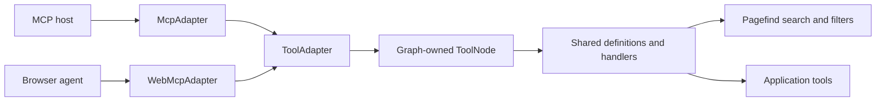

# Reaktor tool adapters

`ToolNode` owns tool definitions and suspending handlers inside a Reaktor graph.
`ToolAdapter` extends the framework's `Adapter<ToolNode>`. `McpAdapter` translates
JSON-RPC requests and results; `WebMcpAdapter` registers the same definitions with
`document.modelContext`. Neither adapter supplies product authorization.



Keep schemas, descriptions, handlers and effect metadata in `ToolDefinition` and
`Tool`. Add another protocol by deriving a `ToolAdapter`; its responsibility is
registration and protocol conversion. The graph owns execution and disposal.
MCP transports call the suspending `McpAdapter.handle` method, allowing their own
request cancellation to reach the handler. Transport-specific cancellation
notifications and authentication remain the transport host's responsibility.

```kotlin
val tools = ToolNode(graph, listOf(
    Tool(ToolDefinition("status", "Read status", readOnly = true)) {
        ToolResult(buildJsonObject { put("status", "ready") })
    }
))
graph.attach(tools)
val mcp = McpAdapter(tools, "example", "1.0")
val response = mcp.handle(requestBody)
```

Graph detachment closes the node and both adapters. Caller cancellation, browser
execution signals, and adapter closure cancel active handlers. A handler failure
becomes an MCP tool error or an explicit WebMCP error value. `ToolResult.content`
preserves MCP image and other content blocks. The existing synchronous
`ReaktorMcpServer` and resource APIs remain available.

The `reaktor-mcp` TypeScript package bridges browser callbacks into this Kotlin
tool node. Create a site graph using this library's exported runtime:

```ts
import { createBrowserToolGraph, WebMcpAdapter } from 'reaktor-mcp';
import { loadPagefind, pagefindTools } from 'reaktor-mcp/pagefind';

const graph = createBrowserToolGraph('documentation');
const tools = new WebMcpAdapter(graph,
  pagefindTools(() => loadPagefind('/docs/pagefind/pagefind.js')));
await tools.register(); // false when the browser does not expose WebMCP
// graph.close() when the site host unmounts
```

Separately linked Kotlin/JS libraries have their own branded classes and coroutine
runtimes. Do not pass a graph from another library's export into this facade.
The JS graph default dispatcher is also owned by its compiled runtime; it avoids
the coroutine library's shared `window` dispatcher cache. Navigation inherits its
graph's dispatcher and cancellation parent.
Manna's current web session owns a headless browser-tool graph alongside its UI
graph and closes both together. Kotlin Surface hosts can attach `ToolNode` directly
when the app and adapters are linked into the same runtime.

Pagefind is a tool provider: its search and filter handlers can also be called
through `handleMcp`. Search validates and bounds inputs, loads only the requested
result window, and returns plain excerpts, section URLs and source metadata.
Cancellation discards pending results; Pagefind's own search API does not expose
network cancellation. Use a same-origin index, or configure module CORS at its
host. Private content must stay behind the host's authorization policy.

The search tool accepts a query of at most 200 characters, up to 20 results, an
offset of at most 1,000 and bounded Pagefind filters. It returns plain excerpts
instead of inserting Pagefind's highlighted HTML. Metadata identifies the exact
document and corpus revisions used to build the index. Search and filter results
carry WebMCP's `untrustedContentHint`; tool annotations describe behavior and do
not grant authority.

`reaktor-mcp/pagefind/build` provides Node-only `buildPagefind` and
`documentationRecords` helpers. The latter selects explicitly public documents
and preserves document IDs, section IDs, content revisions, corpus revisions,
verification and sources. Call `closePagefind()` after the build process has
finished using Pagefind. Runtime browser imports do not include the indexer.

Reaktordocs builds `/docs/pagefind/` from its public corpus. Manna builds a
same-origin copy at `/pagefind/docs/` using the sibling public corpus when present,
otherwise the published public corpus. Its build verifies each document's
identity and revision. Rebuild the docs corpus before rebuilding Manna after a
documentation change.

Manna exposes `manna_context` and `manna_navigate` alongside the two search tools.
Context contains the current page kind and declared page labels. Navigation
accepts declared pages with no record parameter. The browser tools are installed
for an active workspace session and disposed when that session closes. The
browser module loads only when `document.modelContext` exists.

Build Kotlin exports through `:reaktor-mcp:jsBrowserProductionLibraryDistribution`
before typechecking the TypeScript facade. Verify with `:reaktor-mcp:jvmTest`,
`:reaktor-mcp:jsNodeTest`, and `pnpm --dir reaktor-mcp/ts test`.
After producing the Kotlin exports, run `pnpm run pagefind:docs` and
`pnpm run test:webmcp` in Manna's `targets/appWeb`. The smoke test launches a
temporary Chrome profile with experimental web features enabled; it checks the
native API, a real Pagefind index, MCP parity, errors, cancellation and cleanup.
`pnpm exec playwright test tests/manna-webmcp.spec.ts` additionally checks the
signed-in application, page navigation and unregistering tools on logout. Set
`MANNA_WEBMCP_ORIGIN` to check a built preview or the deployed frontend; its API
requests are intercepted by the existing test workspace.

The implementation targets Chrome's current [imperative WebMCP API](https://developer.chrome.com/docs/ai/webmcp/imperative-api).
WebMCP registration does not establish that a given Chrome profile's built-in
Gemini panel is enabled to discover or invoke the tools.
