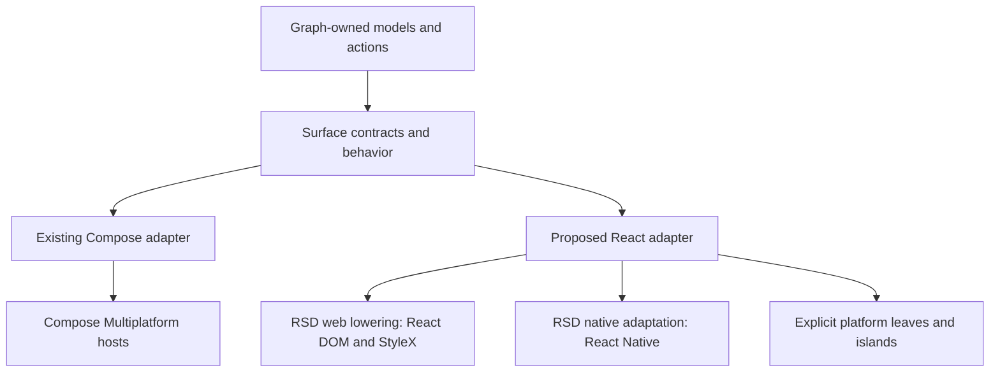

# React Strict DOM in Reaktor Surface

Investigation dated 5 October 2026, using `m1-worker` for builds, package probes and upstream source analysis. Primary Reaktor source: `f2df0db8c697d97efedecebff9f1df9f4333bd89`. The review also covers the newer Claude-recovery continuation at `2e9dc2820b9c74682cd074c84d3782f98873600e`, with BestBuds at `a25939f633c183d60d251a44367dacb79807c6fe`, in `/Users/ovd/dev/tmp/hangar-completion/`. This investigation adds documentation and isolated experiments; it changes no production source, dependencies or public APIs.

## Decision

**Surface should offer Compose and RSD as two selectable rendering targets. An app chooses its target and uses the same Surface behavior and graph ownership rules. RSD is a viable basis for the React target, with web qualification first and an explicitly qualified React Native profile later.**

This follows the user's direction and the current textbook. Compose-first describes the implementation sequence. It does not make RSD a destination for existing Compose apps. BestBuds' Compose-only choice and Hangar's Compose adoption remain choices by those apps.

| App target | Normal authoring path | Rendering implementation | Readiness |
|---|---|---|---|
| Compose | Kotlin with the direct Surface Compose API | Compose Multiplatform | Substantial existing implementation and consumer evidence |
| RSD | React with a Surface React adapter | RSD → React DOM / StyleX on web; RSD → React Native under a qualified native profile | Web feasibility demonstrated; shared adapter and production qualification remain |

The targets share meaning, behavior, identities, owned model/action bindings, token definitions and qualification scenarios. Their layout, editing, focus, accessibility, appearance trees and effects have toolkit-specific implementations. Target selection does not require runtime switching between renderers or identical pixels on every platform.

The immediate prerequisite is a usable shared behavior/contract boundary. The current Kotlin/JS Surface library builds successfully but exposes **zero public JavaScript exports**. The handwritten `reaktor-surface-web` package implements separate behavior rather than consuming the Kotlin kernels. Replacing its HTML tags with RSD tags would preserve that duplication while breaking parts of its current API.

The useful deliverable is a Surface React adapter over the existing contracts and kernels, with RSD realizing appropriate leaves. Compose apps continue using the Compose target. RSD apps use the RSD target. The optional React-to-CMP and portable Compose-to-RSD bridges are separate capabilities; neither is a prerequisite for ordinary apps choosing one target.

## Evidence and scope

The audit covered all 13 current public Surface documentation pages (chapters 1–37, overview and references), the private Hangar capability/migration/H1–H5/handover documents, the BestBuds roadmap's Surface and Lab work, Claude's Surface memory and related review artifacts, the recovered continuation's source changes, Surface kernels and Compose adapter tests, the handwritten TS adapter, Manna web, dormant `reaktor-react`, and RSD release/main. Detailed evidence and executable probes are in [the investigation directory](/Users/ovd/dev/reaktor-context/react-strict-dom-investigation-2026-10-05/README.md).

| Primary-snapshot check on m1-worker | Result |
|---|---|
| `:reaktor-surface:jvmTest` | 135 tests, 15 suites, no failures or skips |
| `:reaktor-surface:jsNodeTest` | 135 tests, 15 suites, no failures or skips |
| `:reaktor-surface-compose:compileKotlinJvm` | Successful |
| `:reaktor-surface-compose:jvmTest` | 142 tests, 27 suites, no failures or skips |
| `:reaktor-surface:jsBrowserDevelopmentLibraryDistribution` | Successful; imported module has `publicExports: []` |
| RSD web fixture | Activation, disabled gating, controlled editing, tab focus/selection and server rendering passed in jsdom/React DOM |
| Babel/PostCSS | Web lowering, static CSS, media rule and theme extraction passed; native transform retains RSD runtime calls |
| TypeScript positive fixture | Strict type check passed with explicitly normalized field event shape |
| TypeScript negative fixtures | Expected rejections reproduced, including theme/style and keyboard event inconsistencies |
| Native function probes | Published translation, style rejection/fallback and ref receiver issue reproduced in isolation |
| React 18 consumer peer resolution | npm rejected RSD 0.0.55 with `ERESOLVE` |

The newer `2e9dc282` Surface snapshot was checked independently in an isolated worker checkout:

| Newer-snapshot check | Result |
|---|---|
| Surface JVM kernels | 135 tests, 15 suites, no failures or skips |
| Surface JS kernels | 135 tests, 15 suites, no failures or skips |
| Compose adapter | 148 tests, 28 suites, no failures or skips, including secure entry and newer pane/tab behavior |
| Isolated Kotlin/JS export | Two generated exports and declarations: `PressProbe` and `PressProbeSnapshot`; the production package remains unexported |
| Existing Kotlin kernel called from JavaScript | Concurrent contacts/cancellation, focus retention while busy, disabled admission, duplicate/older sequence rejection and exact `9007199254740993` round-trip passed |
| RSD button consuming that Kotlin kernel | Two admitted clicks across React updates; busy and disabled clicks blocked; generated Kotlin declarations plus RSD fixture passed strict TypeScript |

There are **418 passing existing test cases on the newer snapshot**, compared with 412 on the primary snapshot. Those are separate runs of mostly the same corpus, not 830 distinct tests.

The first newer Compose test compile failed with unresolved `kotlin.test.Test` across its test sources. A dependency inspection showed `kotlin-test-junit` present. Recompilation with `--no-build-cache -Pkotlin.incremental=false` passed all 148 adapter tests without any production source or dependency change. The failed log and successful retry are retained; the precise cache/classpath cause was not isolated.

These are source and headless test results. There was no RSD installation into a product, physical Android/iOS qualification, screen-reader session, visual browser audit, hydration test or device performance measurement. No emulator or simulator was started. The native function probes extract exact functions from the released bundle and stub their surrounding style hooks; they establish translation behavior, not React Native host correctness.

The first `remote-dev` build succeeded on the worker with exit code 0. Its automatic broad artifact pull failed with exit 74 after this Mac ran out of disk space. Scoped XML reports and logs were copied separately and preserved. Only this investigation's incomplete artifact-copy directory was removed, recovering about 6.2 GiB. The original failed-transfer receipt is retained; it must not be described as a successful end-to-end `remote-dev` run.

## Reading the Surface documentation against the two-target design

All current public Surface pages were read, including the desktop additions through chapter 37. The illustrated PDF is an export companion; this review uses the maintained Markdown sources as authority. The following mapping records how each part affects the RSD target.

| Documentation | Consequence for RSD |
|---|---|
| [Overview](/Users/ovd/dev/bestbuds/targets/reaktorWeb/docusaurus/docs/reaktor-surface.md) | Surface is the shared component/interaction layer over the graph; renderer choice belongs to an app. |
| [Foundations, chapters 1–6](/Users/ovd/dev/bestbuds/targets/reaktorWeb/docusaurus/docs/reaktor-surface-foundations.md) | Separate graph truth, mounted interaction and drawing. Compose and RSD are terminal families; available runtime hosts are qualified individually. |
| [Contracts and interaction, chapters 7–10](/Users/ovd/dev/bestbuds/targets/reaktorWeb/docusaurus/docs/reaktor-surface-contracts-and-interaction.md) | Shared props, events, parts and stable keys carry meaning. RSD supplies platform leaves; Surface still owns admission, reconciliation, commands and one semantic activation. |
| [Design and ownership, chapters 11–14](/Users/ovd/dev/bestbuds/targets/reaktorWeb/docusaurus/docs/reaktor-surface-design-and-ownership.md) | Content slots and behavior remain independent of appearances. Platform editing owns caret/IME; the graph owns revisioned drafts. Theme scopes and presentation plans preserve instance identity. |
| [Renderers, chapters 15–18](/Users/ovd/dev/bestbuds/targets/reaktorWeb/docusaurus/docs/reaktor-surface-renderers.md) | Direct Kotlin→Compose and React→RSD are normal paths. HostApplier and custom React reconciliation are separate interoperability paths with their own structural owner and commit semantics. |
| [Motion and materials, chapters 19–22](/Users/ovd/dev/bestbuds/targets/reaktorWeb/docusaurus/docs/reaktor-surface-motion-and-materials.md) | Share motion intent and deterministic policies where implemented. CSS/WAAPI, RN animation and Compose drawing remain local realizations. Sensor/field/shader support needs a named capability and fallback. |
| [Performance and assets, chapters 23–25](/Users/ovd/dev/bestbuds/targets/reaktorWeb/docusaurus/docs/reaktor-surface-performance-and-assets.md) | RSD's lowering can reduce leaf overhead but does not prove app performance. Media privacy, acquisition, reserved geometry, decoding and cancellation survive target choice. |
| [Dynamic UI and verification, chapters 26–27](/Users/ovd/dev/bestbuds/targets/reaktorWeb/docusaurus/docs/reaktor-surface-dynamic-ui-and-verification.md) | A supported profile is a tested combination of renderer, host, catalogue and design language. Graph updates own activation; Surface does not need a second updater. Plain-data regions and executable React have different qualification obligations. |
| [Application patterns, chapters 28–31](/Users/ovd/dev/bestbuds/targets/reaktorWeb/docusaurus/docs/reaktor-surface-application-patterns.md) | Marketing, chat, generated regions and operator tools are different consumers. Choose a target for each app's requirements; do not generalize one app's Compose-only or compact-only decision. |
| [Application extensions, chapters 32–33](/Users/ovd/dev/bestbuds/targets/reaktorWeb/docusaurus/docs/reaktor-surface-application-extensions.md) | SVG, canvas, media, rich editors and app-specific organisms need typed extension/island boundaries. An unsupported `html` tag does not prohibit the feature from an RSD app. |
| [Implementation plan, chapter 34](/Users/ovd/dev/bestbuds/targets/reaktorWeb/docusaurus/docs/reaktor-surface-implementation-plan.md) | R50 exports, R51 direct RSD, R52 conformance and R53 native qualification are the relevant sequence. R54/R55 remain optional. Existing kernels satisfy much of S03; S04/R50 are not established by a JS build alone. |
| [Desktop, chapters 35–37](/Users/ovd/dev/bestbuds/targets/reaktorWeb/docusaurus/docs/reaktor-surface-desktop.md) | Preserve one collection controller, demand-driven item sources, virtualized focus/reveal, owner-controlled sort, nested pane focus, manual document-tab activation, scoped commands, notices and islands. Desktop mechanisms need an equivalent React realization. |
| [References](/Users/ovd/dev/bestbuds/targets/reaktorWeb/docusaurus/docs/reaktor-surface-references.md) | Reference claims were checked against the actual RSD release/main and relevant React/Kotlin primary sources. A compatibility table is not a substitute for a component's translated native props. |

### What Claude's work changes

The [Claude Surface memory](/Users/ovd/.claude/projects/-Users-ovd-dev/memory/project_reaktor_surface_ui_runtime.md) explicitly marks its earlier custom-kernel architecture as superseded on 23 September. Its earlier exclusion of React Native and mandatory portable-authoring path therefore do not override the current textbook. Its dated statement that Surface had no code also predates the implementation.

The [BestBuds roadmap](/Users/ovd/dev/bestbuds/targets/reaktorWeb/docusaurus/docs/private/bestbuds-surface-roadmap.md) narrows the textbook for a real consumer: slots and named appearances, controlled requests, cancellable commands, platform editors, direct graph ports and a Compose-only app. Those choices earned real implementation. RSD should retain their behavior and ownership lessons without inheriting BestBuds' app-specific target or language restrictions.

The private Hangar corpus was read in full: [capability audit](/Users/ovd/dev/bestbuds/targets/reaktorWeb/docusaurus/docs/private/hangar-surface-capabilities.md), [adoption history](/Users/ovd/dev/bestbuds/targets/reaktorWeb/docusaurus/docs/private/hangar-surface-migration.md), [H1](/Users/ovd/dev/bestbuds/targets/reaktorWeb/docusaurus/docs/private/hangar-h1-design.md), [H2](/Users/ovd/dev/bestbuds/targets/reaktorWeb/docusaurus/docs/private/hangar-h2-design.md), [H3](/Users/ovd/dev/bestbuds/targets/reaktorWeb/docusaurus/docs/private/hangar-h3-design.md), [H4](/Users/ovd/dev/bestbuds/targets/reaktorWeb/docusaurus/docs/private/hangar-h4-design.md), [H5](/Users/ovd/dev/bestbuds/targets/reaktorWeb/docusaurus/docs/private/hangar-h5-design.md) and [handover](/Users/ovd/dev/bestbuds/targets/reaktorWeb/docusaurus/docs/private/hangar-handover.md). Important results:

| Work | Current result and lesson for RSD |
|---|---|
| H1 | Open appearance keys, cheap idle controls, busy focus retention, keyboard/command behavior, Machine Signal root, overlays, menus and tooltips. The target needs an equivalent controller/part/command runtime; a tag substitution does not supply it. |
| H2 | Collections, tree, tables, pane plans, splitters, document tabs, notices, automation and islands. One collection controller serves lazy rows; sort and paging remain owner operations. The qualification matrix found real missing focus treatments. |
| Claude recovery / T3–T5 | The manifest and exact recovered patch preserve the later Agent work. Auto-follow, bounded handoff advisory, response layout, terminal-receipt grace, input scheduling and linked-worktree reads were subsequently verified. They clarify workflow ownership; they do not require an RSD-specific business model. |
| H3 | Surface shell commands/menus/tabs/panes plus graph-owned, persisted workspace layout and exact cross-pane subjects. The new kernel emits focus/reveal even when a pointer selects the already-selected document tab. |
| H4 | Shared pane frame, remembered table/view layout, search grammar, formatting/masking, read status and operator-aware approval. Product policy remains in existing owners, independent of renderer. |
| H5 increment | Auth adopts six tables, lists, a tenancy tree, a map island and secure text entry. Nested pane hosts share one focus order. H5 as a whole remains incomplete; AI, Measure and later waves are not implied complete. |

The primary checkout's code stops before H3. The newer continuation is in `/Users/ovd/dev/tmp/hangar-completion/`; current docs already describe that work. This distinction matters: a primary-checkout search alone incorrectly reports later features as missing.

I inspected the recovery manifest, source diffs, Surface-specific tests and relevant verification logs. The earlier continuation reports 339 passing Hangar flows, 846 qualification cells and 24 existing Human Signal focus findings. These are inherited Compose evidence, not results of this RSD investigation or RSD qualification. The historical memory/audit numbers and planned package tree must not override the current source.

### Concrete shared boundary and renderer obligations

The neutral layer already has useful pure behavior. The quickest faithful RSD target exports that behavior and uses a React controller to run it. A full `SurfaceHost`, `ComponentContract` catalogue, `GraphBinding` abstraction or serialized tooling session need not be added merely because a textbook diagram contains it. Introduce the concrete projection required by a real shared component, while preserving the graph's existing typed owners.

| Shared source/value | Compose realization | RSD realization needed |
|---|---|---|
| Properties, typed input, reduction, events and commands | `rememberMachine` and Foundation input | React controller with normalized inputs, ordered/reentrant reduction, latest handlers, ticket cancellation and retirement |
| Part keys and automation scope | One semantics/input owner per part | Keyed refs plus separate accessible names/roles and automation ids; shared identity does not mean an accessibility label is a test id |
| Controlled draft and revision | `TextFieldState` with local editing state | DOM/RN editor keeps selection and composition; graph replacement respects revisions and active composition |
| Theme identity and design values | Scoped snapshot plus Compose appearances | Scoped React values plus generated static StyleX definitions and runtime scalar variables; independent React appearance trees |
| Constraints and pane plan | Measured Compose container | Web/RN measurement feeds the same plan; focus registry and splitter event adapters realize it |
| `ItemSource` / `TreeSource`, active/selected keys | Lazy collection host and pending reveal | Indexed JS-facing source and virtualizer integration; materialization is bounded, offscreen focus waits for a mounted row |
| Document tabs vs view selectors | `TabSet` manual; `Tabs` view choice | Preserve each contract separately, including disabled items, direction, typeahead, close and overflow reveal |
| Semantic cue and motion intent | Local press/focus animation and cue player | Local web/native effects, one cue delivery, reduced-motion fallback and no per-frame graph/FFI updates |
| Island commands and lifetime | Existing Compose engine under `Island` | Existing browser/RN engine under an explicit island; ordinary RSD leaves do not implement a graph canvas or code editor |

The current brand snapshots are not fully portable values. `MachineSignalSnapshot` contains Compose-oriented colors, metrics and fonts, and Human Signal also uses Compose design values. Exporting `ThemeSnapshot.id` alone is insufficient. Keep Machine Signal/Human Signal as their existing authorities, project logical colors/geometry/font references into JavaScript, and generate transformable `.css.*` definitions. Do not create a second handwritten palette. The open `Appearances` registry itself is a Compose adapter construct, not a shared React registry.

There is also a current difference in mismatch behavior: `theme.machineSignal` raises `ThemeMismatch` for another brand, while `theme.humanSignal` falls back to the Light snapshot. Do not claim universal rejection of unsupported theme scope from these implementations. The shared target contract should declare the intended rejection or fallback, and both realizations should be checked against it.

Virtualization bounds mounted rows and row-local work, but does not make every kernel operation constant-time. The default `RovingItems.indexOf` and typeahead matching can scan the item source. An RSD collection should preserve indexed demand and use an efficient key index where its actual source provides one; measure typeahead separately from mounted-row rendering.

Later source changes deserve explicit RSD cases:

- `Region.label` and `collapsible`, splitter pointer focus, and nested `PaneHostFocus` require named separators and coherent F6 traversal after collapse/removal. Copying the Compose focus-group mechanism is not a portable implementation.
- `TabSet` now accepts display text for typeahead, and `Tabs` supports a vertical axis. Preserve stable keys independently of text and honor the actual axis in keys and semantics.
- `SecureTextField` delegates to `BasicSecureTextField`, always hides the text, marks password semantics and excludes copy/cut actions. A DOM password input is a candidate web realization, but ordinary browser password behavior alone does not establish this exact secure-field contract. RN and inspection/redaction need their own qualified profile; raw secrets must not be exported as story or trace payloads.
- Shared `SearchQuery` grammar moved to the existing tooling owner when Auth became a second consumer. A React pane can call that owner; renderer selection does not justify a second search parser or approval system.

## What Surface implements today

### The Kotlin layer is already substantial

`reaktor-surface/src/commonMain` has 23 Kotlin files and 1,602 lines. Its 15 common test files have 1,979 lines. It has no Compose dependency; `build.gradle.kts` adds common coroutines and configures Android, Darwin, JS and JVM targets.

The important pieces are:

| Responsibility | Current implementation | Relevance to RSD |
|---|---|---|
| Behavior protocol | `BehaviorKernel`, `Reduction`, `FeedbackCue`, `LocalCommand`, `PartKey`, `Ticket` | Keep these semantics; RSD does not supply them |
| Activation | `PressKernel`: contacts, focus visibility, hover, monotonic activation sequence, busy/enabled reconciliation, hold | Normalize platform interaction into this behavior |
| Controlled choices | Toggle, one-of and many-of kernels | RSD tags are leaves, not the selection model |
| Disclosure and menus | Disclosure, roving and menu kernels, submenu timing and commands | Renderer must execute focus/timers and implement overlays |
| Collections | Collection/tree behavior, `ItemSource`, `TreeSource`, keyed selection and typeahead | Preserve identity; renderer owns materialization and scrolling |
| Document tabs | `TabSetKernel`, close requests, active-item recovery, reveal | Richer than the current TS `SurfaceTabs` |
| Split and panes | `SplitterKernel`, `PaneSpec.plan`, layout preferences | Share sizing decisions, translate layout mechanics |
| Drafts | Revisioned `Draft<T>` and compare-and-replace | Preserve conflict/revision semantics independently of the leaf input |
| Notices | Toast/tooltip scheduling and cancellation | Host owns timers and presentation; graph owns durable results |
| Presentation | `presentationPlan`, `SurfaceConstraints`, view state, sort | Resize changes presentation without changing route identity |
| Appearance | `ThemeSnapshot`, `ComponentRecipe`, `ThemeMismatch` | RSD needs an appearance implementation and token projection |

`reaktor-surface-compose/src/commonMain` has 45 files and 5,324 lines. Its current adapter includes focus-aware overlays, menus, tooltips, collections, pane hosts, document tabs, splitters, commands and islands. Its appearance registry is now extensible through `AppearanceKey` and `Appearances`, beyond the older fixed 14-slot constructor. Older capability audits that report these as absent or describe the registry as closed are stale for this revision.

`Machine.kt` shows what a React adapter must match: serialized/reentrant reduction, changing controlled props reconciled into a surviving controller, current callbacks, part registration, focus/reveal execution, scheduled ticket replacement/cancellation and retirement cleanup. These are responsibilities outside RSD.

The graph remains the authority for application identities, state and effects. The Surface module currently does not bind the graph itself. This is an observation about implementation, not a requirement to introduce a parallel graph-agnostic application model.

### The current web adapter is a different implementation

`ts/src/index.tsx` is a 119-line handwritten React DOM package. It exports a presentation function/hook, action, panel, tabs, draft hook, field, dialog and form. It peers with React 18 or 19. No RSD dependency, shared kernel import, generated catalogue or behavior trace integration is present.

| Current API | Why a mechanical RSD conversion fails |
|---|---|
| `SurfaceAction` | Public DOM attribute types and `className` do not fit RSD. Promise-pending state is independently implemented. RSD does not make it share `PressKernel`. |
| `SurfacePanel` | The semantic section translates, but arbitrary DOM attributes/class styling need a separate web contract or RSD appearance. |
| `SurfaceTabs` | Uses `currentTarget.parentElement.querySelectorAll`, immediate selection on arrow keys and DOM focus. Compare it with Surface's view-selector `Tabs`, which also permits automatic activation, rather than assuming it implements the separate manually activated document `TabSet` contract. Neither behavior currently comes from a shared Kotlin import. |
| `SurfaceField` | Uses `htmlFor`, `small`, DOM input attributes and browser hint relationships. RSD uses `for`, has no `html.small`, and native relationships need qualification. |
| `SurfaceDialog` | Uses `HTMLDialogElement.showModal/close`, `onCancel` and `onClose`. RSD has no `html.dialog` export. |
| `SurfaceForm` | RSD exports `html.form`, but its released strict prop API has no `onSubmit`. A web form escape is needed to retain browser submission semantics. |
| `usePresentationPlan` | Calls global `ResizeObserver`, `getComputedStyle` and `matchMedia`; this is a web measurement adapter, not a native one. |
| `useSurfaceDraft` | Implements saved-revision acknowledgement. Kotlin `Draft` exposes publish and revision-checked replace; they are not interchangeable contracts. |

There are also existing web concerns independent of RSD: the ignored `Promise.finally()` result can propagate an action rejection, and the field/dialog/form wrappers have browser-specific semantics. RSD adoption should not be used as evidence that these issues are solved.

The live impact is material: 121 Manna web source files reference `reaktor-surface-web`. Manna declares React/React DOM `^18.3.1`, React 18 types, Vite `^7.1.2` and plugin-react `^5.0.0`. A new RSD app can choose a locked React 19 profile independently. Converting Manna's existing web package is a separate consumer decision and is not required to establish the two-target architecture.

### Compiling Kotlin/JS does not currently expose the kernels

The browser development library's generated `.d.mts` contains only helper declarations. Importing its `.mjs` on the worker returns no public exports. Source search found no `@JsExport` declarations in Surface.

Therefore R50 is not satisfied by the existing `web {}` Gradle target. A deliberate export boundary is needed. Start with the concrete properties, state, inputs, semantic outputs and commands used by the first slice. Do not expose compiler-private class names or assume that Kotlin `List`, `Set`, sealed inputs, `Duration`, `Long` and `StateFlow` are automatically idiomatic JS values.

### A shared-kernel export is feasible

To test the missing boundary, I added [a small export wrapper](/Users/ovd/dev/reaktor-context/react-strict-dom-investigation-2026-10-05/probe/PressProbe.kt) only to the isolated worker copy. It calls the actual `PressKernel`; it does not rewrite press behavior in TypeScript. Its generated declarations contain ordinary booleans, numbers and string sequence values. A [React/RSD probe](/Users/ovd/dev/reaktor-context/react-strict-dom-investigation-2026-10-05/probe/shared-kernel.mjs) consumes the compiled Kotlin module.

The probe preserved concurrent contacts, focus/hover state, busy/disabled reconciliation, cues and duplicate activation rejection. A sequence above JavaScript's safe integer range survived exactly as a string. The RSD button called the same Kotlin kernel, admitted two clicks around controlled-property changes and rejected busy/disabled activation. Strict TypeScript checked the generated Kotlin API and RSD component together.

This closes the basic feasibility question: a direct RSD target can reuse the current Kotlin behavior without a custom reconciler or binary bridge. It is not a production adapter: the deliberately small probe lacks timers, part registration, controller retirement, full typed input generation, graph binding, secure editing and native realization. R50 still requires that deliberate public API and its broader conformance corpus.

Kotlin can export `Long` using experimental BigInt-related compiler options; select an explicit representation for sequences, tickets and revisions rather than silently narrowing them to JS numbers. The language's export facilities are available, but must be enabled and exercised. [Kotlin JS interop](https://kotlinlang.org/docs/js-to-kotlin-interop.html), [project export setup](https://kotlinlang.org/docs/js-project-setup.html).

## What RSD actually provides

RSD is a strict React component/style API over two existing rendering systems. On web it lowers to React DOM and StyleX. On native it adapts HTML-like leaves/styles to React Native views and controls. It is not a new replacement for React reconciliation or a Compose backend. [Upstream project](https://github.com/react/react-strict-dom), [maintainer architecture explanation](https://github.com/react/react-strict-dom/discussions/33).

The solid connection from Surface to the proposed React adapter describes the recommendation, not an implemented import today. Portable host-tree and custom-reconciler paths remain optional work beyond this direct path.

### Published package and main are different profiles

The npm registry was queried directly on the worker. Latest is **0.0.55**, published **9 January 2026**. Its tag resolves to `dd87fb42b3eb8650b772ff866e620159385d24f9`. Current upstream main is `abd34bbf22bb468ffdc0baaf606f172c3a583487`, committed **31 August 2026**. Main still reports package version 0.0.55, so the version string alone does not identify the source profile.

| Property | npm 0.0.55 tested here | Main inspected here |
|---|---|---|
| React / React DOM peers | `^19.0.0` | `^19.0.0` |
| React Native peer | `>=0.79.5` | `>=0.82.0` |
| StyleX dependencies | `^0.15.4`; lock resolved 0.15.4 | `^0.18.3` |
| Native ref implementation | Copies host own descriptors onto a new instance-like wrapper | Uses host as prototype and binds inherited methods back to host |
| Portable event exports | Several handler types are `any`; key event is narrower | Adds explicit strict event types and opaque platform event handlers |
| Relevant source difference | Baseline | 68 package files changed, 1,995 insertions / 952 deletions against the release tag |

The upstream platform-test app uses Expo 55, React 19.2.0 and RN 0.83.6. That is an example profile, not a verified Surface host or a recommendation to use a moving latest release.

The main changelog explicitly calls the native version requirement breaking and its ref change unreleased. Pin a package plus lockfile, or a source commit plus a deliberate build. Do not mix main's fixes/documentation with claims about the installed release. [Pinned main changelog](https://github.com/react/react-strict-dom/blob/abd34bbf22bb468ffdc0baaf606f172c3a583487/packages/react-strict-dom/CHANGELOG.md), [release package](https://github.com/react/react-strict-dom/blob/0.0.55/packages/react-strict-dom/package.json).

The dormant `reaktor-react` module is commented out in settings and references RN 0.68.5 plus old flatinvoker dependencies. It is not a compatible starting native host for either profile.

### Build integration is part of the feature

The published package's web entry itself contains `stylex.create`. An untransformed Node import failed with the expected runtime requirement to compile styles. Transforming only application code is insufficient.

The worker probe demonstrated:

1. Web Babel lowering removes fixture `css.create` and `html.button` calls and emits 11 style rules in its metadata.
2. The native Babel profile emits zero static StyleX rules and retains `css.create` and `html.button`: the native runtime performs adaptation.
3. PostCSS replaces `@react-strict-dom;` with CSS containing theme variables, layers and media rules.
4. The transformed fixture renders with React DOM and server rendering.

For Manna's Vite 7 profile, apply the RSD Babel preset to app source, linked Surface source and the RSD shipped JS; extract styles from the same effective source set; import the generated CSS; preserve React deduplication and web/native extension ordering. Babel's development flags must agree between JS and CSS extraction. For SSR, the package must participate in the transform rather than being blindly externalized. Vite 8's documented pipeline differs; do not copy it into Vite 7 unchanged. [Official Vite setup](https://react.github.io/react-strict-dom/learn/setup-vite/).

The released PostCSS wrapper accepts `useCSSLayers`; current setup examples use `useLayers`. The probe uses the actual released option. This small mismatch is another reason to exercise the pinned pipeline rather than treating snippets as qualification.

Generated Kotlin/JS can call precompiled React-facing components. StyleX cannot be assumed to discover arbitrary computed Kotlin property maps as static CSS definitions. Keep style templates in transformable source or generate static templates; use bounded dynamic style parameters for changing scalar values.

## Compatibility with the Surface catalogue

| Surface capability | RSD web fit | Native qualification requirement |
|---|---|---|
| Button / press | Good semantic leaf; action and busy fixture passed | Normalize Pressable interaction; retain kernel admission, contacts and cues; verify modifier/cancellation behavior |
| Switch / checkbox / radio | Native browser inputs can be web leaves | Checkbox/radio inputs are not implemented as such; use qualified native controls with correct roles/states |
| Field / draft | Controlled editing works | Native TextInput event shape is reduced; IME, selection, hardware keys, paste, secure entry and revision races need tests |
| Tabs / document tabs | Good with keyed refs and Surface behavior | General view/button keyboard events are missing in released translation; `tabIndex` becomes boolean focusability, not browser ordering |
| Menu / context menu / tooltip | Requires Surface behavior, overlay host and positioning | Hover timers, Escape, focus return, modality and announcements remain platform work |
| Dialog / sheet / popover | Use a qualified web platform leaf/portal | RSD does not supply a modal implementation; native Modal/host policy required |
| Tree / table / listbox | Can realize appropriate DOM or role-based leaves | Required relationship/index/sort ARIA and general keys are incomplete; virtualized focus and reveal need an explicit adapter |
| Pane host / splitter | Flex-based panes and measured sizing fit | Grid, sticky positioning and web measurements are not portable; drag/key adapters required |
| Toast / progress / view state | Roles, text and value props can be realized | Announcement timing, live-region behavior and accessibility focus must be qualified |
| Island / graph canvas / code editor | Keep specialized browser content behind explicit ownership | `compat.native` adapts RN leaves only; no automatic CMP, SVG, video, canvas, shader or editor realization |
| Theme / appearances | Static variables/themes and dynamic styles are useful | Preserve role ownership, geometry/text scaling and state precedence; qualify runtime token updates and material effects |

Native layout is fundamentally constrained compared with browser layout: block defaults are polyfilled, but full flow, grid and inline-flex layout are not supplied. Treat `display:flex` with an authored direction as the common baseline. [HTML compatibility](https://react.github.io/react-strict-dom/api/html/), [CSS compatibility](https://react.github.io/react-strict-dom/api/css/).

### Events and accessibility: inspect translation, not only tables

The released native `useNativeProps` maps `onClick` into an `onPress` callback. Its synthesized click has modifier flags and page coordinates, but **no `target` or `currentTarget`**. Its `preventDefault` and `stopPropagation` are no-ops. The isolated probe confirmed `defaultPrevented` remains false after invoking `preventDefault`.

General `onKeyDown` and `onKeyUp` are not copied to view/button native props. Native input factories separately translate a subset of text-input key events and submit editing into small `{key,type}` payloads. That does not provide menu/tree/tab keyboard parity or browser event cancellation.

The same translation probe confirmed `aria-busy` is mapped, while `aria-pressed`, `aria-describedby`, `aria-controls` and arbitrary `data-*` were absent from the mapped result; `data-testid` is mapped. Current main still does not add these particular relationships to `useNativeProps`. The official compatibility table lists some focus/click entries as unsupported even though the package has polyfills; it lists `aria-describedby` as supported although this general translator does not implement it. Use executable/source evidence for the selected component and host.

Do not silently reinterpret a pressed toggle as a checkbox to compensate for a missing property. Preserve the semantic contract and choose a qualified native leaf. Web `aria-*` acceptance is not evidence of Android/iOS accessibility output. [Released native translation source](https://github.com/react/react-strict-dom/blob/0.0.55/packages/react-strict-dom/src/native/modules/useNativeProps.js), [input adaptation](https://github.com/react/react-strict-dom/blob/0.0.55/packages/react-strict-dom/src/native/modules/createStrictDOMTextInputComponent.js).

### Type safety is not complete in the published package

Strict TypeScript rejected `className`, `htmlFor`, raw `{opacity:0.5}` styles, `html.dialog`, `html.svg`, `html.small` and `html.form onSubmit` as expected. It accepted submit button and checkbox declarations, which illustrates that type acceptance alone does not establish native implementation.

Input `onChange` is declared `any`; an unannotated callback in strict mode produced TS7006. Keyboard handlers are more narrowly typed as `{key,type}` and do not promise `preventDefault`. A separately tested supported fixture passes with an explicit portable change-event payload.

The published StyleX/RSD type combination also rejected a documented theme usage, `style={[styles.panel, css.createTheme(...)]}`, with an `_opaque`/`Styles` incompatibility, although the Babel transform and runtime render succeeded. Keep this type regression in the qualification suite. If a narrowly scoped adapter assertion is used temporarily, document it and test the actual theme output; do not weaken all public styles to `any`.

Main introduces exported `StrictChangeEvent`, `StrictInputEvent`, `StrictClickEvent` and other event types, but this audit did not build/publish main or verify its generated TS declarations. [Main event contracts](https://github.com/react/react-strict-dom/blob/abd34bbf22bb468ffdc0baaf606f172c3a583487/packages/react-strict-dom/src/types/StrictReactDOMEvents.js).

### Native refs are a release blocker for focus-heavy controls

The released `getOrCreateStrictRef` copies own descriptors into a new wrapper. An inherited method that relies on instance identity can then run against the wrong receiver. The isolated probe's host `focus()` returned true on the original host and false through the released wrapper.

Upstream PR 515 fixes this by binding inherited methods to the host; it was merged on 31 August 2026 and is in the inspected main commit, but not in npm 0.0.55. Before relying on native `LocalCommand.Focus`, test ref methods against the exact RN host/version. Source fixes plus a mock reproduction do not substitute for that device test. [Merged fix](https://github.com/react/react-strict-dom/pull/515), [RN node model](https://reactnative.dev/docs/nodes).

### Styling, themes and local interaction

The isolated released style processor dropped `calc(...)`, grid column properties, `:disabled`, stable-profile `outlineWidth` and multi-value `padding`; it downgraded sticky positioning to relative. The native unit parser supports a limited set including px/rem/em/vh/vw, not a general CSS expression engine. Browser CSS compilation can accept styles that native cannot realize.

Disabled, busy, focus-visible, selection and gesture state already have Surface meanings. Resolve those meanings into explicit recipe variants. RSD native pseudo-state handling maintains its own focus/hover/active state; it does not implement Surface's contact tracking, sequence deduplication, hold policy or focus-visible convention. Avoid making two independent state machines authoritative for the same semantic event.

Surface's recipe boundary is promising, but currently `ThemeSnapshot` only promises an id and appearance renderers are toolkit-specific functions. RSD does not automatically translate a Compose appearance tree. Generate projections from the actual Machine Signal / product design source and provide renderer-specific realizations of the same recipe roles. Do not manually establish another token palette in RSD.

`css.defineVars`/`defineConsts` use named exports in `.css.*` files; `css.createTheme` supports scoped overrides. The probe confirmed their web lowering, not parity with Machine Signal or Human Signal. RSD exposes native-only `contexts.ThemeProvider` and `ViewportProvider`; these are not a universal React theme/environment contract. [Theming API](https://react.github.io/react-strict-dom/learn/themes/), [native style processor](https://github.com/react/react-strict-dom/blob/0.0.55/packages/react-strict-dom/src/native/css/processStyle.js).

Motion, haptics, blur/material effects and assets remain adapter concerns. Native transitions use JS/Animated adaptation, CSS keyframes are not implemented, and reduced-motion handling alone does not establish tactile policy. A semantic cue must execute once through the Surface cue player, never as a byproduct of speculative rendering.

## State, ownership and integration

The React adapter should host a surviving Surface controller keyed by logical component identity. Current controlled props must be reconciled without resetting contacts/focus. Semantic events should call graph-bound actions; they must not execute during React render or be replayed by an effect merely because the screen appears.

Subscriptions need cached immutable snapshots and cleanup. `useSyncExternalStore` is the relevant React contract for graph/external state; unchanged reads must retain identity. Existing Reaktor graph-port React code already uses this mechanism, so inspect/reuse the owning graph boundary rather than introducing Redux or another application store. Provide a coherent server snapshot if SSR/hydration is supported. [React subscription contract](https://react.dev/reference/react/useSyncExternalStore).

Port the Compose machine's lifecycle obligations explicitly: cancellation of scheduled tickets on retirement, safe unregistering of part refs, latest callbacks, reentrant input ordering and no stale callbacks targeting a reused mount. Durable drafts, selected entries and graph sessions must survive renderer resize/remount according to their existing owner.

Overlays need a host: modality, focus trap/return, layered dismissal, opener theme/environment capture, keyboard priority and accessibility coverage. A React portal changes physical placement while keeping React context; native modal windows have different behavior. Both need tests matching Surface's existing overlay/command obligations.

Collections need stable keys and source-demand boundaries, not a serialized unbounded row tree. Web scrolling, RN lists and CMP lazy collections can use different implementations while preserving selection and reveal semantics. RSD supplies no paging or virtualizer for this contract.

`compat.native` is documented as experimental and unstable. It translates RSD props for a custom RN child; it does not connect React to Compose or grant a child authority over another renderer's tree. [Compat API](https://react.github.io/react-strict-dom/api/other/compat/).

## Performance assessment

The web lowering is attractive: the compiler can remove RSD leaf wrappers and extract atomic CSS. The native profile retains wrapper components, style normalization, custom-property/inheritance contexts, pseudo-state hooks and transition/ref work. These are different cost structures, not evidence that one wins against CMP.

The probe's Node ESM fixture, with React external, was 17,586 bytes raw / 4,186 bytes gzip. Its generated CSS was 1,241 bytes. These figures describe that fixture only. They do not include an application's React runtime, a native host, assets, every control or a production browser bundling strategy. No comparative FPS, startup, memory or accessibility-tree claim follows.

For the first integrated slice, use the existing Reaktor performance harness and record: production bundle/CSS delta; activation-to-feedback and event admission; editing latency and composition stability; bounded collection mount/update costs; focus/reveal cost; theme/resize invalidation; native JS/UI frame timing and retained resources after remounts. Test actual appearance trees and large-text/RTL inputs. Source inspection establishes likely costs; profiling must decide their magnitude.

Pin dependency/transform versions and repeat qualification when changing RN, RSD or StyleX. Native code uses internal RN subpaths and evolving DOM-node APIs; a broad peer range is not proof of all future versions. [RN render pipeline](https://reactnative.dev/architecture/render-pipeline), [RSD production/adoption discussion](https://github.com/react/react-strict-dom/discussions/270).

## Recommended implementation order

| Stage | Concrete deliverable | Acceptance |
|---|---|---|
| R50: shared boundary | Export only the first slice's Kotlin behavior/contract values and generated TS types; define ticket/revision/time encoding | Kotlin and JS replay the same activation, disabled/busy, reconciliation, draft and command traces; public exports exist |
| R51: web slice | RSD-backed action, field, choice/tab and theme scope; explicit web form/dialog leaves where needed; graph subscription | React 19 consumer isolated and locked; strict types, CSS output, real browser interaction, accessibility and production build pass |
| R52: conformance | Shared semantic trace corpus against CMP and React, with named platform differences | Identity, activation count, draft lifecycle, focus, timer retirement, theme and route behavior agree |
| R53: native profile | Exact RN/RSD profile plus missing native controls/overlay/key/accessibility adapters | Physical Android and iOS tests, hardware keys where relevant, TalkBack/VoiceOver, large text/RTL, focus refs and performance pass |
| R54: optional React-to-CMP | Version-qualified custom reconciler and host commit boundary | Separate protocol/commit/identity/cancellation proof; RSD cannot provide this implementation |
| R55: optional Compose-to-RSD | Portable host nodes with one structural owner and qualified RSD leaf catalogue | Explicit unsupported toolkit islands, lifecycle and committed-tree conformance |

This aligns with the current Surface implementation plan, which already identifies R51 as the primary React path and R54/R55 as optional interoperability work. Do not start with a new reconciler, replace the graph, route every pointer sample through a binary bridge, or reimplement all behavior in handwritten TS.

The first useful slice is a graph-owned editor/form: controlled revisioned text, one admitted action, one selection control, two theme scopes and resize preserving the selected route. Add an overlay only when its platform leaf and focus policy are concrete. It is enough to challenge export, state, styles and lifecycle without pretending the whole catalogue is done.

## Completion and remaining qualification

The investigation establishes the two-target fit, documentation and Claude-work lineage, source/release differences, integration blockers, executable RSD web behavior, direct reuse of an existing Kotlin kernel, native translation limitations and an implementation sequence. The primary snapshot passed 412 existing cases; the newer snapshot passed 418. The experiments and exact logs are preserved for reproduction on the worker.

Production RSD integration and physical native qualification remain future implementation work. There is no evidence yet that an RSD renderer improves Reaktor's measured performance, achieves complete native accessibility parity or realizes the full Surface catalogue. The recommended decision is **implement the RSD target through R50–R52 alongside the existing Compose target, then qualify each native RSD host through R53**.

Repository-required Manna reporting was attempted: the connected tool-set version was `ebc8af3b1e09`; the connection could not access a Reaktor space, and an unscoped related search found no matching mission. No unrelated mission was selected or modified.
